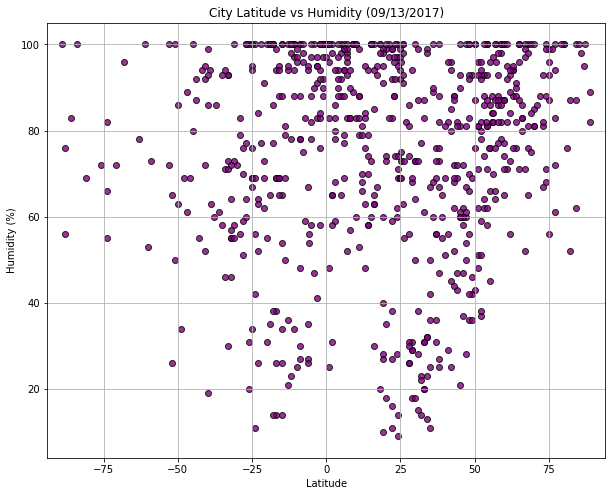
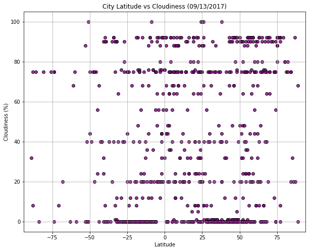
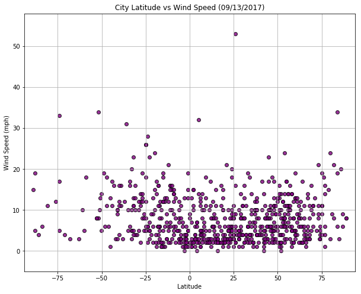

# WeatherPy

*  In the temperature chart below, it illustrates that, generally, places closer to the Equator (lower latitudes) have relatively higher temperatures than places farther from the Equator (higher latitudes).

*  In the humidity chart below, it illustrates that the higher the latitude the more likely the higher the humidity. What does this mean?  I researched it and found that a reading of 100 percent relative humidity means that the air is totally saturated with water vapor and cannot hold any more, creating the possibility of rain.  The chart shows that between 50-75 latitude, % humidity is mostly between 80% to 100%.

*  In the Wind Speed chart below, it illustrates that the wind speed does is not affected by the change in latitude.  Wind speed is about 0 - 20 mph in all latitudes. 


```python
# longtiude (-180 - 180)
# latitude (-90 - 90)

# Dependencies
import numpy as np
import pandas as pd
import matplotlib.pyplot as plt
import requests as req
import time
import random
import sys
import math
from citipy import citipy
from datetime import datetime


# flag to run from file created or run from a new generated random numbers
#  True:  to run it from the csv file created
#  False: to create latitude and Longtitude file and call the api
runFromFile = True

outpath = "Resources"
keyfile = '%s/Keys' % (outpath)
latlong_filename = '%s/Locations' % (outpath)
reportDate = datetime.today()
logfilename = "%s/weatherpy_%s" % (outpath, datetime.strftime(reportDate,'%Y%m%d.%f'))

```


```python
def generate_random_data(radius, num_rows):
    counter = 0
    while counter < num_rows:
        lat = float(np.random.randint(-90, 90)) + np.random.randint(-90, 90)/radius
        lon = float(np.random.randint(-180, 180)) + np.random.randint(-180, 180)/radius    

        # find city name
        city = citipy.nearest_city(lat, lon)
        if city.city_name in City:
#             print("Duplicate:  Will Bypass %s" % city.city_name)
            continue
        else:
            counter += 1 
            City.append (city.city_name)
            Lon.append (lon)
            Lat.append (lat)

```

## Generate City List


```python
if not runFromFile:     
    nbrRows = 700
    # Earths radius
    # longtiude (-180 - 180)
    # latitude (-90 - 90)
    earthRadius = 3959
#     lonlat = []
    City = []
    Lon = []
    Lat = []
    
    print("Creating file: %s.csv" % latlong_filename)
    
    generate_random_data(earthRadius, nbrRows)
    locations_df = pd.DataFrame(
    {'City': City,
     'Lat': Lat,
     'Long': Lon
    }, columns=['City','Lat', 'Long'])

    #  create the city file list 
    locations_df.to_csv("%s.csv" % latlong_filename, index=False)
    locations_df
```

    Creating file: Resources/Locations.csv
    

## Perform API Calls


```python
if not runFromFile: 
    # Create blank columns for necessary fields
    locations_df["City Id"] = ""
    locations_df["Date"] = ""
    locations_df["Country"] = ""
    locations_df["Max Temp"] = ""
    locations_df["Humidity"] = ""
    locations_df["Cloudiness"] = ""
    locations_df["Wind Speed"] = ""


    # Counters
    row_count = 0
    rowsError = 0
    rowsRetrieved = 0
    
    # get key
    key_pd = pd.read_csv("%s.csv" % (keyfile))
    wkey = key_pd[key_pd['Name']== 'wkey']['key'].max().strip()
#     print(wkey)
    
    fw = open("%s.log" % (logfilename), 'w', newline='\n')

    print("----------------------------------")    
    print("Data Retrieval Start")     
    print("----------------------------------")
    
    fw.write("----------------------------------\n")    
    fw.write("Data Retrieval Start\n")     
    fw.write("----------------------------------\n") 

    # Loop through and grab the lat/lng using Google maps
    for index, row in locations_df.iterrows():    
        # Create endpoint URL
        target_url = "https://api.openweathermap.org/data/2.5/weather?units=imperial&appid=%s&q=%s" % (wkey, row['City'])
    #     print(target_url)
        # Retrieve response in json format
        city_weather = req.get(target_url).json()

        row_count += 1
        try:        
            # Printing log to ensure loop is working correctly
            # get id and name of city
            print("%s Now retrieving city # %s: %s" % (row_count, city_weather['id'], row['City'] ))
            print("%s\n" % target_url)           
            
            fw.write("%s Now retrieving city # %s: %s\n" % (row_count, city_weather['id'], row['City'] ))
            fw.write("%s\n" % target_url)
            
            locations_df.set_value(index,"City Id", city_weather['id'])
            locations_df.set_value(index,"Date", city_weather['dt'])
            locations_df.set_value(index,"Country", city_weather['sys']['country'])
            locations_df.set_value(index,"Max Temp", city_weather['main']['temp'])
            locations_df.set_value(index,"Humidity", city_weather['main']['humidity'])
            locations_df.set_value(index,"Cloudiness", city_weather['clouds']['all'])
            locations_df.set_value(index,"Wind Speed", city_weather['wind']['speed'])
            rowsRetrieved += 1
        except:
            print("%s ****** Missing City %s" % (row_count, row['City']))
            rowsError += 1

    print("----------------------------------")    
    print("Data Retrieval Complete")
    print("Total records retrieved: %s" % rowsRetrieved)
    print("Total records in error: %s" % rowsError)
    print("----------------------------------")
    
    fw.write("----------------------------------\n")    
    fw.write("Data Retrieval Complete\n")
    fw.write("Total records retrieved: %s\n" % rowsRetrieved)
    fw.write("Total records in error: %s\n" % rowsError)
    fw.write("----------------------------------\n")
    fw.close()

    #  create the csv that is the one used for this project
    locations_df.to_csv("%s_final.csv" % latlong_filename, index=False)
else:
    # read the random latitude and longtitude
    print("Reading from file: %s_final.csv" % (latlong_filename))
    locations_pd = pd.read_csv("%s_final.csv" % (latlong_filename))
    locations_df = pd.DataFrame(locations_pd)
    
locations_df.head()

```

    ----------------------------------
    Data Retrieval Start
    ----------------------------------
    1 Now retrieving city # 360464: el wasta
    https://api.openweathermap.org/data/2.5/weather?units=imperial&appid=77004d160b3009ad5c5fef5b50e2c32e&q=el wasta
    
    2 Now retrieving city # 3430863: mar del plata
    https://api.openweathermap.org/data/2.5/weather?units=imperial&appid=77004d160b3009ad5c5fef5b50e2c32e&q=mar del plata
    
    3 Now retrieving city # 2075265: busselton
    https://api.openweathermap.org/data/2.5/weather?units=imperial&appid=77004d160b3009ad5c5fef5b50e2c32e&q=busselton
    
    4 Now retrieving city # 5975004: high level
    https://api.openweathermap.org/data/2.5/weather?units=imperial&appid=77004d160b3009ad5c5fef5b50e2c32e&q=high level
    
    5 Now retrieving city # 292223: dibaya
    https://api.openweathermap.org/data/2.5/weather?units=imperial&appid=77004d160b3009ad5c5fef5b50e2c32e&q=dibaya
    
    6 Now retrieving city # 3369157: cape town
    https://api.openweathermap.org/data/2.5/weather?units=imperial&appid=77004d160b3009ad5c5fef5b50e2c32e&q=cape town
    
    7 Now retrieving city # 1282256: hithadhoo
    https://api.openweathermap.org/data/2.5/weather?units=imperial&appid=77004d160b3009ad5c5fef5b50e2c32e&q=hithadhoo
    
    8 Now retrieving city # 1631637: pemangkat
    https://api.openweathermap.org/data/2.5/weather?units=imperial&appid=77004d160b3009ad5c5fef5b50e2c32e&q=pemangkat
    
    9 Now retrieving city # 6696918: yaan
    https://api.openweathermap.org/data/2.5/weather?units=imperial&appid=77004d160b3009ad5c5fef5b50e2c32e&q=yaan
    
    10 Now retrieving city # 53372: odweyne
    https://api.openweathermap.org/data/2.5/weather?units=imperial&appid=77004d160b3009ad5c5fef5b50e2c32e&q=odweyne
    
    11 Now retrieving city # 1687186: sarangani
    https://api.openweathermap.org/data/2.5/weather?units=imperial&appid=77004d160b3009ad5c5fef5b50e2c32e&q=sarangani
    
    12 Now retrieving city # 3034911: bar-le-duc
    https://api.openweathermap.org/data/2.5/weather?units=imperial&appid=77004d160b3009ad5c5fef5b50e2c32e&q=bar-le-duc
    
    13 Now retrieving city # 512570: parfino
    https://api.openweathermap.org/data/2.5/weather?units=imperial&appid=77004d160b3009ad5c5fef5b50e2c32e&q=parfino
    
    14 Now retrieving city # 5106834: albany
    https://api.openweathermap.org/data/2.5/weather?units=imperial&appid=77004d160b3009ad5c5fef5b50e2c32e&q=albany
    
    15 Now retrieving city # 2126710: beringovskiy
    https://api.openweathermap.org/data/2.5/weather?units=imperial&appid=77004d160b3009ad5c5fef5b50e2c32e&q=beringovskiy
    
    16 Now retrieving city # 4030556: rikitea
    https://api.openweathermap.org/data/2.5/weather?units=imperial&appid=77004d160b3009ad5c5fef5b50e2c32e&q=rikitea
    
    17 Now retrieving city # 3576994: cockburn town
    https://api.openweathermap.org/data/2.5/weather?units=imperial&appid=77004d160b3009ad5c5fef5b50e2c32e&q=cockburn town
    
    18 Now retrieving city # 5690532: minot
    https://api.openweathermap.org/data/2.5/weather?units=imperial&appid=77004d160b3009ad5c5fef5b50e2c32e&q=minot
    
    19 Now retrieving city # 2396518: port-gentil
    https://api.openweathermap.org/data/2.5/weather?units=imperial&appid=77004d160b3009ad5c5fef5b50e2c32e&q=port-gentil
    
    20 Now retrieving city # 3450288: santa cruz cabralia
    https://api.openweathermap.org/data/2.5/weather?units=imperial&appid=77004d160b3009ad5c5fef5b50e2c32e&q=santa cruz cabralia
    
    21 Now retrieving city # 3461370: imbituba
    https://api.openweathermap.org/data/2.5/weather?units=imperial&appid=77004d160b3009ad5c5fef5b50e2c32e&q=imbituba
    
    22 Now retrieving city # 3378644: georgetown
    https://api.openweathermap.org/data/2.5/weather?units=imperial&appid=77004d160b3009ad5c5fef5b50e2c32e&q=georgetown
    
    23 Now retrieving city # 3833367: ushuaia
    https://api.openweathermap.org/data/2.5/weather?units=imperial&appid=77004d160b3009ad5c5fef5b50e2c32e&q=ushuaia
    
    24 Now retrieving city # 4034551: faanui
    https://api.openweathermap.org/data/2.5/weather?units=imperial&appid=77004d160b3009ad5c5fef5b50e2c32e&q=faanui
    
    25 Now retrieving city # 2729907: longyearbyen
    https://api.openweathermap.org/data/2.5/weather?units=imperial&appid=77004d160b3009ad5c5fef5b50e2c32e&q=longyearbyen
    
    26 Now retrieving city # 1814435: dafeng
    https://api.openweathermap.org/data/2.5/weather?units=imperial&appid=77004d160b3009ad5c5fef5b50e2c32e&q=dafeng
    
    27 Now retrieving city # 1078317: taolanaro
    https://api.openweathermap.org/data/2.5/weather?units=imperial&appid=77004d160b3009ad5c5fef5b50e2c32e&q=taolanaro
    
    28 Now retrieving city # 1544819: amderma
    https://api.openweathermap.org/data/2.5/weather?units=imperial&appid=77004d160b3009ad5c5fef5b50e2c32e&q=amderma
    
    29 Now retrieving city # 541826: nikolskoye
    https://api.openweathermap.org/data/2.5/weather?units=imperial&appid=77004d160b3009ad5c5fef5b50e2c32e&q=nikolskoye
    
    30 Now retrieving city # 6696686: sentyabrskiy
    https://api.openweathermap.org/data/2.5/weather?units=imperial&appid=77004d160b3009ad5c5fef5b50e2c32e&q=sentyabrskiy
    
    31 Now retrieving city # 4032243: vaini
    https://api.openweathermap.org/data/2.5/weather?units=imperial&appid=77004d160b3009ad5c5fef5b50e2c32e&q=vaini
    
    32 Now retrieving city # 2126199: cherskiy
    https://api.openweathermap.org/data/2.5/weather?units=imperial&appid=77004d160b3009ad5c5fef5b50e2c32e&q=cherskiy
    
    33 Now retrieving city # 3893629: coquimbo
    https://api.openweathermap.org/data/2.5/weather?units=imperial&appid=77004d160b3009ad5c5fef5b50e2c32e&q=coquimbo
    
    34 Now retrieving city # 6185377: yellowknife
    https://api.openweathermap.org/data/2.5/weather?units=imperial&appid=77004d160b3009ad5c5fef5b50e2c32e&q=yellowknife
    
    35 Now retrieving city # 2013465: verkhoyansk
    https://api.openweathermap.org/data/2.5/weather?units=imperial&appid=77004d160b3009ad5c5fef5b50e2c32e&q=verkhoyansk
    
    36 Now retrieving city # 1806840: huilong
    https://api.openweathermap.org/data/2.5/weather?units=imperial&appid=77004d160b3009ad5c5fef5b50e2c32e&q=huilong
    
    37 Now retrieving city # 1263364: mataura
    https://api.openweathermap.org/data/2.5/weather?units=imperial&appid=77004d160b3009ad5c5fef5b50e2c32e&q=mataura
    
    38 Now retrieving city # 2685750: ostersund
    https://api.openweathermap.org/data/2.5/weather?units=imperial&appid=77004d160b3009ad5c5fef5b50e2c32e&q=ostersund
    
    39 Now retrieving city # 6545158: illoqqortoormiut
    https://api.openweathermap.org/data/2.5/weather?units=imperial&appid=77004d160b3009ad5c5fef5b50e2c32e&q=illoqqortoormiut
    
    40 Now retrieving city # 2126123: chokurdakh
    https://api.openweathermap.org/data/2.5/weather?units=imperial&appid=77004d160b3009ad5c5fef5b50e2c32e&q=chokurdakh
    
    41 Now retrieving city # 3441894: maldonado
    https://api.openweathermap.org/data/2.5/weather?units=imperial&appid=77004d160b3009ad5c5fef5b50e2c32e&q=maldonado
    
    42 Now retrieving city # 3652764: puerto ayora
    https://api.openweathermap.org/data/2.5/weather?units=imperial&appid=77004d160b3009ad5c5fef5b50e2c32e&q=puerto ayora
    
    43 Now retrieving city # 3366880: hermanus
    https://api.openweathermap.org/data/2.5/weather?units=imperial&appid=77004d160b3009ad5c5fef5b50e2c32e&q=hermanus
    
    44 Now retrieving city # 7839412: jabiru
    https://api.openweathermap.org/data/2.5/weather?units=imperial&appid=77004d160b3009ad5c5fef5b50e2c32e&q=jabiru
    
    45 Now retrieving city # 1015776: bredasdorp
    https://api.openweathermap.org/data/2.5/weather?units=imperial&appid=77004d160b3009ad5c5fef5b50e2c32e&q=bredasdorp
    
    46 Now retrieving city # 2159220: mackay
    https://api.openweathermap.org/data/2.5/weather?units=imperial&appid=77004d160b3009ad5c5fef5b50e2c32e&q=mackay
    
    47 Now retrieving city # 2065594: mount isa
    https://api.openweathermap.org/data/2.5/weather?units=imperial&appid=77004d160b3009ad5c5fef5b50e2c32e&q=mount isa
    
    48 Now retrieving city # 1537939: stepnogorsk
    https://api.openweathermap.org/data/2.5/weather?units=imperial&appid=77004d160b3009ad5c5fef5b50e2c32e&q=stepnogorsk
    
    49 Now retrieving city # 464179: zavetnoye
    https://api.openweathermap.org/data/2.5/weather?units=imperial&appid=77004d160b3009ad5c5fef5b50e2c32e&q=zavetnoye
    
    50 Now retrieving city # 2656046: bedford
    https://api.openweathermap.org/data/2.5/weather?units=imperial&appid=77004d160b3009ad5c5fef5b50e2c32e&q=bedford
    
    51 Now retrieving city # 1788852: xining
    https://api.openweathermap.org/data/2.5/weather?units=imperial&appid=77004d160b3009ad5c5fef5b50e2c32e&q=xining
    
    52 Now retrieving city # 5122534: jamestown
    https://api.openweathermap.org/data/2.5/weather?units=imperial&appid=77004d160b3009ad5c5fef5b50e2c32e&q=jamestown
    
    53 Now retrieving city # 290030: doha
    https://api.openweathermap.org/data/2.5/weather?units=imperial&appid=77004d160b3009ad5c5fef5b50e2c32e&q=doha
    
    54 Now retrieving city # 2173125: burnie
    https://api.openweathermap.org/data/2.5/weather?units=imperial&appid=77004d160b3009ad5c5fef5b50e2c32e&q=burnie
    
    55 Now retrieving city # 1078553: ampanihy
    https://api.openweathermap.org/data/2.5/weather?units=imperial&appid=77004d160b3009ad5c5fef5b50e2c32e&q=ampanihy
    
    56 Now retrieving city # 3452483: prado
    https://api.openweathermap.org/data/2.5/weather?units=imperial&appid=77004d160b3009ad5c5fef5b50e2c32e&q=prado
    
    57 Now retrieving city # 3526662: izamal
    https://api.openweathermap.org/data/2.5/weather?units=imperial&appid=77004d160b3009ad5c5fef5b50e2c32e&q=izamal
    
    58 Now retrieving city # 1493044: sarapulka
    https://api.openweathermap.org/data/2.5/weather?units=imperial&appid=77004d160b3009ad5c5fef5b50e2c32e&q=sarapulka
    
    59 Now retrieving city # 935215: saint-philippe
    https://api.openweathermap.org/data/2.5/weather?units=imperial&appid=77004d160b3009ad5c5fef5b50e2c32e&q=saint-philippe
    
    60 Now retrieving city # 493160: kizilskoye
    https://api.openweathermap.org/data/2.5/weather?units=imperial&appid=77004d160b3009ad5c5fef5b50e2c32e&q=kizilskoye
    
    61 Now retrieving city # 4020109: atuona
    https://api.openweathermap.org/data/2.5/weather?units=imperial&appid=77004d160b3009ad5c5fef5b50e2c32e&q=atuona
    
    62 Now retrieving city # 3831208: qaanaaq
    https://api.openweathermap.org/data/2.5/weather?units=imperial&appid=77004d160b3009ad5c5fef5b50e2c32e&q=qaanaaq
    
    63 Now retrieving city # 2698739: kungalv
    https://api.openweathermap.org/data/2.5/weather?units=imperial&appid=77004d160b3009ad5c5fef5b50e2c32e&q=kungalv
    
    64 Now retrieving city # 964420: port elizabeth
    https://api.openweathermap.org/data/2.5/weather?units=imperial&appid=77004d160b3009ad5c5fef5b50e2c32e&q=port elizabeth
    
    65 Now retrieving city # 2074865: carnarvon
    https://api.openweathermap.org/data/2.5/weather?units=imperial&appid=77004d160b3009ad5c5fef5b50e2c32e&q=carnarvon
    
    66 Now retrieving city # 2108857: gizo
    https://api.openweathermap.org/data/2.5/weather?units=imperial&appid=77004d160b3009ad5c5fef5b50e2c32e&q=gizo
    
    67 Now retrieving city # 5712169: baker city
    https://api.openweathermap.org/data/2.5/weather?units=imperial&appid=77004d160b3009ad5c5fef5b50e2c32e&q=baker city
    
    68 Now retrieving city # 601551: akdepe
    https://api.openweathermap.org/data/2.5/weather?units=imperial&appid=77004d160b3009ad5c5fef5b50e2c32e&q=akdepe
    
    69 Now retrieving city # 3899539: antofagasta
    https://api.openweathermap.org/data/2.5/weather?units=imperial&appid=77004d160b3009ad5c5fef5b50e2c32e&q=antofagasta
    
    70 Now retrieving city # 1859175: kobayashi
    https://api.openweathermap.org/data/2.5/weather?units=imperial&appid=77004d160b3009ad5c5fef5b50e2c32e&q=kobayashi
    
    71 Now retrieving city # 2148431: stawell
    https://api.openweathermap.org/data/2.5/weather?units=imperial&appid=77004d160b3009ad5c5fef5b50e2c32e&q=stawell
    
    72 Now retrieving city # 2206939: bluff
    https://api.openweathermap.org/data/2.5/weather?units=imperial&appid=77004d160b3009ad5c5fef5b50e2c32e&q=bluff
    
    73 Now retrieving city # 2208248: kaitangata
    https://api.openweathermap.org/data/2.5/weather?units=imperial&appid=77004d160b3009ad5c5fef5b50e2c32e&q=kaitangata
    
    74 Now retrieving city # 2618795: klaksvik
    https://api.openweathermap.org/data/2.5/weather?units=imperial&appid=77004d160b3009ad5c5fef5b50e2c32e&q=klaksvik
    
    75 Now retrieving city # 934322: mahebourg
    https://api.openweathermap.org/data/2.5/weather?units=imperial&appid=77004d160b3009ad5c5fef5b50e2c32e&q=mahebourg
    
    76 Now retrieving city # 97270: bargal
    https://api.openweathermap.org/data/2.5/weather?units=imperial&appid=77004d160b3009ad5c5fef5b50e2c32e&q=bargal
    
    77 Now retrieving city # 5855927: hilo
    https://api.openweathermap.org/data/2.5/weather?units=imperial&appid=77004d160b3009ad5c5fef5b50e2c32e&q=hilo
    
    78 Now retrieving city # 962367: richards bay
    https://api.openweathermap.org/data/2.5/weather?units=imperial&appid=77004d160b3009ad5c5fef5b50e2c32e&q=richards bay
    
    79 Now retrieving city # 2122090: pevek
    https://api.openweathermap.org/data/2.5/weather?units=imperial&appid=77004d160b3009ad5c5fef5b50e2c32e&q=pevek
    
    80 Now retrieving city # 379149: marzuq
    https://api.openweathermap.org/data/2.5/weather?units=imperial&appid=77004d160b3009ad5c5fef5b50e2c32e&q=marzuq
    
    81 Now retrieving city # 4362001: mayo
    https://api.openweathermap.org/data/2.5/weather?units=imperial&appid=77004d160b3009ad5c5fef5b50e2c32e&q=mayo
    
    82 Now retrieving city # 5866583: kodiak
    https://api.openweathermap.org/data/2.5/weather?units=imperial&appid=77004d160b3009ad5c5fef5b50e2c32e&q=kodiak
    
    83 Now retrieving city # 3416888: grindavik
    https://api.openweathermap.org/data/2.5/weather?units=imperial&appid=77004d160b3009ad5c5fef5b50e2c32e&q=grindavik
    
    84 Now retrieving city # 1082243: ambilobe
    https://api.openweathermap.org/data/2.5/weather?units=imperial&appid=77004d160b3009ad5c5fef5b50e2c32e&q=ambilobe
    
    85 Now retrieving city # 3421765: nanortalik
    https://api.openweathermap.org/data/2.5/weather?units=imperial&appid=77004d160b3009ad5c5fef5b50e2c32e&q=nanortalik
    
    86 Now retrieving city # 1783873: zhumadian
    https://api.openweathermap.org/data/2.5/weather?units=imperial&appid=77004d160b3009ad5c5fef5b50e2c32e&q=zhumadian
    
    87 Now retrieving city # 2236568: uige
    https://api.openweathermap.org/data/2.5/weather?units=imperial&appid=77004d160b3009ad5c5fef5b50e2c32e&q=uige
    
    88 Now retrieving city # 1529660: aksu
    https://api.openweathermap.org/data/2.5/weather?units=imperial&appid=77004d160b3009ad5c5fef5b50e2c32e&q=aksu
    
    89 Now retrieving city # 779330: kautokeino
    https://api.openweathermap.org/data/2.5/weather?units=imperial&appid=77004d160b3009ad5c5fef5b50e2c32e&q=kautokeino
    
    90 Now retrieving city # 3932145: pisco
    https://api.openweathermap.org/data/2.5/weather?units=imperial&appid=77004d160b3009ad5c5fef5b50e2c32e&q=pisco
    
    91 Now retrieving city # 5848280: kapaa
    https://api.openweathermap.org/data/2.5/weather?units=imperial&appid=77004d160b3009ad5c5fef5b50e2c32e&q=kapaa
    
    92 Now retrieving city # 4031637: lavrentiya
    https://api.openweathermap.org/data/2.5/weather?units=imperial&appid=77004d160b3009ad5c5fef5b50e2c32e&q=lavrentiya
    
    93 Now retrieving city # 3355672: luderitz
    https://api.openweathermap.org/data/2.5/weather?units=imperial&appid=77004d160b3009ad5c5fef5b50e2c32e&q=luderitz
    
    94 Now retrieving city # 6096551: pangnirtung
    https://api.openweathermap.org/data/2.5/weather?units=imperial&appid=77004d160b3009ad5c5fef5b50e2c32e&q=pangnirtung
    
    95 Now retrieving city # 2045485: samusu
    https://api.openweathermap.org/data/2.5/weather?units=imperial&appid=77004d160b3009ad5c5fef5b50e2c32e&q=samusu
    
    96 Now retrieving city # 160172: dongobesh
    https://api.openweathermap.org/data/2.5/weather?units=imperial&appid=77004d160b3009ad5c5fef5b50e2c32e&q=dongobesh
    
    97 Now retrieving city # 3984997: san quintin
    https://api.openweathermap.org/data/2.5/weather?units=imperial&appid=77004d160b3009ad5c5fef5b50e2c32e&q=san quintin
    
    98 Now retrieving city # 5861897: fairbanks
    https://api.openweathermap.org/data/2.5/weather?units=imperial&appid=77004d160b3009ad5c5fef5b50e2c32e&q=fairbanks
    
    99 Now retrieving city # 3945466: carhuamayo
    https://api.openweathermap.org/data/2.5/weather?units=imperial&appid=77004d160b3009ad5c5fef5b50e2c32e&q=carhuamayo
    
    100 Now retrieving city # 5821593: cody
    https://api.openweathermap.org/data/2.5/weather?units=imperial&appid=77004d160b3009ad5c5fef5b50e2c32e&q=cody
    
    101 Now retrieving city # 2782053: bad hofgastein
    https://api.openweathermap.org/data/2.5/weather?units=imperial&appid=77004d160b3009ad5c5fef5b50e2c32e&q=bad hofgastein
    
    102 Now retrieving city # 3514843: vega de alatorre
    https://api.openweathermap.org/data/2.5/weather?units=imperial&appid=77004d160b3009ad5c5fef5b50e2c32e&q=vega de alatorre
    
    103 Now retrieving city # 6170031: tuktoyaktuk
    https://api.openweathermap.org/data/2.5/weather?units=imperial&appid=77004d160b3009ad5c5fef5b50e2c32e&q=tuktoyaktuk
    
    104 Now retrieving city # 609537: karaton
    https://api.openweathermap.org/data/2.5/weather?units=imperial&appid=77004d160b3009ad5c5fef5b50e2c32e&q=karaton
    
    105 Now retrieving city # 2110227: butaritari
    https://api.openweathermap.org/data/2.5/weather?units=imperial&appid=77004d160b3009ad5c5fef5b50e2c32e&q=butaritari
    
    106 Now retrieving city # 53654: mogadishu
    https://api.openweathermap.org/data/2.5/weather?units=imperial&appid=77004d160b3009ad5c5fef5b50e2c32e&q=mogadishu
    
    107 Now retrieving city # 2012956: yerbogachen
    https://api.openweathermap.org/data/2.5/weather?units=imperial&appid=77004d160b3009ad5c5fef5b50e2c32e&q=yerbogachen
    
    108 Now retrieving city # 3985710: cabo san lucas
    https://api.openweathermap.org/data/2.5/weather?units=imperial&appid=77004d160b3009ad5c5fef5b50e2c32e&q=cabo san lucas
    
    109 Now retrieving city # 1855342: nishihara
    https://api.openweathermap.org/data/2.5/weather?units=imperial&appid=77004d160b3009ad5c5fef5b50e2c32e&q=nishihara
    
    110 Now retrieving city # 3874787: punta arenas
    https://api.openweathermap.org/data/2.5/weather?units=imperial&appid=77004d160b3009ad5c5fef5b50e2c32e&q=punta arenas
    
    111 Now retrieving city # 3418910: upernavik
    https://api.openweathermap.org/data/2.5/weather?units=imperial&appid=77004d160b3009ad5c5fef5b50e2c32e&q=upernavik
    
    112 Now retrieving city # 4031574: provideniya
    https://api.openweathermap.org/data/2.5/weather?units=imperial&appid=77004d160b3009ad5c5fef5b50e2c32e&q=provideniya
    
    113 Now retrieving city # 1855891: nakamura
    https://api.openweathermap.org/data/2.5/weather?units=imperial&appid=77004d160b3009ad5c5fef5b50e2c32e&q=nakamura
    
    114 Now retrieving city # 1520240: pavlodar
    https://api.openweathermap.org/data/2.5/weather?units=imperial&appid=77004d160b3009ad5c5fef5b50e2c32e&q=pavlodar
    
    115 Now retrieving city # 3665210: ipixuna
    https://api.openweathermap.org/data/2.5/weather?units=imperial&appid=77004d160b3009ad5c5fef5b50e2c32e&q=ipixuna
    
    116 Now retrieving city # 2163355: hobart
    https://api.openweathermap.org/data/2.5/weather?units=imperial&appid=77004d160b3009ad5c5fef5b50e2c32e&q=hobart
    
    117 Now retrieving city # 2127202: anadyr
    https://api.openweathermap.org/data/2.5/weather?units=imperial&appid=77004d160b3009ad5c5fef5b50e2c32e&q=anadyr
    
    118 Now retrieving city # 3374336: porto novo
    https://api.openweathermap.org/data/2.5/weather?units=imperial&appid=77004d160b3009ad5c5fef5b50e2c32e&q=porto novo
    
    119 Now retrieving city # 3443061: chuy
    https://api.openweathermap.org/data/2.5/weather?units=imperial&appid=77004d160b3009ad5c5fef5b50e2c32e&q=chuy
    
    120 Now retrieving city # 294166: mizpe ramon
    https://api.openweathermap.org/data/2.5/weather?units=imperial&appid=77004d160b3009ad5c5fef5b50e2c32e&q=mizpe ramon
    
    121 Now retrieving city # 3466980: caravelas
    https://api.openweathermap.org/data/2.5/weather?units=imperial&appid=77004d160b3009ad5c5fef5b50e2c32e&q=caravelas
    
    122 Now retrieving city # 1487762: belushya guba
    https://api.openweathermap.org/data/2.5/weather?units=imperial&appid=77004d160b3009ad5c5fef5b50e2c32e&q=belushya guba
    
    123 Now retrieving city # 1709886: kabugao
    https://api.openweathermap.org/data/2.5/weather?units=imperial&appid=77004d160b3009ad5c5fef5b50e2c32e&q=kabugao
    
    124 Now retrieving city # 1714733: dingle
    https://api.openweathermap.org/data/2.5/weather?units=imperial&appid=77004d160b3009ad5c5fef5b50e2c32e&q=dingle
    
    125 Now retrieving city # 2067089: milingimbi
    https://api.openweathermap.org/data/2.5/weather?units=imperial&appid=77004d160b3009ad5c5fef5b50e2c32e&q=milingimbi
    
    126 Now retrieving city # 3424607: tasiilaq
    https://api.openweathermap.org/data/2.5/weather?units=imperial&appid=77004d160b3009ad5c5fef5b50e2c32e&q=tasiilaq
    
    127 Now retrieving city # 1507390: dikson
    https://api.openweathermap.org/data/2.5/weather?units=imperial&appid=77004d160b3009ad5c5fef5b50e2c32e&q=dikson
    
    128 Now retrieving city # 5880054: barrow
    https://api.openweathermap.org/data/2.5/weather?units=imperial&appid=77004d160b3009ad5c5fef5b50e2c32e&q=barrow
    
    129 Now retrieving city # 3374083: bathsheba
    https://api.openweathermap.org/data/2.5/weather?units=imperial&appid=77004d160b3009ad5c5fef5b50e2c32e&q=bathsheba
    
    130 Now retrieving city # 3837056: san luis
    https://api.openweathermap.org/data/2.5/weather?units=imperial&appid=77004d160b3009ad5c5fef5b50e2c32e&q=san luis
    
    131 Now retrieving city # 5859699: college
    https://api.openweathermap.org/data/2.5/weather?units=imperial&appid=77004d160b3009ad5c5fef5b50e2c32e&q=college
    
    132 Now retrieving city # 1726449: basco
    https://api.openweathermap.org/data/2.5/weather?units=imperial&appid=77004d160b3009ad5c5fef5b50e2c32e&q=basco
    
    133 Now retrieving city # 1835848: seoul
    https://api.openweathermap.org/data/2.5/weather?units=imperial&appid=77004d160b3009ad5c5fef5b50e2c32e&q=seoul
    
    134 Now retrieving city # 964432: port alfred
    https://api.openweathermap.org/data/2.5/weather?units=imperial&appid=77004d160b3009ad5c5fef5b50e2c32e&q=port alfred
    
    135 Now retrieving city # 1445310: saleaula
    https://api.openweathermap.org/data/2.5/weather?units=imperial&appid=77004d160b3009ad5c5fef5b50e2c32e&q=saleaula
    
    136 Now retrieving city # 3386213: touros
    https://api.openweathermap.org/data/2.5/weather?units=imperial&appid=77004d160b3009ad5c5fef5b50e2c32e&q=touros
    
    137 Now retrieving city # 608668: zachagansk
    https://api.openweathermap.org/data/2.5/weather?units=imperial&appid=77004d160b3009ad5c5fef5b50e2c32e&q=zachagansk
    
    138 Now retrieving city # 1106643: quatre cocos
    https://api.openweathermap.org/data/2.5/weather?units=imperial&appid=77004d160b3009ad5c5fef5b50e2c32e&q=quatre cocos
    
    139 Now retrieving city # 2112309: katsuura
    https://api.openweathermap.org/data/2.5/weather?units=imperial&appid=77004d160b3009ad5c5fef5b50e2c32e&q=katsuura
    
    140 Now retrieving city # 2155415: new norfolk
    https://api.openweathermap.org/data/2.5/weather?units=imperial&appid=77004d160b3009ad5c5fef5b50e2c32e&q=new norfolk
    
    141 Now retrieving city # 1861280: itoman
    https://api.openweathermap.org/data/2.5/weather?units=imperial&appid=77004d160b3009ad5c5fef5b50e2c32e&q=itoman
    
    142 Now retrieving city # 2122574: ola
    https://api.openweathermap.org/data/2.5/weather?units=imperial&appid=77004d160b3009ad5c5fef5b50e2c32e&q=ola
    
    143 Now retrieving city # 2112802: hasaki
    https://api.openweathermap.org/data/2.5/weather?units=imperial&appid=77004d160b3009ad5c5fef5b50e2c32e&q=hasaki
    
    144 Now retrieving city # 2121385: severo-kurilsk
    https://api.openweathermap.org/data/2.5/weather?units=imperial&appid=77004d160b3009ad5c5fef5b50e2c32e&q=severo-kurilsk
    
    145 Now retrieving city # 3897347: calama
    https://api.openweathermap.org/data/2.5/weather?units=imperial&appid=77004d160b3009ad5c5fef5b50e2c32e&q=calama
    
    146 Now retrieving city # 88533: awjilah
    https://api.openweathermap.org/data/2.5/weather?units=imperial&appid=77004d160b3009ad5c5fef5b50e2c32e&q=awjilah
    
    147 Now retrieving city # 3935624: macusani
    https://api.openweathermap.org/data/2.5/weather?units=imperial&appid=77004d160b3009ad5c5fef5b50e2c32e&q=macusani
    
    148 Now retrieving city # 2015306: tiksi
    https://api.openweathermap.org/data/2.5/weather?units=imperial&appid=77004d160b3009ad5c5fef5b50e2c32e&q=tiksi
    
    149 Now retrieving city # 1795565: shenzhen
    https://api.openweathermap.org/data/2.5/weather?units=imperial&appid=77004d160b3009ad5c5fef5b50e2c32e&q=shenzhen
    
    150 Now retrieving city # 2389804: baoro
    https://api.openweathermap.org/data/2.5/weather?units=imperial&appid=77004d160b3009ad5c5fef5b50e2c32e&q=baoro
    
    151 Now retrieving city # 1058381: morondava
    https://api.openweathermap.org/data/2.5/weather?units=imperial&appid=77004d160b3009ad5c5fef5b50e2c32e&q=morondava
    
    152 Now retrieving city # 2094342: kavieng
    https://api.openweathermap.org/data/2.5/weather?units=imperial&appid=77004d160b3009ad5c5fef5b50e2c32e&q=kavieng
    
    153 Now retrieving city # 483379: tumannyy
    https://api.openweathermap.org/data/2.5/weather?units=imperial&appid=77004d160b3009ad5c5fef5b50e2c32e&q=tumannyy
    
    154 Now retrieving city # 3628473: san cristobal
    https://api.openweathermap.org/data/2.5/weather?units=imperial&appid=77004d160b3009ad5c5fef5b50e2c32e&q=san cristobal
    
    155 Now retrieving city # 3514961: tzucacab
    https://api.openweathermap.org/data/2.5/weather?units=imperial&appid=77004d160b3009ad5c5fef5b50e2c32e&q=tzucacab
    
    156 Now retrieving city # 1496503: noyabrsk
    https://api.openweathermap.org/data/2.5/weather?units=imperial&appid=77004d160b3009ad5c5fef5b50e2c32e&q=noyabrsk
    
    157 Now retrieving city # 556268: ostrovnoy
    https://api.openweathermap.org/data/2.5/weather?units=imperial&appid=77004d160b3009ad5c5fef5b50e2c32e&q=ostrovnoy
    
    158 Now retrieving city # 3146487: maloy
    https://api.openweathermap.org/data/2.5/weather?units=imperial&appid=77004d160b3009ad5c5fef5b50e2c32e&q=maloy
    
    159 Now retrieving city # 5847411: kahului
    https://api.openweathermap.org/data/2.5/weather?units=imperial&appid=77004d160b3009ad5c5fef5b50e2c32e&q=kahului
    
    160 Now retrieving city # 4456703: boone
    https://api.openweathermap.org/data/2.5/weather?units=imperial&appid=77004d160b3009ad5c5fef5b50e2c32e&q=boone
    
    161 Now retrieving city # 1800657: mentougou
    https://api.openweathermap.org/data/2.5/weather?units=imperial&appid=77004d160b3009ad5c5fef5b50e2c32e&q=mentougou
    
    162 Now retrieving city # 5882953: aklavik
    https://api.openweathermap.org/data/2.5/weather?units=imperial&appid=77004d160b3009ad5c5fef5b50e2c32e&q=aklavik
    
    163 Now retrieving city # 5866063: kenai
    https://api.openweathermap.org/data/2.5/weather?units=imperial&appid=77004d160b3009ad5c5fef5b50e2c32e&q=kenai
    
    164 Now retrieving city # 4035715: avarua
    https://api.openweathermap.org/data/2.5/weather?units=imperial&appid=77004d160b3009ad5c5fef5b50e2c32e&q=avarua
    
    165 Now retrieving city # 1265150: lalpur
    https://api.openweathermap.org/data/2.5/weather?units=imperial&appid=77004d160b3009ad5c5fef5b50e2c32e&q=lalpur
    
    166 Now retrieving city # 876123: lumeje
    https://api.openweathermap.org/data/2.5/weather?units=imperial&appid=77004d160b3009ad5c5fef5b50e2c32e&q=lumeje
    
    167 Now retrieving city # 1257326: haibowan
    https://api.openweathermap.org/data/2.5/weather?units=imperial&appid=77004d160b3009ad5c5fef5b50e2c32e&q=haibowan
    
    168 Now retrieving city # 3838859: rio gallegos
    https://api.openweathermap.org/data/2.5/weather?units=imperial&appid=77004d160b3009ad5c5fef5b50e2c32e&q=rio gallegos
    
    169 Now retrieving city # 6145890: shelburne
    https://api.openweathermap.org/data/2.5/weather?units=imperial&appid=77004d160b3009ad5c5fef5b50e2c32e&q=shelburne
    
    170 Now retrieving city # 3412093: vestmannaeyjar
    https://api.openweathermap.org/data/2.5/weather?units=imperial&appid=77004d160b3009ad5c5fef5b50e2c32e&q=vestmannaeyjar
    
    171 Now retrieving city # 2092164: lorengau
    https://api.openweathermap.org/data/2.5/weather?units=imperial&appid=77004d160b3009ad5c5fef5b50e2c32e&q=lorengau
    
    172 Now retrieving city # 379102: babanusah
    https://api.openweathermap.org/data/2.5/weather?units=imperial&appid=77004d160b3009ad5c5fef5b50e2c32e&q=babanusah
    
    173 Now retrieving city # 5972762: hay river
    https://api.openweathermap.org/data/2.5/weather?units=imperial&appid=77004d160b3009ad5c5fef5b50e2c32e&q=hay river
    
    174 Now retrieving city # 1254046: tura
    https://api.openweathermap.org/data/2.5/weather?units=imperial&appid=77004d160b3009ad5c5fef5b50e2c32e&q=tura
    
    175 Now retrieving city # 2171099: codrington
    https://api.openweathermap.org/data/2.5/weather?units=imperial&appid=77004d160b3009ad5c5fef5b50e2c32e&q=codrington
    
    176 Now retrieving city # 699413: novomykolayivka
    https://api.openweathermap.org/data/2.5/weather?units=imperial&appid=77004d160b3009ad5c5fef5b50e2c32e&q=novomykolayivka
    
    177 Now retrieving city # 1528998: yumen
    https://api.openweathermap.org/data/2.5/weather?units=imperial&appid=77004d160b3009ad5c5fef5b50e2c32e&q=yumen
    
    178 Now retrieving city # 296852: erzin
    https://api.openweathermap.org/data/2.5/weather?units=imperial&appid=77004d160b3009ad5c5fef5b50e2c32e&q=erzin
    
    179 Now retrieving city # 212360: kongolo
    https://api.openweathermap.org/data/2.5/weather?units=imperial&appid=77004d160b3009ad5c5fef5b50e2c32e&q=kongolo
    
    180 Now retrieving city # 2013921: ust-kuyga
    https://api.openweathermap.org/data/2.5/weather?units=imperial&appid=77004d160b3009ad5c5fef5b50e2c32e&q=ust-kuyga
    
    181 Now retrieving city # 933178: pandamatenga
    https://api.openweathermap.org/data/2.5/weather?units=imperial&appid=77004d160b3009ad5c5fef5b50e2c32e&q=pandamatenga
    
    182 Now retrieving city # 2027044: batagay
    https://api.openweathermap.org/data/2.5/weather?units=imperial&appid=77004d160b3009ad5c5fef5b50e2c32e&q=batagay
    
    183 Now retrieving city # 1651531: ambon
    https://api.openweathermap.org/data/2.5/weather?units=imperial&appid=77004d160b3009ad5c5fef5b50e2c32e&q=ambon
    
    184 Now retrieving city # 3162668: ask
    https://api.openweathermap.org/data/2.5/weather?units=imperial&appid=77004d160b3009ad5c5fef5b50e2c32e&q=ask
    
    185 Now retrieving city # 3423146: ilulissat
    https://api.openweathermap.org/data/2.5/weather?units=imperial&appid=77004d160b3009ad5c5fef5b50e2c32e&q=ilulissat
    
    186 Now retrieving city # 1805733: jinchang
    https://api.openweathermap.org/data/2.5/weather?units=imperial&appid=77004d160b3009ad5c5fef5b50e2c32e&q=jinchang
    
    187 Now retrieving city # 5746545: portland
    https://api.openweathermap.org/data/2.5/weather?units=imperial&appid=77004d160b3009ad5c5fef5b50e2c32e&q=portland
    
    188 Now retrieving city # 2278158: buchanan
    https://api.openweathermap.org/data/2.5/weather?units=imperial&appid=77004d160b3009ad5c5fef5b50e2c32e&q=buchanan
    
    189 Now retrieving city # 934475: grand river south east
    https://api.openweathermap.org/data/2.5/weather?units=imperial&appid=77004d160b3009ad5c5fef5b50e2c32e&q=grand river south east
    
    190 Now retrieving city # 367544: sawakin
    https://api.openweathermap.org/data/2.5/weather?units=imperial&appid=77004d160b3009ad5c5fef5b50e2c32e&q=sawakin
    
    191 Now retrieving city # 3883457: lebu
    https://api.openweathermap.org/data/2.5/weather?units=imperial&appid=77004d160b3009ad5c5fef5b50e2c32e&q=lebu
    
    192 Now retrieving city # 3386931: tamandare
    https://api.openweathermap.org/data/2.5/weather?units=imperial&appid=77004d160b3009ad5c5fef5b50e2c32e&q=tamandare
    
    193 Now retrieving city # 3144369: nordfjordeid
    https://api.openweathermap.org/data/2.5/weather?units=imperial&appid=77004d160b3009ad5c5fef5b50e2c32e&q=nordfjordeid
    
    194 Now retrieving city # 2156643: mount gambier
    https://api.openweathermap.org/data/2.5/weather?units=imperial&appid=77004d160b3009ad5c5fef5b50e2c32e&q=mount gambier
    
    195 Now retrieving city # 5262680: merrill
    https://api.openweathermap.org/data/2.5/weather?units=imperial&appid=77004d160b3009ad5c5fef5b50e2c32e&q=merrill
    
    196 Now retrieving city # 7117100: vila
    https://api.openweathermap.org/data/2.5/weather?units=imperial&appid=77004d160b3009ad5c5fef5b50e2c32e&q=vila
    
    197 Now retrieving city # 6174041: victoria
    https://api.openweathermap.org/data/2.5/weather?units=imperial&appid=77004d160b3009ad5c5fef5b50e2c32e&q=victoria
    
    198 Now retrieving city # 4173593: south venice
    https://api.openweathermap.org/data/2.5/weather?units=imperial&appid=77004d160b3009ad5c5fef5b50e2c32e&q=south venice
    
    199 Now retrieving city # 2647984: great yarmouth
    https://api.openweathermap.org/data/2.5/weather?units=imperial&appid=77004d160b3009ad5c5fef5b50e2c32e&q=great yarmouth
    
    200 Now retrieving city # 1337610: thinadhoo
    https://api.openweathermap.org/data/2.5/weather?units=imperial&appid=77004d160b3009ad5c5fef5b50e2c32e&q=thinadhoo
    
    201 Now retrieving city # 1267390: kavaratti
    https://api.openweathermap.org/data/2.5/weather?units=imperial&appid=77004d160b3009ad5c5fef5b50e2c32e&q=kavaratti
    
    202 Now retrieving city # 2400547: gamba
    https://api.openweathermap.org/data/2.5/weather?units=imperial&appid=77004d160b3009ad5c5fef5b50e2c32e&q=gamba
    
    203 Now retrieving city # 3013748: hauterive
    https://api.openweathermap.org/data/2.5/weather?units=imperial&appid=77004d160b3009ad5c5fef5b50e2c32e&q=hauterive
    
    204 Now retrieving city # 5364271: laguna
    https://api.openweathermap.org/data/2.5/weather?units=imperial&appid=77004d160b3009ad5c5fef5b50e2c32e&q=laguna
    
    205 Now retrieving city # 2022572: khatanga
    https://api.openweathermap.org/data/2.5/weather?units=imperial&appid=77004d160b3009ad5c5fef5b50e2c32e&q=khatanga
    
    206 Now retrieving city # 2206894: hokitika
    https://api.openweathermap.org/data/2.5/weather?units=imperial&appid=77004d160b3009ad5c5fef5b50e2c32e&q=hokitika
    
    207 Now retrieving city # 683985: bozovici
    https://api.openweathermap.org/data/2.5/weather?units=imperial&appid=77004d160b3009ad5c5fef5b50e2c32e&q=bozovici
    
    208 Now retrieving city # 514796: orlovskiy
    https://api.openweathermap.org/data/2.5/weather?units=imperial&appid=77004d160b3009ad5c5fef5b50e2c32e&q=orlovskiy
    
    209 Now retrieving city # 2019135: nizhniy kuranakh
    https://api.openweathermap.org/data/2.5/weather?units=imperial&appid=77004d160b3009ad5c5fef5b50e2c32e&q=nizhniy kuranakh
    
    210 Now retrieving city # 3461425: ilhabela
    https://api.openweathermap.org/data/2.5/weather?units=imperial&appid=77004d160b3009ad5c5fef5b50e2c32e&q=ilhabela
    
    211 Now retrieving city # 2136825: isangel
    https://api.openweathermap.org/data/2.5/weather?units=imperial&appid=77004d160b3009ad5c5fef5b50e2c32e&q=isangel
    
    212 Now retrieving city # 2181625: te anau
    https://api.openweathermap.org/data/2.5/weather?units=imperial&appid=77004d160b3009ad5c5fef5b50e2c32e&q=te anau
    
    213 Now retrieving city # 7020913: vaitupu
    https://api.openweathermap.org/data/2.5/weather?units=imperial&appid=77004d160b3009ad5c5fef5b50e2c32e&q=vaitupu
    
    214 Now retrieving city # 3347019: namibe
    https://api.openweathermap.org/data/2.5/weather?units=imperial&appid=77004d160b3009ad5c5fef5b50e2c32e&q=namibe
    
    215 Now retrieving city # 2508813: adrar
    https://api.openweathermap.org/data/2.5/weather?units=imperial&appid=77004d160b3009ad5c5fef5b50e2c32e&q=adrar
    
    216 Now retrieving city # 4428667: gulfport
    https://api.openweathermap.org/data/2.5/weather?units=imperial&appid=77004d160b3009ad5c5fef5b50e2c32e&q=gulfport
    
    217 Now retrieving city # 2136150: luganville
    https://api.openweathermap.org/data/2.5/weather?units=imperial&appid=77004d160b3009ad5c5fef5b50e2c32e&q=luganville
    
    218 Now retrieving city # 1175712: jiwani
    https://api.openweathermap.org/data/2.5/weather?units=imperial&appid=77004d160b3009ad5c5fef5b50e2c32e&q=jiwani
    
    219 Now retrieving city # 1649150: bengkulu
    https://api.openweathermap.org/data/2.5/weather?units=imperial&appid=77004d160b3009ad5c5fef5b50e2c32e&q=bengkulu
    
    220 Now retrieving city # 553766: kamenka
    https://api.openweathermap.org/data/2.5/weather?units=imperial&appid=77004d160b3009ad5c5fef5b50e2c32e&q=kamenka
    
    221 Now retrieving city # 3461724: formoso do araguaia
    https://api.openweathermap.org/data/2.5/weather?units=imperial&appid=77004d160b3009ad5c5fef5b50e2c32e&q=formoso do araguaia
    
    222 Now retrieving city # 3687972: calamar
    https://api.openweathermap.org/data/2.5/weather?units=imperial&appid=77004d160b3009ad5c5fef5b50e2c32e&q=calamar
    
    223 Now retrieving city # 1270576: airai
    https://api.openweathermap.org/data/2.5/weather?units=imperial&appid=77004d160b3009ad5c5fef5b50e2c32e&q=airai
    
    224 Now retrieving city # 3393536: olinda
    https://api.openweathermap.org/data/2.5/weather?units=imperial&appid=77004d160b3009ad5c5fef5b50e2c32e&q=olinda
    
    225 Now retrieving city # 5742974: north bend
    https://api.openweathermap.org/data/2.5/weather?units=imperial&appid=77004d160b3009ad5c5fef5b50e2c32e&q=north bend
    
    226 Now retrieving city # 580431: kamenskoye
    https://api.openweathermap.org/data/2.5/weather?units=imperial&appid=77004d160b3009ad5c5fef5b50e2c32e&q=kamenskoye
    
    227 Now retrieving city # 2445704: diffa
    https://api.openweathermap.org/data/2.5/weather?units=imperial&appid=77004d160b3009ad5c5fef5b50e2c32e&q=diffa
    
    228 Now retrieving city # 1488933: turinsk
    https://api.openweathermap.org/data/2.5/weather?units=imperial&appid=77004d160b3009ad5c5fef5b50e2c32e&q=turinsk
    
    229 Now retrieving city # 6165406: thompson
    https://api.openweathermap.org/data/2.5/weather?units=imperial&appid=77004d160b3009ad5c5fef5b50e2c32e&q=thompson
    
    230 Now retrieving city # 2264557: ponta do sol
    https://api.openweathermap.org/data/2.5/weather?units=imperial&appid=77004d160b3009ad5c5fef5b50e2c32e&q=ponta do sol
    
    231 Now retrieving city # 712794: barvinkove
    https://api.openweathermap.org/data/2.5/weather?units=imperial&appid=77004d160b3009ad5c5fef5b50e2c32e&q=barvinkove
    
    232 Now retrieving city # 3419842: sisimiut
    https://api.openweathermap.org/data/2.5/weather?units=imperial&appid=77004d160b3009ad5c5fef5b50e2c32e&q=sisimiut
    
    233 Now retrieving city # 639248: satitoa
    https://api.openweathermap.org/data/2.5/weather?units=imperial&appid=77004d160b3009ad5c5fef5b50e2c32e&q=satitoa
    
    234 Now retrieving city # 601734: dasoguz
    https://api.openweathermap.org/data/2.5/weather?units=imperial&appid=77004d160b3009ad5c5fef5b50e2c32e&q=dasoguz
    
    235 Now retrieving city # 2071860: esperance
    https://api.openweathermap.org/data/2.5/weather?units=imperial&appid=77004d160b3009ad5c5fef5b50e2c32e&q=esperance
    
    236 Now retrieving city # 4033557: tautira
    https://api.openweathermap.org/data/2.5/weather?units=imperial&appid=77004d160b3009ad5c5fef5b50e2c32e&q=tautira
    
    237 Now retrieving city # 1510689: baykit
    https://api.openweathermap.org/data/2.5/weather?units=imperial&appid=77004d160b3009ad5c5fef5b50e2c32e&q=baykit
    
    238 Now retrieving city # 1651591: amahai
    https://api.openweathermap.org/data/2.5/weather?units=imperial&appid=77004d160b3009ad5c5fef5b50e2c32e&q=amahai
    
    239 Now retrieving city # 6942803: caraquet
    https://api.openweathermap.org/data/2.5/weather?units=imperial&appid=77004d160b3009ad5c5fef5b50e2c32e&q=caraquet
    
    240 Now retrieving city # 473994: veshkayma
    https://api.openweathermap.org/data/2.5/weather?units=imperial&appid=77004d160b3009ad5c5fef5b50e2c32e&q=veshkayma
    
    241 Now retrieving city # 2708365: halmstad
    https://api.openweathermap.org/data/2.5/weather?units=imperial&appid=77004d160b3009ad5c5fef5b50e2c32e&q=halmstad
    
    242 Now retrieving city # 1812101: dongying
    https://api.openweathermap.org/data/2.5/weather?units=imperial&appid=77004d160b3009ad5c5fef5b50e2c32e&q=dongying
    
    243 Now retrieving city # 986717: kruisfontein
    https://api.openweathermap.org/data/2.5/weather?units=imperial&appid=77004d160b3009ad5c5fef5b50e2c32e&q=kruisfontein
    
    244 Now retrieving city # 5554428: ketchikan
    https://api.openweathermap.org/data/2.5/weather?units=imperial&appid=77004d160b3009ad5c5fef5b50e2c32e&q=ketchikan
    
    245 Now retrieving city # 292672: sharjah
    https://api.openweathermap.org/data/2.5/weather?units=imperial&appid=77004d160b3009ad5c5fef5b50e2c32e&q=sharjah
    
    246 Now retrieving city # 3464724: diamantino
    https://api.openweathermap.org/data/2.5/weather?units=imperial&appid=77004d160b3009ad5c5fef5b50e2c32e&q=diamantino
    
    247 Now retrieving city # 6167817: torbay
    https://api.openweathermap.org/data/2.5/weather?units=imperial&appid=77004d160b3009ad5c5fef5b50e2c32e&q=torbay
    
    248 Now retrieving city # 3579250: grand-bourg
    https://api.openweathermap.org/data/2.5/weather?units=imperial&appid=77004d160b3009ad5c5fef5b50e2c32e&q=grand-bourg
    
    249 Now retrieving city # 64814: bandarbeyla
    https://api.openweathermap.org/data/2.5/weather?units=imperial&appid=77004d160b3009ad5c5fef5b50e2c32e&q=bandarbeyla
    
    250 Now retrieving city # 5850554: makakilo city
    https://api.openweathermap.org/data/2.5/weather?units=imperial&appid=77004d160b3009ad5c5fef5b50e2c32e&q=makakilo city
    
    251 Now retrieving city # 1643837: gorontalo
    https://api.openweathermap.org/data/2.5/weather?units=imperial&appid=77004d160b3009ad5c5fef5b50e2c32e&q=gorontalo
    
    252 Now retrieving city # 3587498: acajutla
    https://api.openweathermap.org/data/2.5/weather?units=imperial&appid=77004d160b3009ad5c5fef5b50e2c32e&q=acajutla
    
    253 Now retrieving city # 2938540: deggendorf
    https://api.openweathermap.org/data/2.5/weather?units=imperial&appid=77004d160b3009ad5c5fef5b50e2c32e&q=deggendorf
    
    254 Now retrieving city # 4393739: kirkwood
    https://api.openweathermap.org/data/2.5/weather?units=imperial&appid=77004d160b3009ad5c5fef5b50e2c32e&q=kirkwood
    
    255 Now retrieving city # 129933: juybar
    https://api.openweathermap.org/data/2.5/weather?units=imperial&appid=77004d160b3009ad5c5fef5b50e2c32e&q=juybar
    
    256 Now retrieving city # 4845585: westport
    https://api.openweathermap.org/data/2.5/weather?units=imperial&appid=77004d160b3009ad5c5fef5b50e2c32e&q=westport
    
    257 Now retrieving city # 1168749: nushki
    https://api.openweathermap.org/data/2.5/weather?units=imperial&appid=77004d160b3009ad5c5fef5b50e2c32e&q=nushki
    
    258 Now retrieving city # 6149996: smithers
    https://api.openweathermap.org/data/2.5/weather?units=imperial&appid=77004d160b3009ad5c5fef5b50e2c32e&q=smithers
    
    259 Now retrieving city # 1255619: srivardhan
    https://api.openweathermap.org/data/2.5/weather?units=imperial&appid=77004d160b3009ad5c5fef5b50e2c32e&q=srivardhan
    
    260 Now retrieving city # 3346821: ondjiva
    https://api.openweathermap.org/data/2.5/weather?units=imperial&appid=77004d160b3009ad5c5fef5b50e2c32e&q=ondjiva
    
    261 Now retrieving city # 5924351: clyde river
    https://api.openweathermap.org/data/2.5/weather?units=imperial&appid=77004d160b3009ad5c5fef5b50e2c32e&q=clyde river
    
    262 Now retrieving city # 2374583: bubaque
    https://api.openweathermap.org/data/2.5/weather?units=imperial&appid=77004d160b3009ad5c5fef5b50e2c32e&q=bubaque
    
    263 Now retrieving city # 3456277: nobres
    https://api.openweathermap.org/data/2.5/weather?units=imperial&appid=77004d160b3009ad5c5fef5b50e2c32e&q=nobres
    
    264 Now retrieving city # 2108502: honiara
    https://api.openweathermap.org/data/2.5/weather?units=imperial&appid=77004d160b3009ad5c5fef5b50e2c32e&q=honiara
    
    265 Now retrieving city # 3421719: narsaq
    https://api.openweathermap.org/data/2.5/weather?units=imperial&appid=77004d160b3009ad5c5fef5b50e2c32e&q=narsaq
    
    266 Now retrieving city # 692829: mys shmidta
    https://api.openweathermap.org/data/2.5/weather?units=imperial&appid=77004d160b3009ad5c5fef5b50e2c32e&q=mys shmidta
    
    267 Now retrieving city # 3836669: san rafael
    https://api.openweathermap.org/data/2.5/weather?units=imperial&appid=77004d160b3009ad5c5fef5b50e2c32e&q=san rafael
    
    268 Now retrieving city # 1153669: chiang rai
    https://api.openweathermap.org/data/2.5/weather?units=imperial&appid=77004d160b3009ad5c5fef5b50e2c32e&q=chiang rai
    
    269 Now retrieving city # 2263905: ribeira brava
    https://api.openweathermap.org/data/2.5/weather?units=imperial&appid=77004d160b3009ad5c5fef5b50e2c32e&q=ribeira brava
    
    270 Now retrieving city # 245669: adre
    https://api.openweathermap.org/data/2.5/weather?units=imperial&appid=77004d160b3009ad5c5fef5b50e2c32e&q=adre
    
    271 Now retrieving city # 3466704: castro
    https://api.openweathermap.org/data/2.5/weather?units=imperial&appid=77004d160b3009ad5c5fef5b50e2c32e&q=castro
    
    272 Now retrieving city # 2063039: port keats
    https://api.openweathermap.org/data/2.5/weather?units=imperial&appid=77004d160b3009ad5c5fef5b50e2c32e&q=port keats
    
    273 Now retrieving city # 2070998: geraldton
    https://api.openweathermap.org/data/2.5/weather?units=imperial&appid=77004d160b3009ad5c5fef5b50e2c32e&q=geraldton
    
    274 Now retrieving city # 337771: fiche
    https://api.openweathermap.org/data/2.5/weather?units=imperial&appid=77004d160b3009ad5c5fef5b50e2c32e&q=fiche
    
    275 Now retrieving city # 6316343: alta floresta
    https://api.openweathermap.org/data/2.5/weather?units=imperial&appid=77004d160b3009ad5c5fef5b50e2c32e&q=alta floresta
    
    276 Now retrieving city # 5989520: attawapiskat
    https://api.openweathermap.org/data/2.5/weather?units=imperial&appid=77004d160b3009ad5c5fef5b50e2c32e&q=attawapiskat
    
    277 Now retrieving city # 2082539: merauke
    https://api.openweathermap.org/data/2.5/weather?units=imperial&appid=77004d160b3009ad5c5fef5b50e2c32e&q=merauke
    
    278 Now retrieving city # 3985168: san patricio
    https://api.openweathermap.org/data/2.5/weather?units=imperial&appid=77004d160b3009ad5c5fef5b50e2c32e&q=san patricio
    
    279 Now retrieving city # 5864145: homer
    https://api.openweathermap.org/data/2.5/weather?units=imperial&appid=77004d160b3009ad5c5fef5b50e2c32e&q=homer
    
    280 Now retrieving city # 3893726: constitucion
    https://api.openweathermap.org/data/2.5/weather?units=imperial&appid=77004d160b3009ad5c5fef5b50e2c32e&q=constitucion
    
    281 Now retrieving city # 2655288: boddam
    https://api.openweathermap.org/data/2.5/weather?units=imperial&appid=77004d160b3009ad5c5fef5b50e2c32e&q=boddam
    
    282 Now retrieving city # 2172797: cairns
    https://api.openweathermap.org/data/2.5/weather?units=imperial&appid=77004d160b3009ad5c5fef5b50e2c32e&q=cairns
    
    283 Now retrieving city # 2030065: mandalgovi
    https://api.openweathermap.org/data/2.5/weather?units=imperial&appid=77004d160b3009ad5c5fef5b50e2c32e&q=mandalgovi
    
    284 Now retrieving city # 1493162: salym
    https://api.openweathermap.org/data/2.5/weather?units=imperial&appid=77004d160b3009ad5c5fef5b50e2c32e&q=salym
    
    285 Now retrieving city # 5965462: gravelbourg
    https://api.openweathermap.org/data/2.5/weather?units=imperial&appid=77004d160b3009ad5c5fef5b50e2c32e&q=gravelbourg
    
    286 Now retrieving city # 1283285: jumla
    https://api.openweathermap.org/data/2.5/weather?units=imperial&appid=77004d160b3009ad5c5fef5b50e2c32e&q=jumla
    
    287 Now retrieving city # 2186111: ngunguru
    https://api.openweathermap.org/data/2.5/weather?units=imperial&appid=77004d160b3009ad5c5fef5b50e2c32e&q=ngunguru
    
    288 Now retrieving city # 104515: mecca
    https://api.openweathermap.org/data/2.5/weather?units=imperial&appid=77004d160b3009ad5c5fef5b50e2c32e&q=mecca
    
    289 Now retrieving city # 564593: dubovskoye
    https://api.openweathermap.org/data/2.5/weather?units=imperial&appid=77004d160b3009ad5c5fef5b50e2c32e&q=dubovskoye
    
    290 Now retrieving city # 5321473: winslow
    https://api.openweathermap.org/data/2.5/weather?units=imperial&appid=77004d160b3009ad5c5fef5b50e2c32e&q=winslow
    
    291 Now retrieving city # 6620339: karratha
    https://api.openweathermap.org/data/2.5/weather?units=imperial&appid=77004d160b3009ad5c5fef5b50e2c32e&q=karratha
    
    292 Now retrieving city # 1257410: sangod
    https://api.openweathermap.org/data/2.5/weather?units=imperial&appid=77004d160b3009ad5c5fef5b50e2c32e&q=sangod
    
    293 Now retrieving city # 7530769: karauzyak
    https://api.openweathermap.org/data/2.5/weather?units=imperial&appid=77004d160b3009ad5c5fef5b50e2c32e&q=karauzyak
    
    294 Now retrieving city # 3894426: coihaique
    https://api.openweathermap.org/data/2.5/weather?units=imperial&appid=77004d160b3009ad5c5fef5b50e2c32e&q=coihaique
    
    295 Now retrieving city # 934479: grand gaube
    https://api.openweathermap.org/data/2.5/weather?units=imperial&appid=77004d160b3009ad5c5fef5b50e2c32e&q=grand gaube
    
    296 Now retrieving city # 2510542: telde
    https://api.openweathermap.org/data/2.5/weather?units=imperial&appid=77004d160b3009ad5c5fef5b50e2c32e&q=telde
    
    297 Now retrieving city # 3453171: pontal
    https://api.openweathermap.org/data/2.5/weather?units=imperial&appid=77004d160b3009ad5c5fef5b50e2c32e&q=pontal
    
    298 Now retrieving city # 5484874: portales
    https://api.openweathermap.org/data/2.5/weather?units=imperial&appid=77004d160b3009ad5c5fef5b50e2c32e&q=portales
    
    299 Now retrieving city # 3372707: ribeira grande
    https://api.openweathermap.org/data/2.5/weather?units=imperial&appid=77004d160b3009ad5c5fef5b50e2c32e&q=ribeira grande
    
    300 Now retrieving city # 5983720: iqaluit
    https://api.openweathermap.org/data/2.5/weather?units=imperial&appid=77004d160b3009ad5c5fef5b50e2c32e&q=iqaluit
    
    301 Now retrieving city # 3132644: varhaug
    https://api.openweathermap.org/data/2.5/weather?units=imperial&appid=77004d160b3009ad5c5fef5b50e2c32e&q=varhaug
    
    302 Now retrieving city # 3868626: valparaiso
    https://api.openweathermap.org/data/2.5/weather?units=imperial&appid=77004d160b3009ad5c5fef5b50e2c32e&q=valparaiso
    
    303 Now retrieving city # 5490263: santa fe
    https://api.openweathermap.org/data/2.5/weather?units=imperial&appid=77004d160b3009ad5c5fef5b50e2c32e&q=santa fe
    
    304 Now retrieving city # 1242110: kalmunai
    https://api.openweathermap.org/data/2.5/weather?units=imperial&appid=77004d160b3009ad5c5fef5b50e2c32e&q=kalmunai
    
    305 Now retrieving city # 2121025: srednekolymsk
    https://api.openweathermap.org/data/2.5/weather?units=imperial&appid=77004d160b3009ad5c5fef5b50e2c32e&q=srednekolymsk
    
    306 Now retrieving city # 1847947: shingu
    https://api.openweathermap.org/data/2.5/weather?units=imperial&appid=77004d160b3009ad5c5fef5b50e2c32e&q=shingu
    
    307 Now retrieving city # 6149374: slave lake
    https://api.openweathermap.org/data/2.5/weather?units=imperial&appid=77004d160b3009ad5c5fef5b50e2c32e&q=slave lake
    
    308 Now retrieving city # 2093967: kimbe
    https://api.openweathermap.org/data/2.5/weather?units=imperial&appid=77004d160b3009ad5c5fef5b50e2c32e&q=kimbe
    
    309 Now retrieving city # 191220: kitale
    https://api.openweathermap.org/data/2.5/weather?units=imperial&appid=77004d160b3009ad5c5fef5b50e2c32e&q=kitale
    
    310 Now retrieving city # 1501377: kungurtug
    https://api.openweathermap.org/data/2.5/weather?units=imperial&appid=77004d160b3009ad5c5fef5b50e2c32e&q=kungurtug
    
    311 Now retrieving city # 2064735: nhulunbuy
    https://api.openweathermap.org/data/2.5/weather?units=imperial&appid=77004d160b3009ad5c5fef5b50e2c32e&q=nhulunbuy
    
    312 Now retrieving city # 1529376: korla
    https://api.openweathermap.org/data/2.5/weather?units=imperial&appid=77004d160b3009ad5c5fef5b50e2c32e&q=korla
    
    313 Now retrieving city # 5557293: sitka
    https://api.openweathermap.org/data/2.5/weather?units=imperial&appid=77004d160b3009ad5c5fef5b50e2c32e&q=sitka
    
    314 Now retrieving city # 520783: nizhniy chir
    https://api.openweathermap.org/data/2.5/weather?units=imperial&appid=77004d160b3009ad5c5fef5b50e2c32e&q=nizhniy chir
    
    315 Now retrieving city # 5546220: saint george
    https://api.openweathermap.org/data/2.5/weather?units=imperial&appid=77004d160b3009ad5c5fef5b50e2c32e&q=saint george
    
    316 Now retrieving city # 4026082: lazaro cardenas
    https://api.openweathermap.org/data/2.5/weather?units=imperial&appid=77004d160b3009ad5c5fef5b50e2c32e&q=lazaro cardenas
    
    317 Now retrieving city # 8185303: ambulu
    https://api.openweathermap.org/data/2.5/weather?units=imperial&appid=77004d160b3009ad5c5fef5b50e2c32e&q=ambulu
    
    318 Now retrieving city # 2738381: lata
    https://api.openweathermap.org/data/2.5/weather?units=imperial&appid=77004d160b3009ad5c5fef5b50e2c32e&q=lata
    
    319 Now retrieving city # 527321: mezen
    https://api.openweathermap.org/data/2.5/weather?units=imperial&appid=77004d160b3009ad5c5fef5b50e2c32e&q=mezen
    
    320 Now retrieving city # 2643044: margate
    https://api.openweathermap.org/data/2.5/weather?units=imperial&appid=77004d160b3009ad5c5fef5b50e2c32e&q=margate
    
    321 Now retrieving city # 2017155: saskylakh
    https://api.openweathermap.org/data/2.5/weather?units=imperial&appid=77004d160b3009ad5c5fef5b50e2c32e&q=saskylakh
    
    322 Now retrieving city # 1106677: bambous virieux
    https://api.openweathermap.org/data/2.5/weather?units=imperial&appid=77004d160b3009ad5c5fef5b50e2c32e&q=bambous virieux
    
    323 Now retrieving city # 1792916: tianpeng
    https://api.openweathermap.org/data/2.5/weather?units=imperial&appid=77004d160b3009ad5c5fef5b50e2c32e&q=tianpeng
    
    324 Now retrieving city # 1696899: tabiauea
    https://api.openweathermap.org/data/2.5/weather?units=imperial&appid=77004d160b3009ad5c5fef5b50e2c32e&q=tabiauea
    
    325 Now retrieving city # 1808759: jinchengjiang
    https://api.openweathermap.org/data/2.5/weather?units=imperial&appid=77004d160b3009ad5c5fef5b50e2c32e&q=jinchengjiang
    
    326 Now retrieving city # 3393764: oeiras
    https://api.openweathermap.org/data/2.5/weather?units=imperial&appid=77004d160b3009ad5c5fef5b50e2c32e&q=oeiras
    
    327 Now retrieving city # 3437056: doctor pedro p. pena
    https://api.openweathermap.org/data/2.5/weather?units=imperial&appid=77004d160b3009ad5c5fef5b50e2c32e&q=doctor pedro p. pena
    
    328 Now retrieving city # 1633419: padang
    https://api.openweathermap.org/data/2.5/weather?units=imperial&appid=77004d160b3009ad5c5fef5b50e2c32e&q=padang
    
    329 Now retrieving city # 5955902: fort nelson
    https://api.openweathermap.org/data/2.5/weather?units=imperial&appid=77004d160b3009ad5c5fef5b50e2c32e&q=fort nelson
    
    330 Now retrieving city # 1586350: cam ranh
    https://api.openweathermap.org/data/2.5/weather?units=imperial&appid=77004d160b3009ad5c5fef5b50e2c32e&q=cam ranh
    
    331 Now retrieving city # 2126785: belaya gora
    https://api.openweathermap.org/data/2.5/weather?units=imperial&appid=77004d160b3009ad5c5fef5b50e2c32e&q=belaya gora
    
    332 Now retrieving city # 1508138: bolshegrivskoye
    https://api.openweathermap.org/data/2.5/weather?units=imperial&appid=77004d160b3009ad5c5fef5b50e2c32e&q=bolshegrivskoye
    
    333 Now retrieving city # 1681820: teneguiban
    https://api.openweathermap.org/data/2.5/weather?units=imperial&appid=77004d160b3009ad5c5fef5b50e2c32e&q=teneguiban
    
    334 Now retrieving city # 3442206: juan lacaze
    https://api.openweathermap.org/data/2.5/weather?units=imperial&appid=77004d160b3009ad5c5fef5b50e2c32e&q=juan lacaze
    
    335 Now retrieving city # 2014624: udachnyy
    https://api.openweathermap.org/data/2.5/weather?units=imperial&appid=77004d160b3009ad5c5fef5b50e2c32e&q=udachnyy
    
    336 Now retrieving city # 5554072: juneau
    https://api.openweathermap.org/data/2.5/weather?units=imperial&appid=77004d160b3009ad5c5fef5b50e2c32e&q=juneau
    
    337 Now retrieving city # 3454061: peruibe
    https://api.openweathermap.org/data/2.5/weather?units=imperial&appid=77004d160b3009ad5c5fef5b50e2c32e&q=peruibe
    
    338 Now retrieving city # 4160610: jupiter
    https://api.openweathermap.org/data/2.5/weather?units=imperial&appid=77004d160b3009ad5c5fef5b50e2c32e&q=jupiter
    
    339 Now retrieving city # 2022773: khandyga
    https://api.openweathermap.org/data/2.5/weather?units=imperial&appid=77004d160b3009ad5c5fef5b50e2c32e&q=khandyga
    
    340 Now retrieving city # 6138282: saint-georges
    https://api.openweathermap.org/data/2.5/weather?units=imperial&appid=77004d160b3009ad5c5fef5b50e2c32e&q=saint-georges
    
    341 Now retrieving city # 3839982: punta alta
    https://api.openweathermap.org/data/2.5/weather?units=imperial&appid=77004d160b3009ad5c5fef5b50e2c32e&q=punta alta
    
    342 Now retrieving city # 1885823: jiangyou
    https://api.openweathermap.org/data/2.5/weather?units=imperial&appid=77004d160b3009ad5c5fef5b50e2c32e&q=jiangyou
    
    343 Now retrieving city # 935214: saint-pierre
    https://api.openweathermap.org/data/2.5/weather?units=imperial&appid=77004d160b3009ad5c5fef5b50e2c32e&q=saint-pierre
    
    344 Now retrieving city # 1687343: sapa
    https://api.openweathermap.org/data/2.5/weather?units=imperial&appid=77004d160b3009ad5c5fef5b50e2c32e&q=sapa
    
    345 Now retrieving city # 3141667: roald
    https://api.openweathermap.org/data/2.5/weather?units=imperial&appid=77004d160b3009ad5c5fef5b50e2c32e&q=roald
    
    346 Now retrieving city # 3988392: rosarito
    https://api.openweathermap.org/data/2.5/weather?units=imperial&appid=77004d160b3009ad5c5fef5b50e2c32e&q=rosarito
    
    347 Now retrieving city # 1490085: tarko-sale
    https://api.openweathermap.org/data/2.5/weather?units=imperial&appid=77004d160b3009ad5c5fef5b50e2c32e&q=tarko-sale
    
    348 Now retrieving city # 1502389: koshurnikovo
    https://api.openweathermap.org/data/2.5/weather?units=imperial&appid=77004d160b3009ad5c5fef5b50e2c32e&q=koshurnikovo
    
    349 Now retrieving city # 1529102: urumqi
    https://api.openweathermap.org/data/2.5/weather?units=imperial&appid=77004d160b3009ad5c5fef5b50e2c32e&q=urumqi
    
    350 Now retrieving city # 2210554: surt
    https://api.openweathermap.org/data/2.5/weather?units=imperial&appid=77004d160b3009ad5c5fef5b50e2c32e&q=surt
    
    351 Now retrieving city # 2952767: barentsburg
    https://api.openweathermap.org/data/2.5/weather?units=imperial&appid=77004d160b3009ad5c5fef5b50e2c32e&q=barentsburg
    
    352 Now retrieving city # 515805: oktyabrskoye
    https://api.openweathermap.org/data/2.5/weather?units=imperial&appid=77004d160b3009ad5c5fef5b50e2c32e&q=oktyabrskoye
    
    353 Now retrieving city # 286245: sur
    https://api.openweathermap.org/data/2.5/weather?units=imperial&appid=77004d160b3009ad5c5fef5b50e2c32e&q=sur
    
    354 Now retrieving city # 5282297: bethel
    https://api.openweathermap.org/data/2.5/weather?units=imperial&appid=77004d160b3009ad5c5fef5b50e2c32e&q=bethel
    
    355 Now retrieving city # 236844: ouango
    https://api.openweathermap.org/data/2.5/weather?units=imperial&appid=77004d160b3009ad5c5fef5b50e2c32e&q=ouango
    
    356 Now retrieving city # 468063: yelan
    https://api.openweathermap.org/data/2.5/weather?units=imperial&appid=77004d160b3009ad5c5fef5b50e2c32e&q=yelan
    
    357 Now retrieving city # 2138555: poum
    https://api.openweathermap.org/data/2.5/weather?units=imperial&appid=77004d160b3009ad5c5fef5b50e2c32e&q=poum
    
    358 Now retrieving city # 2449067: tombouctou
    https://api.openweathermap.org/data/2.5/weather?units=imperial&appid=77004d160b3009ad5c5fef5b50e2c32e&q=tombouctou
    
    359 Now retrieving city # 2093846: kiunga
    https://api.openweathermap.org/data/2.5/weather?units=imperial&appid=77004d160b3009ad5c5fef5b50e2c32e&q=kiunga
    
    360 Now retrieving city # 1518768: stepnyak
    https://api.openweathermap.org/data/2.5/weather?units=imperial&appid=77004d160b3009ad5c5fef5b50e2c32e&q=stepnyak
    
    361 Now retrieving city # 2178753: kirakira
    https://api.openweathermap.org/data/2.5/weather?units=imperial&appid=77004d160b3009ad5c5fef5b50e2c32e&q=kirakira
    
    362 Now retrieving city # 527717: meleuz
    https://api.openweathermap.org/data/2.5/weather?units=imperial&appid=77004d160b3009ad5c5fef5b50e2c32e&q=meleuz
    
    363 Now retrieving city # 1794903: shiyan
    https://api.openweathermap.org/data/2.5/weather?units=imperial&appid=77004d160b3009ad5c5fef5b50e2c32e&q=shiyan
    
    364 Now retrieving city # 2255304: sembe
    https://api.openweathermap.org/data/2.5/weather?units=imperial&appid=77004d160b3009ad5c5fef5b50e2c32e&q=sembe
    
    365 Now retrieving city # 3115824: muros
    https://api.openweathermap.org/data/2.5/weather?units=imperial&appid=77004d160b3009ad5c5fef5b50e2c32e&q=muros
    
    366 Now retrieving city # 2323675: sapele
    https://api.openweathermap.org/data/2.5/weather?units=imperial&appid=77004d160b3009ad5c5fef5b50e2c32e&q=sapele
    
    367 Now retrieving city # 3374210: sao filipe
    https://api.openweathermap.org/data/2.5/weather?units=imperial&appid=77004d160b3009ad5c5fef5b50e2c32e&q=sao filipe
    
    368 Now retrieving city # 2027296: aykhal
    https://api.openweathermap.org/data/2.5/weather?units=imperial&appid=77004d160b3009ad5c5fef5b50e2c32e&q=aykhal
    
    369 Now retrieving city # 2063036: port lincoln
    https://api.openweathermap.org/data/2.5/weather?units=imperial&appid=77004d160b3009ad5c5fef5b50e2c32e&q=port lincoln
    
    370 Now retrieving city # 3354898: okahandja
    https://api.openweathermap.org/data/2.5/weather?units=imperial&appid=77004d160b3009ad5c5fef5b50e2c32e&q=okahandja
    
    371 Now retrieving city # 1263900: mandapam
    https://api.openweathermap.org/data/2.5/weather?units=imperial&appid=77004d160b3009ad5c5fef5b50e2c32e&q=mandapam
    
    372 Now retrieving city # 1215502: banda aceh
    https://api.openweathermap.org/data/2.5/weather?units=imperial&appid=77004d160b3009ad5c5fef5b50e2c32e&q=banda aceh
    
    373 Now retrieving city # 5044290: saint anthony
    https://api.openweathermap.org/data/2.5/weather?units=imperial&appid=77004d160b3009ad5c5fef5b50e2c32e&q=saint anthony
    
    374 Now retrieving city # 1626703: soe
    https://api.openweathermap.org/data/2.5/weather?units=imperial&appid=77004d160b3009ad5c5fef5b50e2c32e&q=soe
    
    375 Now retrieving city # 6355222: yulara
    https://api.openweathermap.org/data/2.5/weather?units=imperial&appid=77004d160b3009ad5c5fef5b50e2c32e&q=yulara
    
    376 Now retrieving city # 3421193: paamiut
    https://api.openweathermap.org/data/2.5/weather?units=imperial&appid=77004d160b3009ad5c5fef5b50e2c32e&q=paamiut
    
    377 Now retrieving city # 1513491: komsomolskiy
    https://api.openweathermap.org/data/2.5/weather?units=imperial&appid=77004d160b3009ad5c5fef5b50e2c32e&q=komsomolskiy
    
    378 Now retrieving city # 1006984: east london
    https://api.openweathermap.org/data/2.5/weather?units=imperial&appid=77004d160b3009ad5c5fef5b50e2c32e&q=east london
    
    379 Now retrieving city # 1735902: sibu
    https://api.openweathermap.org/data/2.5/weather?units=imperial&appid=77004d160b3009ad5c5fef5b50e2c32e&q=sibu
    
    380 Now retrieving city # 1644932: ende
    https://api.openweathermap.org/data/2.5/weather?units=imperial&appid=77004d160b3009ad5c5fef5b50e2c32e&q=ende
    
    381 Now retrieving city # 1259385: port blair
    https://api.openweathermap.org/data/2.5/weather?units=imperial&appid=77004d160b3009ad5c5fef5b50e2c32e&q=port blair
    
    382 Now retrieving city # 2444219: goure
    https://api.openweathermap.org/data/2.5/weather?units=imperial&appid=77004d160b3009ad5c5fef5b50e2c32e&q=goure
    
    383 Now retrieving city # 4198322: griffin
    https://api.openweathermap.org/data/2.5/weather?units=imperial&appid=77004d160b3009ad5c5fef5b50e2c32e&q=griffin
    
    384 Now retrieving city # 3132051: vestbygda
    https://api.openweathermap.org/data/2.5/weather?units=imperial&appid=77004d160b3009ad5c5fef5b50e2c32e&q=vestbygda
    
    385 Now retrieving city # 1283742: warqla
    https://api.openweathermap.org/data/2.5/weather?units=imperial&appid=77004d160b3009ad5c5fef5b50e2c32e&q=warqla
    
    386 Now retrieving city # 4317412: bogalusa
    https://api.openweathermap.org/data/2.5/weather?units=imperial&appid=77004d160b3009ad5c5fef5b50e2c32e&q=bogalusa
    
    387 Now retrieving city # 3899695: ancud
    https://api.openweathermap.org/data/2.5/weather?units=imperial&appid=77004d160b3009ad5c5fef5b50e2c32e&q=ancud
    
    388 Now retrieving city # 2123814: leningradskiy
    https://api.openweathermap.org/data/2.5/weather?units=imperial&appid=77004d160b3009ad5c5fef5b50e2c32e&q=leningradskiy
    
    389 Now retrieving city # 337853: kuche
    https://api.openweathermap.org/data/2.5/weather?units=imperial&appid=77004d160b3009ad5c5fef5b50e2c32e&q=kuche
    
    390 Now retrieving city # 3134658: terrak
    https://api.openweathermap.org/data/2.5/weather?units=imperial&appid=77004d160b3009ad5c5fef5b50e2c32e&q=terrak
    
    391 Now retrieving city # 2013727: vanavara
    https://api.openweathermap.org/data/2.5/weather?units=imperial&appid=77004d160b3009ad5c5fef5b50e2c32e&q=vanavara
    
    392 Now retrieving city # 2527087: tiznit
    https://api.openweathermap.org/data/2.5/weather?units=imperial&appid=77004d160b3009ad5c5fef5b50e2c32e&q=tiznit
    
    393 Now retrieving city # 1636308: manokwari
    https://api.openweathermap.org/data/2.5/weather?units=imperial&appid=77004d160b3009ad5c5fef5b50e2c32e&q=manokwari
    
    394 Now retrieving city # 3867291: filadelfia
    https://api.openweathermap.org/data/2.5/weather?units=imperial&appid=77004d160b3009ad5c5fef5b50e2c32e&q=filadelfia
    
    395 Now retrieving city # 1496511: novyy urengoy
    https://api.openweathermap.org/data/2.5/weather?units=imperial&appid=77004d160b3009ad5c5fef5b50e2c32e&q=novyy urengoy
    
    396 Now retrieving city # 543737: karaul
    https://api.openweathermap.org/data/2.5/weather?units=imperial&appid=77004d160b3009ad5c5fef5b50e2c32e&q=karaul
    
    397 Now retrieving city # 658225: pousat
    https://api.openweathermap.org/data/2.5/weather?units=imperial&appid=77004d160b3009ad5c5fef5b50e2c32e&q=pousat
    
    398 Now retrieving city # 588409: naftah
    https://api.openweathermap.org/data/2.5/weather?units=imperial&appid=77004d160b3009ad5c5fef5b50e2c32e&q=naftah
    
    399 Now retrieving city # 2156927: moree
    https://api.openweathermap.org/data/2.5/weather?units=imperial&appid=77004d160b3009ad5c5fef5b50e2c32e&q=moree
    
    400 Now retrieving city # 5367788: lompoc
    https://api.openweathermap.org/data/2.5/weather?units=imperial&appid=77004d160b3009ad5c5fef5b50e2c32e&q=lompoc
    
    401 Now retrieving city # 2094746: kandrian
    https://api.openweathermap.org/data/2.5/weather?units=imperial&appid=77004d160b3009ad5c5fef5b50e2c32e&q=kandrian
    
    402 Now retrieving city # 5509851: pahrump
    https://api.openweathermap.org/data/2.5/weather?units=imperial&appid=77004d160b3009ad5c5fef5b50e2c32e&q=pahrump
    
    403 Now retrieving city # 3403687: camocim
    https://api.openweathermap.org/data/2.5/weather?units=imperial&appid=77004d160b3009ad5c5fef5b50e2c32e&q=camocim
    
    404 Now retrieving city # 705442: kulevcha
    https://api.openweathermap.org/data/2.5/weather?units=imperial&appid=77004d160b3009ad5c5fef5b50e2c32e&q=kulevcha
    
    405 Now retrieving city # 3471451: arraial do cabo
    https://api.openweathermap.org/data/2.5/weather?units=imperial&appid=77004d160b3009ad5c5fef5b50e2c32e&q=arraial do cabo
    
    406 Now retrieving city # 5380437: pacific grove
    https://api.openweathermap.org/data/2.5/weather?units=imperial&appid=77004d160b3009ad5c5fef5b50e2c32e&q=pacific grove
    
    407 Now retrieving city # 1689396: tungkang
    https://api.openweathermap.org/data/2.5/weather?units=imperial&appid=77004d160b3009ad5c5fef5b50e2c32e&q=tungkang
    
    408 Now retrieving city # 2122605: okhotsk
    https://api.openweathermap.org/data/2.5/weather?units=imperial&appid=77004d160b3009ad5c5fef5b50e2c32e&q=okhotsk
    
    409 Now retrieving city # 352733: marsa matruh
    https://api.openweathermap.org/data/2.5/weather?units=imperial&appid=77004d160b3009ad5c5fef5b50e2c32e&q=marsa matruh
    
    410 Now retrieving city # 1855540: naze
    https://api.openweathermap.org/data/2.5/weather?units=imperial&appid=77004d160b3009ad5c5fef5b50e2c32e&q=naze
    
    411 Now retrieving city # 2206874: waipawa
    https://api.openweathermap.org/data/2.5/weather?units=imperial&appid=77004d160b3009ad5c5fef5b50e2c32e&q=waipawa
    
    412 Now retrieving city # 3421319: nuuk
    https://api.openweathermap.org/data/2.5/weather?units=imperial&appid=77004d160b3009ad5c5fef5b50e2c32e&q=nuuk
    
    413 Now retrieving city # 6089245: norman wells
    https://api.openweathermap.org/data/2.5/weather?units=imperial&appid=77004d160b3009ad5c5fef5b50e2c32e&q=norman wells
    
    414 Now retrieving city # 237379: ndele
    https://api.openweathermap.org/data/2.5/weather?units=imperial&appid=77004d160b3009ad5c5fef5b50e2c32e&q=ndele
    
    415 Now retrieving city # 3451138: rio grande
    https://api.openweathermap.org/data/2.5/weather?units=imperial&appid=77004d160b3009ad5c5fef5b50e2c32e&q=rio grande
    
    416 Now retrieving city # 3385077: conde
    https://api.openweathermap.org/data/2.5/weather?units=imperial&appid=77004d160b3009ad5c5fef5b50e2c32e&q=conde
    
    417 Now retrieving city # 3522526: nuevo progreso
    https://api.openweathermap.org/data/2.5/weather?units=imperial&appid=77004d160b3009ad5c5fef5b50e2c32e&q=nuevo progreso
    
    418 Now retrieving city # 2649738: fairlie
    https://api.openweathermap.org/data/2.5/weather?units=imperial&appid=77004d160b3009ad5c5fef5b50e2c32e&q=fairlie
    
    419 Now retrieving city # 2015701: taksimo
    https://api.openweathermap.org/data/2.5/weather?units=imperial&appid=77004d160b3009ad5c5fef5b50e2c32e&q=taksimo
    
    420 Now retrieving city # 964712: plettenberg bay
    https://api.openweathermap.org/data/2.5/weather?units=imperial&appid=77004d160b3009ad5c5fef5b50e2c32e&q=plettenberg bay
    
    421 Now retrieving city # 3559318: esmeralda
    https://api.openweathermap.org/data/2.5/weather?units=imperial&appid=77004d160b3009ad5c5fef5b50e2c32e&q=esmeralda
    
    422 Now retrieving city # 1270642: gurgan
    https://api.openweathermap.org/data/2.5/weather?units=imperial&appid=77004d160b3009ad5c5fef5b50e2c32e&q=gurgan
    
    423 Now retrieving city # 1489853: tazovskiy
    https://api.openweathermap.org/data/2.5/weather?units=imperial&appid=77004d160b3009ad5c5fef5b50e2c32e&q=tazovskiy
    
    424 Now retrieving city # 459031: kandava
    https://api.openweathermap.org/data/2.5/weather?units=imperial&appid=77004d160b3009ad5c5fef5b50e2c32e&q=kandava
    
    425 Now retrieving city # 4969398: lewiston
    https://api.openweathermap.org/data/2.5/weather?units=imperial&appid=77004d160b3009ad5c5fef5b50e2c32e&q=lewiston
    
    426 Now retrieving city # 2137773: vao
    https://api.openweathermap.org/data/2.5/weather?units=imperial&appid=77004d160b3009ad5c5fef5b50e2c32e&q=vao
    
    427 Now retrieving city # 2610806: vagur
    https://api.openweathermap.org/data/2.5/weather?units=imperial&appid=77004d160b3009ad5c5fef5b50e2c32e&q=vagur
    
    428 Now retrieving city # 3629706: puerto cabello
    https://api.openweathermap.org/data/2.5/weather?units=imperial&appid=77004d160b3009ad5c5fef5b50e2c32e&q=puerto cabello
    
    429 Now retrieving city # 2208791: yafran
    https://api.openweathermap.org/data/2.5/weather?units=imperial&appid=77004d160b3009ad5c5fef5b50e2c32e&q=yafran
    
    430 Now retrieving city # 5905393: bonavista
    https://api.openweathermap.org/data/2.5/weather?units=imperial&appid=77004d160b3009ad5c5fef5b50e2c32e&q=bonavista
    
    431 Now retrieving city # 1804651: kunming
    https://api.openweathermap.org/data/2.5/weather?units=imperial&appid=77004d160b3009ad5c5fef5b50e2c32e&q=kunming
    
    432 Now retrieving city # 3870243: taltal
    https://api.openweathermap.org/data/2.5/weather?units=imperial&appid=77004d160b3009ad5c5fef5b50e2c32e&q=taltal
    
    433 Now retrieving city # 3827693: la macarena
    https://api.openweathermap.org/data/2.5/weather?units=imperial&appid=77004d160b3009ad5c5fef5b50e2c32e&q=la macarena
    
    434 Now retrieving city # 876177: luau
    https://api.openweathermap.org/data/2.5/weather?units=imperial&appid=77004d160b3009ad5c5fef5b50e2c32e&q=luau
    
    435 Now retrieving city # 463655: zenzeli
    https://api.openweathermap.org/data/2.5/weather?units=imperial&appid=77004d160b3009ad5c5fef5b50e2c32e&q=zenzeli
    
    436 Now retrieving city # 3570392: le vauclin
    https://api.openweathermap.org/data/2.5/weather?units=imperial&appid=77004d160b3009ad5c5fef5b50e2c32e&q=le vauclin
    
    437 Now retrieving city # 6690296: saint-joseph
    https://api.openweathermap.org/data/2.5/weather?units=imperial&appid=77004d160b3009ad5c5fef5b50e2c32e&q=saint-joseph
    
    438 Now retrieving city # 2514651: los llanos de aridane
    https://api.openweathermap.org/data/2.5/weather?units=imperial&appid=77004d160b3009ad5c5fef5b50e2c32e&q=los llanos de aridane
    
    439 Now retrieving city # 293842: gat
    https://api.openweathermap.org/data/2.5/weather?units=imperial&appid=77004d160b3009ad5c5fef5b50e2c32e&q=gat
    
    440 Now retrieving city # 5870133: nome
    https://api.openweathermap.org/data/2.5/weather?units=imperial&appid=77004d160b3009ad5c5fef5b50e2c32e&q=nome
    
    441 Now retrieving city # 5711847: astoria
    https://api.openweathermap.org/data/2.5/weather?units=imperial&appid=77004d160b3009ad5c5fef5b50e2c32e&q=astoria
    
    442 Now retrieving city # 521118: nizhneyansk
    https://api.openweathermap.org/data/2.5/weather?units=imperial&appid=77004d160b3009ad5c5fef5b50e2c32e&q=nizhneyansk
    
    443 Now retrieving city # 3466165: cidreira
    https://api.openweathermap.org/data/2.5/weather?units=imperial&appid=77004d160b3009ad5c5fef5b50e2c32e&q=cidreira
    
    444 Now retrieving city # 2120400: tungor
    https://api.openweathermap.org/data/2.5/weather?units=imperial&appid=77004d160b3009ad5c5fef5b50e2c32e&q=tungor
    
    445 Now retrieving city # 2455290: kidal
    https://api.openweathermap.org/data/2.5/weather?units=imperial&appid=77004d160b3009ad5c5fef5b50e2c32e&q=kidal
    
    446 Now retrieving city # 576626: betlitsa
    https://api.openweathermap.org/data/2.5/weather?units=imperial&appid=77004d160b3009ad5c5fef5b50e2c32e&q=betlitsa
    
    447 Now retrieving city # 3393692: itarema
    https://api.openweathermap.org/data/2.5/weather?units=imperial&appid=77004d160b3009ad5c5fef5b50e2c32e&q=itarema
    
    448 Now retrieving city # 707489: ivankiv
    https://api.openweathermap.org/data/2.5/weather?units=imperial&appid=77004d160b3009ad5c5fef5b50e2c32e&q=ivankiv
    
    449 Now retrieving city # 5793271: east wenatchee
    https://api.openweathermap.org/data/2.5/weather?units=imperial&appid=77004d160b3009ad5c5fef5b50e2c32e&q=east wenatchee
    
    450 Now retrieving city # 2318123: yenagoa
    https://api.openweathermap.org/data/2.5/weather?units=imperial&appid=77004d160b3009ad5c5fef5b50e2c32e&q=yenagoa
    
    451 Now retrieving city # 1784554: zhicheng
    https://api.openweathermap.org/data/2.5/weather?units=imperial&appid=77004d160b3009ad5c5fef5b50e2c32e&q=zhicheng
    
    452 Now retrieving city # 658225: lolua
    https://api.openweathermap.org/data/2.5/weather?units=imperial&appid=77004d160b3009ad5c5fef5b50e2c32e&q=lolua
    
    453 Now retrieving city # 461163: balvi
    https://api.openweathermap.org/data/2.5/weather?units=imperial&appid=77004d160b3009ad5c5fef5b50e2c32e&q=balvi
    
    454 Now retrieving city # 5952330: ferme-neuve
    https://api.openweathermap.org/data/2.5/weather?units=imperial&appid=77004d160b3009ad5c5fef5b50e2c32e&q=ferme-neuve
    
    455 Now retrieving city # 1254111: tuljapur
    https://api.openweathermap.org/data/2.5/weather?units=imperial&appid=77004d160b3009ad5c5fef5b50e2c32e&q=tuljapur
    
    456 Now retrieving city # 2122850: nikolayevsk-na-amure
    https://api.openweathermap.org/data/2.5/weather?units=imperial&appid=77004d160b3009ad5c5fef5b50e2c32e&q=nikolayevsk-na-amure
    
    457 Now retrieving city # 2283016: odienne
    https://api.openweathermap.org/data/2.5/weather?units=imperial&appid=77004d160b3009ad5c5fef5b50e2c32e&q=odienne
    
    458 Now retrieving city # 2449893: tessalit
    https://api.openweathermap.org/data/2.5/weather?units=imperial&appid=77004d160b3009ad5c5fef5b50e2c32e&q=tessalit
    
    459 Now retrieving city # 3893894: concepcion
    https://api.openweathermap.org/data/2.5/weather?units=imperial&appid=77004d160b3009ad5c5fef5b50e2c32e&q=concepcion
    
    460 Now retrieving city # 759734: rzeszow
    https://api.openweathermap.org/data/2.5/weather?units=imperial&appid=77004d160b3009ad5c5fef5b50e2c32e&q=rzeszow
    
    461 Now retrieving city # 2177069: ballina
    https://api.openweathermap.org/data/2.5/weather?units=imperial&appid=77004d160b3009ad5c5fef5b50e2c32e&q=ballina
    
    462 Now retrieving city # 3125287: cervo
    https://api.openweathermap.org/data/2.5/weather?units=imperial&appid=77004d160b3009ad5c5fef5b50e2c32e&q=cervo
    
    463 Now retrieving city # 3382160: cayenne
    https://api.openweathermap.org/data/2.5/weather?units=imperial&appid=77004d160b3009ad5c5fef5b50e2c32e&q=cayenne
    
    464 Now retrieving city # 3372783: ponta delgada
    https://api.openweathermap.org/data/2.5/weather?units=imperial&appid=77004d160b3009ad5c5fef5b50e2c32e&q=ponta delgada
    
    465 Now retrieving city # 1490256: talnakh
    https://api.openweathermap.org/data/2.5/weather?units=imperial&appid=77004d160b3009ad5c5fef5b50e2c32e&q=talnakh
    
    466 Now retrieving city # 3361934: saldanha
    https://api.openweathermap.org/data/2.5/weather?units=imperial&appid=77004d160b3009ad5c5fef5b50e2c32e&q=saldanha
    
    467 Now retrieving city # 2268728: burica
    https://api.openweathermap.org/data/2.5/weather?units=imperial&appid=77004d160b3009ad5c5fef5b50e2c32e&q=burica
    
    468 Now retrieving city # 361291: hurghada
    https://api.openweathermap.org/data/2.5/weather?units=imperial&appid=77004d160b3009ad5c5fef5b50e2c32e&q=hurghada
    
    469 Now retrieving city # 2059470: victor harbor
    https://api.openweathermap.org/data/2.5/weather?units=imperial&appid=77004d160b3009ad5c5fef5b50e2c32e&q=victor harbor
    
    470 Now retrieving city # 2110560: yamada
    https://api.openweathermap.org/data/2.5/weather?units=imperial&appid=77004d160b3009ad5c5fef5b50e2c32e&q=yamada
    
    471 Now retrieving city # 1214488: meulaboh
    https://api.openweathermap.org/data/2.5/weather?units=imperial&appid=77004d160b3009ad5c5fef5b50e2c32e&q=meulaboh
    
    472 Now retrieving city # 1586443: ca mau
    https://api.openweathermap.org/data/2.5/weather?units=imperial&appid=77004d160b3009ad5c5fef5b50e2c32e&q=ca mau
    
    473 Now retrieving city # 2122104: petropavlovsk-kamchatskiy
    https://api.openweathermap.org/data/2.5/weather?units=imperial&appid=77004d160b3009ad5c5fef5b50e2c32e&q=petropavlovsk-kamchatskiy
    
    474 Now retrieving city # 6182212: williams lake
    https://api.openweathermap.org/data/2.5/weather?units=imperial&appid=77004d160b3009ad5c5fef5b50e2c32e&q=williams lake
    
    475 Now retrieving city # 1516589: zhezkazgan
    https://api.openweathermap.org/data/2.5/weather?units=imperial&appid=77004d160b3009ad5c5fef5b50e2c32e&q=zhezkazgan
    
    476 Now retrieving city # 2138285: tadine
    https://api.openweathermap.org/data/2.5/weather?units=imperial&appid=77004d160b3009ad5c5fef5b50e2c32e&q=tadine
    
    477 Now retrieving city # 1486321: yar-sale
    https://api.openweathermap.org/data/2.5/weather?units=imperial&appid=77004d160b3009ad5c5fef5b50e2c32e&q=yar-sale
    
    478 Now retrieving city # 1850523: tateyama
    https://api.openweathermap.org/data/2.5/weather?units=imperial&appid=77004d160b3009ad5c5fef5b50e2c32e&q=tateyama
    
    479 Now retrieving city # 1636544: manado
    https://api.openweathermap.org/data/2.5/weather?units=imperial&appid=77004d160b3009ad5c5fef5b50e2c32e&q=manado
    
    480 Now retrieving city # 1256328: sikandarpur
    https://api.openweathermap.org/data/2.5/weather?units=imperial&appid=77004d160b3009ad5c5fef5b50e2c32e&q=sikandarpur
    
    481 Now retrieving city # 3372964: lagoa
    https://api.openweathermap.org/data/2.5/weather?units=imperial&appid=77004d160b3009ad5c5fef5b50e2c32e&q=lagoa
    
    482 Now retrieving city # 3910758: mapiri
    https://api.openweathermap.org/data/2.5/weather?units=imperial&appid=77004d160b3009ad5c5fef5b50e2c32e&q=mapiri
    
    483 Now retrieving city # 3175034: lauria
    https://api.openweathermap.org/data/2.5/weather?units=imperial&appid=77004d160b3009ad5c5fef5b50e2c32e&q=lauria
    
    484 Now retrieving city # 161943: gumdag
    https://api.openweathermap.org/data/2.5/weather?units=imperial&appid=77004d160b3009ad5c5fef5b50e2c32e&q=gumdag
    
    485 Now retrieving city # 2027109: barguzin
    https://api.openweathermap.org/data/2.5/weather?units=imperial&appid=77004d160b3009ad5c5fef5b50e2c32e&q=barguzin
    
    486 Now retrieving city # 1791464: wenling
    https://api.openweathermap.org/data/2.5/weather?units=imperial&appid=77004d160b3009ad5c5fef5b50e2c32e&q=wenling
    
    487 Now retrieving city # 1337612: dhidhdhoo
    https://api.openweathermap.org/data/2.5/weather?units=imperial&appid=77004d160b3009ad5c5fef5b50e2c32e&q=dhidhdhoo
    
    488 Now retrieving city # 2122493: omsukchan
    https://api.openweathermap.org/data/2.5/weather?units=imperial&appid=77004d160b3009ad5c5fef5b50e2c32e&q=omsukchan
    
    489 Now retrieving city # 4101114: bella vista
    https://api.openweathermap.org/data/2.5/weather?units=imperial&appid=77004d160b3009ad5c5fef5b50e2c32e&q=bella vista
    
    490 Now retrieving city # 6180550: whitehorse
    https://api.openweathermap.org/data/2.5/weather?units=imperial&appid=77004d160b3009ad5c5fef5b50e2c32e&q=whitehorse
    
    491 Now retrieving city # 2115627: ust-kamchatsk
    https://api.openweathermap.org/data/2.5/weather?units=imperial&appid=77004d160b3009ad5c5fef5b50e2c32e&q=ust-kamchatsk
    
    492 Now retrieving city # 6111696: port-cartier
    https://api.openweathermap.org/data/2.5/weather?units=imperial&appid=77004d160b3009ad5c5fef5b50e2c32e&q=port-cartier
    
    493 Now retrieving city # 359792: aswan
    https://api.openweathermap.org/data/2.5/weather?units=imperial&appid=77004d160b3009ad5c5fef5b50e2c32e&q=aswan
    
    494 Now retrieving city # 5978133: hudson bay
    https://api.openweathermap.org/data/2.5/weather?units=imperial&appid=77004d160b3009ad5c5fef5b50e2c32e&q=hudson bay
    
    495 Now retrieving city # 3664980: boa vista
    https://api.openweathermap.org/data/2.5/weather?units=imperial&appid=77004d160b3009ad5c5fef5b50e2c32e&q=boa vista
    
    496 Now retrieving city # 1516601: zhitikara
    https://api.openweathermap.org/data/2.5/weather?units=imperial&appid=77004d160b3009ad5c5fef5b50e2c32e&q=zhitikara
    
    497 Now retrieving city # 2636719: stranraer
    https://api.openweathermap.org/data/2.5/weather?units=imperial&appid=77004d160b3009ad5c5fef5b50e2c32e&q=stranraer
    
    498 Now retrieving city # 3128382: bejar
    https://api.openweathermap.org/data/2.5/weather?units=imperial&appid=77004d160b3009ad5c5fef5b50e2c32e&q=bejar
    
    499 Now retrieving city # 3405006: braganca
    https://api.openweathermap.org/data/2.5/weather?units=imperial&appid=77004d160b3009ad5c5fef5b50e2c32e&q=braganca
    
    500 Now retrieving city # 1314759: lashio
    https://api.openweathermap.org/data/2.5/weather?units=imperial&appid=77004d160b3009ad5c5fef5b50e2c32e&q=lashio
    
    501 Now retrieving city # 7671049: mullaitivu
    https://api.openweathermap.org/data/2.5/weather?units=imperial&appid=77004d160b3009ad5c5fef5b50e2c32e&q=mullaitivu
    
    502 Now retrieving city # 584308: achit
    https://api.openweathermap.org/data/2.5/weather?units=imperial&appid=77004d160b3009ad5c5fef5b50e2c32e&q=achit
    
    503 Now retrieving city # 4036284: alofi
    https://api.openweathermap.org/data/2.5/weather?units=imperial&appid=77004d160b3009ad5c5fef5b50e2c32e&q=alofi
    
    504 Now retrieving city # 1611424: chai badan
    https://api.openweathermap.org/data/2.5/weather?units=imperial&appid=77004d160b3009ad5c5fef5b50e2c32e&q=chai badan
    
    505 Now retrieving city # 3860443: comodoro rivadavia
    https://api.openweathermap.org/data/2.5/weather?units=imperial&appid=77004d160b3009ad5c5fef5b50e2c32e&q=comodoro rivadavia
    
    506 Now retrieving city # 3521108: progreso
    https://api.openweathermap.org/data/2.5/weather?units=imperial&appid=77004d160b3009ad5c5fef5b50e2c32e&q=progreso
    
    507 Now retrieving city # 988356: umzimvubu
    https://api.openweathermap.org/data/2.5/weather?units=imperial&appid=77004d160b3009ad5c5fef5b50e2c32e&q=umzimvubu
    
    508 Now retrieving city # 3694112: paita
    https://api.openweathermap.org/data/2.5/weather?units=imperial&appid=77004d160b3009ad5c5fef5b50e2c32e&q=paita
    
    509 Now retrieving city # 1056899: sambava
    https://api.openweathermap.org/data/2.5/weather?units=imperial&appid=77004d160b3009ad5c5fef5b50e2c32e&q=sambava
    
    510 Now retrieving city # 3527545: frontera
    https://api.openweathermap.org/data/2.5/weather?units=imperial&appid=77004d160b3009ad5c5fef5b50e2c32e&q=frontera
    
    511 Now retrieving city # 863061: usinsk
    https://api.openweathermap.org/data/2.5/weather?units=imperial&appid=77004d160b3009ad5c5fef5b50e2c32e&q=usinsk
    
    512 Now retrieving city # 3991253: purepero
    https://api.openweathermap.org/data/2.5/weather?units=imperial&appid=77004d160b3009ad5c5fef5b50e2c32e&q=purepero
    
    513 Now retrieving city # 3388456: sao jose da coroa grande
    https://api.openweathermap.org/data/2.5/weather?units=imperial&appid=77004d160b3009ad5c5fef5b50e2c32e&q=sao jose da coroa grande
    
    514 Now retrieving city # 1895695: kushima
    https://api.openweathermap.org/data/2.5/weather?units=imperial&appid=77004d160b3009ad5c5fef5b50e2c32e&q=kushima
    
    515 Now retrieving city # 2688250: norrtalje
    https://api.openweathermap.org/data/2.5/weather?units=imperial&appid=77004d160b3009ad5c5fef5b50e2c32e&q=norrtalje
    
    516 Now retrieving city # 3397763: jacareacanga
    https://api.openweathermap.org/data/2.5/weather?units=imperial&appid=77004d160b3009ad5c5fef5b50e2c32e&q=jacareacanga
    
    517 Now retrieving city # 2109701: auki
    https://api.openweathermap.org/data/2.5/weather?units=imperial&appid=77004d160b3009ad5c5fef5b50e2c32e&q=auki
    
    518 Now retrieving city # 2077895: alice springs
    https://api.openweathermap.org/data/2.5/weather?units=imperial&appid=77004d160b3009ad5c5fef5b50e2c32e&q=alice springs
    
    519 Now retrieving city # 1495385: pelym
    https://api.openweathermap.org/data/2.5/weather?units=imperial&appid=77004d160b3009ad5c5fef5b50e2c32e&q=pelym
    
    520 Now retrieving city # 6295613: bur gabo
    https://api.openweathermap.org/data/2.5/weather?units=imperial&appid=77004d160b3009ad5c5fef5b50e2c32e&q=bur gabo
    
    521 Now retrieving city # 2448083: agadez
    https://api.openweathermap.org/data/2.5/weather?units=imperial&appid=77004d160b3009ad5c5fef5b50e2c32e&q=agadez
    
    522 Now retrieving city # 359783: asyut
    https://api.openweathermap.org/data/2.5/weather?units=imperial&appid=77004d160b3009ad5c5fef5b50e2c32e&q=asyut
    
    523 Now retrieving city # 3888749: graneros
    https://api.openweathermap.org/data/2.5/weather?units=imperial&appid=77004d160b3009ad5c5fef5b50e2c32e&q=graneros
    
    524 Now retrieving city # 3186886: zagreb
    https://api.openweathermap.org/data/2.5/weather?units=imperial&appid=77004d160b3009ad5c5fef5b50e2c32e&q=zagreb
    
    525 Now retrieving city # 1800146: nanchong
    https://api.openweathermap.org/data/2.5/weather?units=imperial&appid=77004d160b3009ad5c5fef5b50e2c32e&q=nanchong
    
    526 Now retrieving city # 2522890: tortoli
    https://api.openweathermap.org/data/2.5/weather?units=imperial&appid=77004d160b3009ad5c5fef5b50e2c32e&q=tortoli
    
    527 Now retrieving city # 2656708: ayr
    https://api.openweathermap.org/data/2.5/weather?units=imperial&appid=77004d160b3009ad5c5fef5b50e2c32e&q=ayr
    
    528 Now retrieving city # 2171722: charters towers
    https://api.openweathermap.org/data/2.5/weather?units=imperial&appid=77004d160b3009ad5c5fef5b50e2c32e&q=charters towers
    
    529 Now retrieving city # 1012080: faya
    https://api.openweathermap.org/data/2.5/weather?units=imperial&appid=77004d160b3009ad5c5fef5b50e2c32e&q=faya
    
    530 Now retrieving city # 2173911: broken hill
    https://api.openweathermap.org/data/2.5/weather?units=imperial&appid=77004d160b3009ad5c5fef5b50e2c32e&q=broken hill
    
    531 Now retrieving city # 1629974: rantepao
    https://api.openweathermap.org/data/2.5/weather?units=imperial&appid=77004d160b3009ad5c5fef5b50e2c32e&q=rantepao
    
    532 Now retrieving city # 2027042: batagay-alyta
    https://api.openweathermap.org/data/2.5/weather?units=imperial&appid=77004d160b3009ad5c5fef5b50e2c32e&q=batagay-alyta
    
    533 Now retrieving city # 3571913: marsh harbour
    https://api.openweathermap.org/data/2.5/weather?units=imperial&appid=77004d160b3009ad5c5fef5b50e2c32e&q=marsh harbour
    
    534 Now retrieving city # 1263752: mangrol
    https://api.openweathermap.org/data/2.5/weather?units=imperial&appid=77004d160b3009ad5c5fef5b50e2c32e&q=mangrol
    
    535 Now retrieving city # 586736: pirsagi
    https://api.openweathermap.org/data/2.5/weather?units=imperial&appid=77004d160b3009ad5c5fef5b50e2c32e&q=pirsagi
    
    536 Now retrieving city # 3450083: santa maria
    https://api.openweathermap.org/data/2.5/weather?units=imperial&appid=77004d160b3009ad5c5fef5b50e2c32e&q=santa maria
    
    537 Now retrieving city # 3445026: vila velha
    https://api.openweathermap.org/data/2.5/weather?units=imperial&appid=77004d160b3009ad5c5fef5b50e2c32e&q=vila velha
    
    538 Now retrieving city # 4021858: guerrero negro
    https://api.openweathermap.org/data/2.5/weather?units=imperial&appid=77004d160b3009ad5c5fef5b50e2c32e&q=guerrero negro
    
    539 Now retrieving city # 363243: sarande
    https://api.openweathermap.org/data/2.5/weather?units=imperial&appid=77004d160b3009ad5c5fef5b50e2c32e&q=sarande
    
    540 Now retrieving city # 1635283: metro
    https://api.openweathermap.org/data/2.5/weather?units=imperial&appid=77004d160b3009ad5c5fef5b50e2c32e&q=metro
    
    541 Now retrieving city # 3461892: guaraniacu
    https://api.openweathermap.org/data/2.5/weather?units=imperial&appid=77004d160b3009ad5c5fef5b50e2c32e&q=guaraniacu
    
    542 Now retrieving city # 341397: bure
    https://api.openweathermap.org/data/2.5/weather?units=imperial&appid=77004d160b3009ad5c5fef5b50e2c32e&q=bure
    
    543 Now retrieving city # 1582886: dong hoi
    https://api.openweathermap.org/data/2.5/weather?units=imperial&appid=77004d160b3009ad5c5fef5b50e2c32e&q=dong hoi
    
    544 Now retrieving city # 2122614: ekhabi
    https://api.openweathermap.org/data/2.5/weather?units=imperial&appid=77004d160b3009ad5c5fef5b50e2c32e&q=ekhabi
    
    545 Now retrieving city # 8079926: labuhan
    https://api.openweathermap.org/data/2.5/weather?units=imperial&appid=77004d160b3009ad5c5fef5b50e2c32e&q=labuhan
    
    546 Now retrieving city # 3405215: bonfim
    https://api.openweathermap.org/data/2.5/weather?units=imperial&appid=77004d160b3009ad5c5fef5b50e2c32e&q=bonfim
    
    547 Now retrieving city # 1797595: qinhuangdao
    https://api.openweathermap.org/data/2.5/weather?units=imperial&appid=77004d160b3009ad5c5fef5b50e2c32e&q=qinhuangdao
    
    548 Now retrieving city # 4471025: high point
    https://api.openweathermap.org/data/2.5/weather?units=imperial&appid=77004d160b3009ad5c5fef5b50e2c32e&q=high point
    
    549 Now retrieving city # 3377301: mabaruma
    https://api.openweathermap.org/data/2.5/weather?units=imperial&appid=77004d160b3009ad5c5fef5b50e2c32e&q=mabaruma
    
    550 Now retrieving city # 1487272: verkhnyaya sinyachikha
    https://api.openweathermap.org/data/2.5/weather?units=imperial&appid=77004d160b3009ad5c5fef5b50e2c32e&q=verkhnyaya sinyachikha
    
    551 Now retrieving city # 5969025: haines junction
    https://api.openweathermap.org/data/2.5/weather?units=imperial&appid=77004d160b3009ad5c5fef5b50e2c32e&q=haines junction
    
    552 Now retrieving city # 1540475: turtas
    https://api.openweathermap.org/data/2.5/weather?units=imperial&appid=77004d160b3009ad5c5fef5b50e2c32e&q=turtas
    
    553 Now retrieving city # 64013: bosaso
    https://api.openweathermap.org/data/2.5/weather?units=imperial&appid=77004d160b3009ad5c5fef5b50e2c32e&q=bosaso
    
    554 Now retrieving city # 1805857: jieshi
    https://api.openweathermap.org/data/2.5/weather?units=imperial&appid=77004d160b3009ad5c5fef5b50e2c32e&q=jieshi
    
    555 Now retrieving city # 3832899: viedma
    https://api.openweathermap.org/data/2.5/weather?units=imperial&appid=77004d160b3009ad5c5fef5b50e2c32e&q=viedma
    
    556 Now retrieving city # 2015179: tommot
    https://api.openweathermap.org/data/2.5/weather?units=imperial&appid=77004d160b3009ad5c5fef5b50e2c32e&q=tommot
    
    557 Now retrieving city # 1712961: gigmoto
    https://api.openweathermap.org/data/2.5/weather?units=imperial&appid=77004d160b3009ad5c5fef5b50e2c32e&q=gigmoto
    
    558 Now retrieving city # 3146487: raudeberg
    https://api.openweathermap.org/data/2.5/weather?units=imperial&appid=77004d160b3009ad5c5fef5b50e2c32e&q=raudeberg
    
    559 Now retrieving city # 3137469: sorland
    https://api.openweathermap.org/data/2.5/weather?units=imperial&appid=77004d160b3009ad5c5fef5b50e2c32e&q=sorland
    
    560 Now retrieving city # 216404: gbadolite
    https://api.openweathermap.org/data/2.5/weather?units=imperial&appid=77004d160b3009ad5c5fef5b50e2c32e&q=gbadolite
    
    561 Now retrieving city # 1626542: sorong
    https://api.openweathermap.org/data/2.5/weather?units=imperial&appid=77004d160b3009ad5c5fef5b50e2c32e&q=sorong
    
    562 Now retrieving city # 2012593: zeya
    https://api.openweathermap.org/data/2.5/weather?units=imperial&appid=77004d160b3009ad5c5fef5b50e2c32e&q=zeya
    
    563 Now retrieving city # 3139597: sistranda
    https://api.openweathermap.org/data/2.5/weather?units=imperial&appid=77004d160b3009ad5c5fef5b50e2c32e&q=sistranda
    
    564 Now retrieving city # 570086: chagda
    https://api.openweathermap.org/data/2.5/weather?units=imperial&appid=77004d160b3009ad5c5fef5b50e2c32e&q=chagda
    
    565 Now retrieving city # 2742416: barcelos
    https://api.openweathermap.org/data/2.5/weather?units=imperial&appid=77004d160b3009ad5c5fef5b50e2c32e&q=barcelos
    
    566 Now retrieving city # 1786336: yanchukan
    https://api.openweathermap.org/data/2.5/weather?units=imperial&appid=77004d160b3009ad5c5fef5b50e2c32e&q=yanchukan
    
    567 Now retrieving city # 648901: lappeenranta
    https://api.openweathermap.org/data/2.5/weather?units=imperial&appid=77004d160b3009ad5c5fef5b50e2c32e&q=lappeenranta
    
    568 Now retrieving city # 2311127: tshela
    https://api.openweathermap.org/data/2.5/weather?units=imperial&appid=77004d160b3009ad5c5fef5b50e2c32e&q=tshela
    
    569 Now retrieving city # 187725: maralal
    https://api.openweathermap.org/data/2.5/weather?units=imperial&appid=77004d160b3009ad5c5fef5b50e2c32e&q=maralal
    
    570 Now retrieving city # 2191562: dunedin
    https://api.openweathermap.org/data/2.5/weather?units=imperial&appid=77004d160b3009ad5c5fef5b50e2c32e&q=dunedin
    
    571 Now retrieving city # 6148373: sioux lookout
    https://api.openweathermap.org/data/2.5/weather?units=imperial&appid=77004d160b3009ad5c5fef5b50e2c32e&q=sioux lookout
    
    572 Now retrieving city # 1274055: chitrakonda
    https://api.openweathermap.org/data/2.5/weather?units=imperial&appid=77004d160b3009ad5c5fef5b50e2c32e&q=chitrakonda
    
    573 Now retrieving city # 4960140: caribou
    https://api.openweathermap.org/data/2.5/weather?units=imperial&appid=77004d160b3009ad5c5fef5b50e2c32e&q=caribou
    
    574 Now retrieving city # 2180815: tuatapere
    https://api.openweathermap.org/data/2.5/weather?units=imperial&appid=77004d160b3009ad5c5fef5b50e2c32e&q=tuatapere
    
    575 Now retrieving city # 779261: kjollefjord
    https://api.openweathermap.org/data/2.5/weather?units=imperial&appid=77004d160b3009ad5c5fef5b50e2c32e&q=kjollefjord
    
    576 Now retrieving city # 624079: orsha
    https://api.openweathermap.org/data/2.5/weather?units=imperial&appid=77004d160b3009ad5c5fef5b50e2c32e&q=orsha
    
    577 Now retrieving city # 4966992: hermon
    https://api.openweathermap.org/data/2.5/weather?units=imperial&appid=77004d160b3009ad5c5fef5b50e2c32e&q=hermon
    
    578 Now retrieving city # 1788457: xingyi
    https://api.openweathermap.org/data/2.5/weather?units=imperial&appid=77004d160b3009ad5c5fef5b50e2c32e&q=xingyi
    
    579 Now retrieving city # 1529484: hami
    https://api.openweathermap.org/data/2.5/weather?units=imperial&appid=77004d160b3009ad5c5fef5b50e2c32e&q=hami
    
    580 Now retrieving city # 6139413: salmo
    https://api.openweathermap.org/data/2.5/weather?units=imperial&appid=77004d160b3009ad5c5fef5b50e2c32e&q=salmo
    
    581 Now retrieving city # 2255564: ouesso
    https://api.openweathermap.org/data/2.5/weather?units=imperial&appid=77004d160b3009ad5c5fef5b50e2c32e&q=ouesso
    
    582 Now retrieving city # 4566208: maunabo
    https://api.openweathermap.org/data/2.5/weather?units=imperial&appid=77004d160b3009ad5c5fef5b50e2c32e&q=maunabo
    
    583 Now retrieving city # 2997395: lourdes
    https://api.openweathermap.org/data/2.5/weather?units=imperial&appid=77004d160b3009ad5c5fef5b50e2c32e&q=lourdes
    
    584 Now retrieving city # 2174444: bowen
    https://api.openweathermap.org/data/2.5/weather?units=imperial&appid=77004d160b3009ad5c5fef5b50e2c32e&q=bowen
    
    585 Now retrieving city # 922704: lubumbashi
    https://api.openweathermap.org/data/2.5/weather?units=imperial&appid=77004d160b3009ad5c5fef5b50e2c32e&q=lubumbashi
    
    586 Now retrieving city # 2145554: ulladulla
    https://api.openweathermap.org/data/2.5/weather?units=imperial&appid=77004d160b3009ad5c5fef5b50e2c32e&q=ulladulla
    
    587 Now retrieving city # 6255012: flinders
    https://api.openweathermap.org/data/2.5/weather?units=imperial&appid=77004d160b3009ad5c5fef5b50e2c32e&q=flinders
    
    588 Now retrieving city # 3470137: belmonte
    https://api.openweathermap.org/data/2.5/weather?units=imperial&appid=77004d160b3009ad5c5fef5b50e2c32e&q=belmonte
    
    589 Now retrieving city # 4319518: chalmette
    https://api.openweathermap.org/data/2.5/weather?units=imperial&appid=77004d160b3009ad5c5fef5b50e2c32e&q=chalmette
    
    590 Now retrieving city # 2152659: port macquarie
    https://api.openweathermap.org/data/2.5/weather?units=imperial&appid=77004d160b3009ad5c5fef5b50e2c32e&q=port macquarie
    
    591 Now retrieving city # 3421982: maniitsoq
    https://api.openweathermap.org/data/2.5/weather?units=imperial&appid=77004d160b3009ad5c5fef5b50e2c32e&q=maniitsoq
    
    592 Now retrieving city # 1244926: hambantota
    https://api.openweathermap.org/data/2.5/weather?units=imperial&appid=77004d160b3009ad5c5fef5b50e2c32e&q=hambantota
    
    593 Now retrieving city # 3516171: tecoanapa
    https://api.openweathermap.org/data/2.5/weather?units=imperial&appid=77004d160b3009ad5c5fef5b50e2c32e&q=tecoanapa
    
    594 Now retrieving city # 128321: kazerun
    https://api.openweathermap.org/data/2.5/weather?units=imperial&appid=77004d160b3009ad5c5fef5b50e2c32e&q=kazerun
    
    595 Now retrieving city # 990930: kimberley
    https://api.openweathermap.org/data/2.5/weather?units=imperial&appid=77004d160b3009ad5c5fef5b50e2c32e&q=kimberley
    
    596 Now retrieving city # 2025630: chara
    https://api.openweathermap.org/data/2.5/weather?units=imperial&appid=77004d160b3009ad5c5fef5b50e2c32e&q=chara
    
    597 Now retrieving city # 5392593: san ramon
    https://api.openweathermap.org/data/2.5/weather?units=imperial&appid=77004d160b3009ad5c5fef5b50e2c32e&q=san ramon
    
    598 Now retrieving city # 3173404: minervino murge
    https://api.openweathermap.org/data/2.5/weather?units=imperial&appid=77004d160b3009ad5c5fef5b50e2c32e&q=minervino murge
    
    599 Now retrieving city # 3037846: amilly
    https://api.openweathermap.org/data/2.5/weather?units=imperial&appid=77004d160b3009ad5c5fef5b50e2c32e&q=amilly
    
    600 Now retrieving city # 1062553: mahanoro
    https://api.openweathermap.org/data/2.5/weather?units=imperial&appid=77004d160b3009ad5c5fef5b50e2c32e&q=mahanoro
    
    601 Now retrieving city # 1524801: shieli
    https://api.openweathermap.org/data/2.5/weather?units=imperial&appid=77004d160b3009ad5c5fef5b50e2c32e&q=shieli
    
    602 Now retrieving city # 1260393: paradwip
    https://api.openweathermap.org/data/2.5/weather?units=imperial&appid=77004d160b3009ad5c5fef5b50e2c32e&q=paradwip
    
    603 Now retrieving city # 2017215: sangar
    https://api.openweathermap.org/data/2.5/weather?units=imperial&appid=77004d160b3009ad5c5fef5b50e2c32e&q=sangar
    
    604 Now retrieving city # 1495586: parabel
    https://api.openweathermap.org/data/2.5/weather?units=imperial&appid=77004d160b3009ad5c5fef5b50e2c32e&q=parabel
    
    605 Now retrieving city # 1039536: maxixe
    https://api.openweathermap.org/data/2.5/weather?units=imperial&appid=77004d160b3009ad5c5fef5b50e2c32e&q=maxixe
    
    606 Now retrieving city # 1163968: tandlianwala
    https://api.openweathermap.org/data/2.5/weather?units=imperial&appid=77004d160b3009ad5c5fef5b50e2c32e&q=tandlianwala
    
    607 Now retrieving city # 780687: berlevag
    https://api.openweathermap.org/data/2.5/weather?units=imperial&appid=77004d160b3009ad5c5fef5b50e2c32e&q=berlevag
    
    608 Now retrieving city # 1152562: kui buri
    https://api.openweathermap.org/data/2.5/weather?units=imperial&appid=77004d160b3009ad5c5fef5b50e2c32e&q=kui buri
    
    609 Now retrieving city # 3356832: henties bay
    https://api.openweathermap.org/data/2.5/weather?units=imperial&appid=77004d160b3009ad5c5fef5b50e2c32e&q=henties bay
    
    610 Now retrieving city # 2127060: arman
    https://api.openweathermap.org/data/2.5/weather?units=imperial&appid=77004d160b3009ad5c5fef5b50e2c32e&q=arman
    
    611 Now retrieving city # 2098869: bulolo
    https://api.openweathermap.org/data/2.5/weather?units=imperial&appid=77004d160b3009ad5c5fef5b50e2c32e&q=bulolo
    
    612 Now retrieving city # 777019: vardo
    https://api.openweathermap.org/data/2.5/weather?units=imperial&appid=77004d160b3009ad5c5fef5b50e2c32e&q=vardo
    
    613 Now retrieving city # 2013392: vilyuysk
    https://api.openweathermap.org/data/2.5/weather?units=imperial&appid=77004d160b3009ad5c5fef5b50e2c32e&q=vilyuysk
    
    614 Now retrieving city # 2126682: bilibino
    https://api.openweathermap.org/data/2.5/weather?units=imperial&appid=77004d160b3009ad5c5fef5b50e2c32e&q=bilibino
    
    615 Now retrieving city # 4032420: neiafu
    https://api.openweathermap.org/data/2.5/weather?units=imperial&appid=77004d160b3009ad5c5fef5b50e2c32e&q=neiafu
    
    616 Now retrieving city # 4946620: palmer
    https://api.openweathermap.org/data/2.5/weather?units=imperial&appid=77004d160b3009ad5c5fef5b50e2c32e&q=palmer
    
    617 Now retrieving city # 3448903: sao joao da barra
    https://api.openweathermap.org/data/2.5/weather?units=imperial&appid=77004d160b3009ad5c5fef5b50e2c32e&q=sao joao da barra
    
    618 Now retrieving city # 2338242: ikom
    https://api.openweathermap.org/data/2.5/weather?units=imperial&appid=77004d160b3009ad5c5fef5b50e2c32e&q=ikom
    
    619 Now retrieving city # 3385670: urucara
    https://api.openweathermap.org/data/2.5/weather?units=imperial&appid=77004d160b3009ad5c5fef5b50e2c32e&q=urucara
    
    620 Now retrieving city # 32723: garmsar
    https://api.openweathermap.org/data/2.5/weather?units=imperial&appid=77004d160b3009ad5c5fef5b50e2c32e&q=garmsar
    
    621 Now retrieving city # 1494237: predivinsk
    https://api.openweathermap.org/data/2.5/weather?units=imperial&appid=77004d160b3009ad5c5fef5b50e2c32e&q=predivinsk
    
    622 Now retrieving city # 2229798: kousseri
    https://api.openweathermap.org/data/2.5/weather?units=imperial&appid=77004d160b3009ad5c5fef5b50e2c32e&q=kousseri
    
    623 Now retrieving city # 5431710: montrose
    https://api.openweathermap.org/data/2.5/weather?units=imperial&appid=77004d160b3009ad5c5fef5b50e2c32e&q=montrose
    
    624 Now retrieving city # 214389: kaniama
    https://api.openweathermap.org/data/2.5/weather?units=imperial&appid=77004d160b3009ad5c5fef5b50e2c32e&q=kaniama
    
    625 Now retrieving city # 2016307: solnechnyy
    https://api.openweathermap.org/data/2.5/weather?units=imperial&appid=77004d160b3009ad5c5fef5b50e2c32e&q=solnechnyy
    
    626 Now retrieving city # 1695506: pandan niog
    https://api.openweathermap.org/data/2.5/weather?units=imperial&appid=77004d160b3009ad5c5fef5b50e2c32e&q=pandan niog
    
    627 Now retrieving city # 6943827: thetford mines
    https://api.openweathermap.org/data/2.5/weather?units=imperial&appid=77004d160b3009ad5c5fef5b50e2c32e&q=thetford mines
    
    628 Now retrieving city # 1583992: da nang
    https://api.openweathermap.org/data/2.5/weather?units=imperial&appid=77004d160b3009ad5c5fef5b50e2c32e&q=da nang
    
    629 Now retrieving city # 2160517: launceston
    https://api.openweathermap.org/data/2.5/weather?units=imperial&appid=77004d160b3009ad5c5fef5b50e2c32e&q=launceston
    
    630 Now retrieving city # 2512186: puerto del rosario
    https://api.openweathermap.org/data/2.5/weather?units=imperial&appid=77004d160b3009ad5c5fef5b50e2c32e&q=puerto del rosario
    
    631 Now retrieving city # 2610343: vestmanna
    https://api.openweathermap.org/data/2.5/weather?units=imperial&appid=77004d160b3009ad5c5fef5b50e2c32e&q=vestmanna
    
    632 Now retrieving city # 4057835: cullman
    https://api.openweathermap.org/data/2.5/weather?units=imperial&appid=77004d160b3009ad5c5fef5b50e2c32e&q=cullman
    
    633 Now retrieving city # 5563839: fortuna
    https://api.openweathermap.org/data/2.5/weather?units=imperial&appid=77004d160b3009ad5c5fef5b50e2c32e&q=fortuna
    
    634 Now retrieving city # 1348441: manikganj
    https://api.openweathermap.org/data/2.5/weather?units=imperial&appid=77004d160b3009ad5c5fef5b50e2c32e&q=manikganj
    
    635 Now retrieving city # 2013918: ust-maya
    https://api.openweathermap.org/data/2.5/weather?units=imperial&appid=77004d160b3009ad5c5fef5b50e2c32e&q=ust-maya
    
    636 Now retrieving city # 1734199: tawau
    https://api.openweathermap.org/data/2.5/weather?units=imperial&appid=77004d160b3009ad5c5fef5b50e2c32e&q=tawau
    
    637 Now retrieving city # 6295855: beauceville
    https://api.openweathermap.org/data/2.5/weather?units=imperial&appid=77004d160b3009ad5c5fef5b50e2c32e&q=beauceville
    
    638 Now retrieving city # 933995: souillac
    https://api.openweathermap.org/data/2.5/weather?units=imperial&appid=77004d160b3009ad5c5fef5b50e2c32e&q=souillac
    
    639 Now retrieving city # 2171069: colac
    https://api.openweathermap.org/data/2.5/weather?units=imperial&appid=77004d160b3009ad5c5fef5b50e2c32e&q=colac
    
    640 Now retrieving city # 2184707: wanaka
    https://api.openweathermap.org/data/2.5/weather?units=imperial&appid=77004d160b3009ad5c5fef5b50e2c32e&q=wanaka
    
    641 Now retrieving city # 3667158: tierralta
    https://api.openweathermap.org/data/2.5/weather?units=imperial&appid=77004d160b3009ad5c5fef5b50e2c32e&q=tierralta
    
    642 Now retrieving city # 2396853: omboue
    https://api.openweathermap.org/data/2.5/weather?units=imperial&appid=77004d160b3009ad5c5fef5b50e2c32e&q=omboue
    
    643 Now retrieving city # 677003: godinesti
    https://api.openweathermap.org/data/2.5/weather?units=imperial&appid=77004d160b3009ad5c5fef5b50e2c32e&q=godinesti
    
    644 Now retrieving city # 370737: malakal
    https://api.openweathermap.org/data/2.5/weather?units=imperial&appid=77004d160b3009ad5c5fef5b50e2c32e&q=malakal
    
    645 Now retrieving city # 1487219: verkhoturye
    https://api.openweathermap.org/data/2.5/weather?units=imperial&appid=77004d160b3009ad5c5fef5b50e2c32e&q=verkhoturye
    
    646 Now retrieving city # 3393929: nhamunda
    https://api.openweathermap.org/data/2.5/weather?units=imperial&appid=77004d160b3009ad5c5fef5b50e2c32e&q=nhamunda
    
    647 Now retrieving city # 649549: tatawin
    https://api.openweathermap.org/data/2.5/weather?units=imperial&appid=77004d160b3009ad5c5fef5b50e2c32e&q=tatawin
    
    648 Now retrieving city # 1529651: altay
    https://api.openweathermap.org/data/2.5/weather?units=imperial&appid=77004d160b3009ad5c5fef5b50e2c32e&q=altay
    
    649 Now retrieving city # 564719: dubna
    https://api.openweathermap.org/data/2.5/weather?units=imperial&appid=77004d160b3009ad5c5fef5b50e2c32e&q=dubna
    
    650 Now retrieving city # 3354077: opuwo
    https://api.openweathermap.org/data/2.5/weather?units=imperial&appid=77004d160b3009ad5c5fef5b50e2c32e&q=opuwo
    
    651 Now retrieving city # 3451234: rio claro
    https://api.openweathermap.org/data/2.5/weather?units=imperial&appid=77004d160b3009ad5c5fef5b50e2c32e&q=rio claro
    
    652 Now retrieving city # 3136690: stokmarknes
    https://api.openweathermap.org/data/2.5/weather?units=imperial&appid=77004d160b3009ad5c5fef5b50e2c32e&q=stokmarknes
    
    653 Now retrieving city # 3138076: snasa
    https://api.openweathermap.org/data/2.5/weather?units=imperial&appid=77004d160b3009ad5c5fef5b50e2c32e&q=snasa
    
    654 Now retrieving city # 2189343: kaeo
    https://api.openweathermap.org/data/2.5/weather?units=imperial&appid=77004d160b3009ad5c5fef5b50e2c32e&q=kaeo
    
    655 Now retrieving city # 2037485: erenhot
    https://api.openweathermap.org/data/2.5/weather?units=imperial&appid=77004d160b3009ad5c5fef5b50e2c32e&q=erenhot
    
    656 Now retrieving city # 2276492: harper
    https://api.openweathermap.org/data/2.5/weather?units=imperial&appid=77004d160b3009ad5c5fef5b50e2c32e&q=harper
    
    657 Now retrieving city # 624784: bairiki
    https://api.openweathermap.org/data/2.5/weather?units=imperial&appid=77004d160b3009ad5c5fef5b50e2c32e&q=bairiki
    
    658 Now retrieving city # 5913601: calmar
    https://api.openweathermap.org/data/2.5/weather?units=imperial&appid=77004d160b3009ad5c5fef5b50e2c32e&q=calmar
    
    659 Now retrieving city # 4013679: coahuayana
    https://api.openweathermap.org/data/2.5/weather?units=imperial&appid=77004d160b3009ad5c5fef5b50e2c32e&q=coahuayana
    
    660 Now retrieving city # 1804578: laizhou
    https://api.openweathermap.org/data/2.5/weather?units=imperial&appid=77004d160b3009ad5c5fef5b50e2c32e&q=laizhou
    
    661 Now retrieving city # 4255151: bud
    https://api.openweathermap.org/data/2.5/weather?units=imperial&appid=77004d160b3009ad5c5fef5b50e2c32e&q=bud
    
    662 Now retrieving city # 751949: ardesen
    https://api.openweathermap.org/data/2.5/weather?units=imperial&appid=77004d160b3009ad5c5fef5b50e2c32e&q=ardesen
    
    663 Now retrieving city # 692315: sudak
    https://api.openweathermap.org/data/2.5/weather?units=imperial&appid=77004d160b3009ad5c5fef5b50e2c32e&q=sudak
    
    664 Now retrieving city # 463355: zheleznodorozhnyy
    https://api.openweathermap.org/data/2.5/weather?units=imperial&appid=77004d160b3009ad5c5fef5b50e2c32e&q=zheleznodorozhnyy
    
    665 Now retrieving city # 3664659: carauari
    https://api.openweathermap.org/data/2.5/weather?units=imperial&appid=77004d160b3009ad5c5fef5b50e2c32e&q=carauari
    
    666 Now retrieving city # 2630299: hofn
    https://api.openweathermap.org/data/2.5/weather?units=imperial&appid=77004d160b3009ad5c5fef5b50e2c32e&q=hofn
    
    667 Now retrieving city # 3839307: rawson
    https://api.openweathermap.org/data/2.5/weather?units=imperial&appid=77004d160b3009ad5c5fef5b50e2c32e&q=rawson
    
    668 Now retrieving city # 1516789: kazalinsk
    https://api.openweathermap.org/data/2.5/weather?units=imperial&appid=77004d160b3009ad5c5fef5b50e2c32e&q=kazalinsk
    
    669 Now retrieving city # 140463: birjand
    https://api.openweathermap.org/data/2.5/weather?units=imperial&appid=77004d160b3009ad5c5fef5b50e2c32e&q=birjand
    
    670 Now retrieving city # 2301217: ejura
    https://api.openweathermap.org/data/2.5/weather?units=imperial&appid=77004d160b3009ad5c5fef5b50e2c32e&q=ejura
    
    671 Now retrieving city # 3680090: jurado
    https://api.openweathermap.org/data/2.5/weather?units=imperial&appid=77004d160b3009ad5c5fef5b50e2c32e&q=jurado
    
    672 Now retrieving city # 2120612: tigil
    https://api.openweathermap.org/data/2.5/weather?units=imperial&appid=77004d160b3009ad5c5fef5b50e2c32e&q=tigil
    
    673 Now retrieving city # 658225: yanan
    https://api.openweathermap.org/data/2.5/weather?units=imperial&appid=77004d160b3009ad5c5fef5b50e2c32e&q=yanan
    
    674 Now retrieving city # 3984078: santa maria del oro
    https://api.openweathermap.org/data/2.5/weather?units=imperial&appid=77004d160b3009ad5c5fef5b50e2c32e&q=santa maria del oro
    
    675 Now retrieving city # 92004: rawah
    https://api.openweathermap.org/data/2.5/weather?units=imperial&appid=77004d160b3009ad5c5fef5b50e2c32e&q=rawah
    
    676 Now retrieving city # 2519402: ciudad real
    https://api.openweathermap.org/data/2.5/weather?units=imperial&appid=77004d160b3009ad5c5fef5b50e2c32e&q=ciudad real
    
    677 Now retrieving city # 1164716: sita road
    https://api.openweathermap.org/data/2.5/weather?units=imperial&appid=77004d160b3009ad5c5fef5b50e2c32e&q=sita road
    
    678 Now retrieving city # 2310046: bata
    https://api.openweathermap.org/data/2.5/weather?units=imperial&appid=77004d160b3009ad5c5fef5b50e2c32e&q=bata
    
    679 Now retrieving city # 2388036: bossangoa
    https://api.openweathermap.org/data/2.5/weather?units=imperial&appid=77004d160b3009ad5c5fef5b50e2c32e&q=bossangoa
    
    680 Now retrieving city # 107304: buraydah
    https://api.openweathermap.org/data/2.5/weather?units=imperial&appid=77004d160b3009ad5c5fef5b50e2c32e&q=buraydah
    
    681 Now retrieving city # 3440777: rocha
    https://api.openweathermap.org/data/2.5/weather?units=imperial&appid=77004d160b3009ad5c5fef5b50e2c32e&q=rocha
    
    682 Now retrieving city # 1852357: shimoda
    https://api.openweathermap.org/data/2.5/weather?units=imperial&appid=77004d160b3009ad5c5fef5b50e2c32e&q=shimoda
    
    683 Now retrieving city # 4692883: galveston
    https://api.openweathermap.org/data/2.5/weather?units=imperial&appid=77004d160b3009ad5c5fef5b50e2c32e&q=galveston
    
    684 Now retrieving city # 2034754: shunyi
    https://api.openweathermap.org/data/2.5/weather?units=imperial&appid=77004d160b3009ad5c5fef5b50e2c32e&q=shunyi
    
    685 Now retrieving city # 1805844: jieshou
    https://api.openweathermap.org/data/2.5/weather?units=imperial&appid=77004d160b3009ad5c5fef5b50e2c32e&q=jieshou
    
    686 Now retrieving city # 5703670: elko
    https://api.openweathermap.org/data/2.5/weather?units=imperial&appid=77004d160b3009ad5c5fef5b50e2c32e&q=elko
    
    687 Now retrieving city # 1789065: ankang
    https://api.openweathermap.org/data/2.5/weather?units=imperial&appid=77004d160b3009ad5c5fef5b50e2c32e&q=ankang
    
    688 Now retrieving city # 2520645: cabra
    https://api.openweathermap.org/data/2.5/weather?units=imperial&appid=77004d160b3009ad5c5fef5b50e2c32e&q=cabra
    
    689 Now retrieving city # 2123100: kadykchan
    https://api.openweathermap.org/data/2.5/weather?units=imperial&appid=77004d160b3009ad5c5fef5b50e2c32e&q=kadykchan
    
    690 Now retrieving city # 699328: novopokrovka
    https://api.openweathermap.org/data/2.5/weather?units=imperial&appid=77004d160b3009ad5c5fef5b50e2c32e&q=novopokrovka
    
    691 Now retrieving city # 3468020: camapua
    https://api.openweathermap.org/data/2.5/weather?units=imperial&appid=77004d160b3009ad5c5fef5b50e2c32e&q=camapua
    
    692 Now retrieving city # 6944110: les escoumins
    https://api.openweathermap.org/data/2.5/weather?units=imperial&appid=77004d160b3009ad5c5fef5b50e2c32e&q=les escoumins
    
    693 Now retrieving city # 3463237: florianopolis
    https://api.openweathermap.org/data/2.5/weather?units=imperial&appid=77004d160b3009ad5c5fef5b50e2c32e&q=florianopolis
    
    694 Now retrieving city # 628397: spornoye
    https://api.openweathermap.org/data/2.5/weather?units=imperial&appid=77004d160b3009ad5c5fef5b50e2c32e&q=spornoye
    
    695 Now retrieving city # 245338: am timan
    https://api.openweathermap.org/data/2.5/weather?units=imperial&appid=77004d160b3009ad5c5fef5b50e2c32e&q=am timan
    
    696 Now retrieving city # 1525798: balkhash
    https://api.openweathermap.org/data/2.5/weather?units=imperial&appid=77004d160b3009ad5c5fef5b50e2c32e&q=balkhash
    
    697 Now retrieving city # 4006163: fresnillo
    https://api.openweathermap.org/data/2.5/weather?units=imperial&appid=77004d160b3009ad5c5fef5b50e2c32e&q=fresnillo
    
    698 Now retrieving city # 2398283: mitzic
    https://api.openweathermap.org/data/2.5/weather?units=imperial&appid=77004d160b3009ad5c5fef5b50e2c32e&q=mitzic
    
    699 Now retrieving city # 2121909: poronaysk
    https://api.openweathermap.org/data/2.5/weather?units=imperial&appid=77004d160b3009ad5c5fef5b50e2c32e&q=poronaysk
    
    700 Now retrieving city # 1637001: luwuk
    https://api.openweathermap.org/data/2.5/weather?units=imperial&appid=77004d160b3009ad5c5fef5b50e2c32e&q=luwuk
    
    ----------------------------------
    Data Retrieval Complete
    Total records retrieved: 700
    Total records in error: 0
    ----------------------------------
    


<div>
<style>
    .dataframe thead tr:only-child th {
        text-align: right;
    }

    .dataframe thead th {
        text-align: left;
    }

    .dataframe tbody tr th {
        vertical-align: top;
    }
</style>
<table border="1" class="dataframe">
  <thead>
    <tr style="text-align: right;">
      <th></th>
      <th>City</th>
      <th>Lat</th>
      <th>Long</th>
      <th>City Id</th>
      <th>Date</th>
      <th>Country</th>
      <th>Max Temp</th>
      <th>Humidity</th>
      <th>Cloudiness</th>
      <th>Wind Speed</th>
    </tr>
  </thead>
  <tbody>
    <tr>
      <th>0</th>
      <td>el wasta</td>
      <td>29.001768</td>
      <td>31.995201</td>
      <td>360464</td>
      <td>1505278594</td>
      <td>EG</td>
      <td>84.06</td>
      <td>47</td>
      <td>0</td>
      <td>13.24</td>
    </tr>
    <tr>
      <th>1</th>
      <td>mar del plata</td>
      <td>-53.013892</td>
      <td>-40.042688</td>
      <td>3430863</td>
      <td>1505275200</td>
      <td>AR</td>
      <td>48.2</td>
      <td>93</td>
      <td>0</td>
      <td>4.7</td>
    </tr>
    <tr>
      <th>2</th>
      <td>busselton</td>
      <td>-45.980551</td>
      <td>87.981308</td>
      <td>2075265</td>
      <td>1505278594</td>
      <td>AU</td>
      <td>59.58</td>
      <td>100</td>
      <td>0</td>
      <td>6.64</td>
    </tr>
    <tr>
      <th>3</th>
      <td>high level</td>
      <td>59.995453</td>
      <td>-117.956807</td>
      <td>5975004</td>
      <td>1505275200</td>
      <td>CA</td>
      <td>44.6</td>
      <td>93</td>
      <td>40</td>
      <td>2.95</td>
    </tr>
    <tr>
      <th>4</th>
      <td>dibaya</td>
      <td>-6.021217</td>
      <td>23.016166</td>
      <td>292223</td>
      <td>1505275200</td>
      <td>AE</td>
      <td>91.4</td>
      <td>36</td>
      <td>0</td>
      <td>14.99</td>
    </tr>
  </tbody>
</table>
</div>


```python

```

## Latitude vs Temperature Plot


```python
fig, ax = plt.subplots(figsize=(10,10))

ax.scatter(locations_df['Lat'],locations_df['Max Temp'], marker="o", color="purple", alpha=0.8, edgecolors="black", linewidth=1) 

ax.grid(True)
ax.set_title('City Latitude vs Max Temperature (%s)' % datetime.strftime(reportDate,'%m/%d/%Y'))
ax.set_xlabel('Latitude')
ax.set_ylabel('Max Temperature (F)')
ax.set_xlim(locations_df['Lat'].min()-5, locations_df['Lat'].max()+5)
ax.set_ylim(locations_df['Max Temp'].min()-5, (locations_df['Max Temp'].max()+5))
plt.show()
```


## Latitude vs Humidity Plot


```python
plt.figure(figsize=(10,8))
plt.scatter(locations_df['Lat'],locations_df['Humidity'], marker="o", color="purple", alpha=0.8, edgecolors="black", linewidth=1) 

plt.grid(True)
plt.title('City Latitude vs Humidity (%s)' % datetime.strftime(reportDate,'%m/%d/%Y'))
plt.xlabel('Latitude')
plt.ylabel('Humidity (%)')
plt.xlim(locations_df['Lat'].min()-5, locations_df['Lat'].max()+5)
plt.ylim(locations_df['Humidity'].min()-5, (locations_df['Humidity'].max()+5))
plt.show()
```





## Latitude vs Cloudiness Plot


```python
plt.figure(figsize=(10,8))
plt.scatter(locations_df['Lat'],locations_df['Cloudiness'], marker="o", color="purple", alpha=0.8, edgecolors="black", linewidth=1) 

plt.grid(True)
plt.title('City Latitude vs Cloudiness (%s)' % datetime.strftime(reportDate,'%m/%d/%Y'))
plt.xlabel('Latitude')
plt.ylabel('Cloudiness (%)')
plt.xlim(locations_df['Lat'].min()-5, locations_df['Lat'].max()+5)
plt.ylim(locations_df['Cloudiness'].min()-5, (locations_df['Cloudiness'].max()+5))
plt.show()
```





## Latitude vs Wind Speed Plot


```python
plt.figure(figsize=(10,8))
plt.scatter(locations_df['Lat'],locations_df['Wind Speed'], marker="o", color="purple", alpha=0.8, edgecolors="black", linewidth=1) 

plt.grid(True)
plt.title('City Latitude vs Wind Speed (%s)' % datetime.strftime(reportDate,'%m/%d/%Y'))
plt.xlabel('Latitude')
plt.ylabel('Wind Speed (mph)')
plt.xlim(locations_df['Lat'].min()-5, locations_df['Lat'].max()+5)
plt.ylim(locations_df['Wind Speed'].min()-5, (locations_df['Wind Speed'].max()+5))
plt.show()
```




