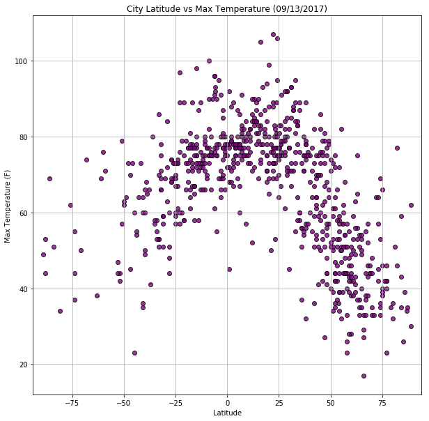

# WeatherPy

*  In the temperature chart below, it illustrates that, generally, places closer to the Equator, approximately 0-25 degrees latitude, have relatively higher temperatures than places farther from the Equator.

*  In the humidity chart below, it illustrates that the higher the latitude the more likely the higher the humidity. What does this mean?  I researched it and found that a reading of 100 percent relative humidity means that the air is totally saturated with water vapor and cannot hold any more, creating the possibility of rain.  The chart shows that between 50-75 latitude, % humidity is mostly higher.

*  While the tempeartues greatly vary as you move away from the equator, the wind speed stay relatively the same ragrdless of the distance away from the equator.  Wind speed is about 0 - 20 mph in all latitudes. 


```python
# longtiude (-180 - 180)
# latitude (-90 - 90)

# Dependencies
import numpy as np
import pandas as pd
import matplotlib.pyplot as plt
import requests as req
import time
import random
import sys
import math
from citipy import citipy
from datetime import datetime


# flag to run from file created or run from a new generated random numbers
#  True:  to run it from the csv file created
#  False: to create latitude and Longtitude file and call the api

runFromFile = False

outpath = "Resources"
keyfile = 'Keys.py'
latlong_filename = '%s/Locations' % (outpath)
reportDate = datetime.today()
logfilename = "%s/weatherpy_%s" % (outpath, datetime.strftime(reportDate,'%Y%m%d.%f'))

```


```python
def generate_random_data(radius, num_rows):    
    # longtiude (-180 - 180)
    # latitude (-90 - 90)
    
    counter = 0
    while counter < num_rows:
        lat = float(np.random.randint(-90, 90)) + np.random.randint(-90, 90)/radius
        lon = float(np.random.randint(-180, 180)) + np.random.randint(-180, 180)/radius    

        # find city name
        city = citipy.nearest_city(lat, lon)
        if city.city_name in City:
#             print("Duplicate:  Will Bypass %s" % city.city_name)
            continue
        else:
            counter += 1 
            City.append (city.city_name)
            Lon.append (lon)
            Lat.append (lat)

```

## Generate City List


```python
if not runFromFile:     
    nbrRows = 700
    # Earths radius
    earthRadius = 3959
    
    City = []
    Lon = []
    Lat = []
    
    print("Creating file: %s.csv" % latlong_filename)
    
    generate_random_data(earthRadius, nbrRows)
    locations_df = pd.DataFrame(
    {'City': City,
     'Lat': Lat,
     'Long': Lon
    }, columns=['City','Lat', 'Long'])

    #  create the city file list 
    locations_df.to_csv("%s.csv" % latlong_filename, index=False)
    locations_df
```

    Creating file: Resources/Locations.csv
    

## Perform API Calls


```python
if not runFromFile: 
    # Create blank columns for necessary fields
    locations_df["City Id"] = ""
    locations_df["Date"] = ""
    locations_df["Country"] = ""
    locations_df["Max Temp"] = 0
    locations_df["Humidity"] = 0
    locations_df["Cloudiness"] = 0
    locations_df["Wind Speed"] = 0


    # Counters
    row_count = 0
    rowsError = 0
    rowsRetrieved = 0
    
    # get key
    key_pd = pd.read_csv("%s" % (keyfile))
    wkey = key_pd[key_pd['Name']== 'wkey']['key'].max().strip()
#     print(wkey)
    
    fw = open("%s.log" % (logfilename), 'w', newline='\n')

    print("----------------------------------")    
    print("Data Retrieval Start")     
    print("----------------------------------")
    
    fw.write("----------------------------------\n")    
    fw.write("Data Retrieval Start\n")     
    fw.write("----------------------------------\n") 

    # Loop through and grab the lat/lng using Google maps
    for index, row in locations_df.iterrows():    
        # Create endpoint URL
        target_url = "https://api.openweathermap.org/data/2.5/weather?units=imperial&appid=%s&q=%s" % (wkey, row['City'])
    #     print(target_url)
        # Retrieve response in json format
        city_weather = req.get(target_url).json()

        row_count += 1
        try:        
            # Printing log to ensure loop is working correctly
            # get id and name of city
            print("%s Now retrieving city # %s: %s" % (row_count, city_weather['id'], row['City'] ))
            print("%s\n" % target_url)           
            
            fw.write("%s Now retrieving city # %s: %s\n" % (row_count, city_weather['id'], row['City'] ))
            fw.write("%s\n" % target_url)
            
            if (city_weather['cod'] == 200):            
                locations_df.set_value(index,"City Id", city_weather['id'])
                locations_df.set_value(index,"Date", city_weather['dt'])
                locations_df.set_value(index,"Country", city_weather['sys']['country'])
                locations_df.set_value(index,"Max Temp", city_weather['main']['temp'])
                locations_df.set_value(index,"Humidity", city_weather['main']['humidity'])
                locations_df.set_value(index,"Cloudiness", city_weather['clouds']['all'])
                locations_df.set_value(index,"Wind Speed", city_weather['wind']['speed'])
            else:
                locations_df.set_value(index,"City", "*****")
                print("%s ****** Error retrieving city %s - %s " % (row_count, row['City'], city_weather['message']))
                rowsError += 1
                
            rowsRetrieved += 1
            
            if (rowsRetrieved % 100) == 0:
                print("%s: Pausing a few minutes" % time.ctime())
                time.sleep(70)
                print("%s: End pause\n" % time.ctime())                
                
        except:
            print("%s ****** Missing City %s" % (row_count, row['City']))
            rowsError += 1

    print("----------------------------------")    
    print("Data Retrieval Complete")
    print("Total records retrieved: %s" % rowsRetrieved)
    print("Total records in error: %s" % rowsError)
    print("----------------------------------")
    
    fw.write("----------------------------------\n")    
    fw.write("Data Retrieval Complete\n")
    fw.write("Total records retrieved: %s\n" % rowsRetrieved)
    fw.write("Total records in error: %s\n" % rowsError)
    fw.write("----------------------------------\n")
    fw.close()

    #  create the csv that is the one used for this project
    locations_df.to_csv("%s_final.csv" % latlong_filename, index=False)
else:
    # read the random latitude and longtitude
    print("Reading from file: %s_final.csv" % (latlong_filename))
    locations_pd = pd.read_csv("%s_final.csv" % (latlong_filename))
    locations_df = pd.DataFrame(locations_pd)
    
locations_df = locations_df[locations_df['City'] != '****']
locations_df.head()

```

    ----------------------------------
    Data Retrieval Start
    ----------------------------------
    1 Now retrieving city # 3652764: puerto ayora
    https://api.openweathermap.org/data/2.5/weather?units=imperial&appid=77004d160b3009ad5c5fef5b50e2c32e&q=puerto ayora
    
    2 Now retrieving city # 3443061: chuy
    https://api.openweathermap.org/data/2.5/weather?units=imperial&appid=77004d160b3009ad5c5fef5b50e2c32e&q=chuy
    
    3 Now retrieving city # 1528998: yumen
    https://api.openweathermap.org/data/2.5/weather?units=imperial&appid=77004d160b3009ad5c5fef5b50e2c32e&q=yumen
    
    4 Now retrieving city # 1646443: palabuhanratu
    https://api.openweathermap.org/data/2.5/weather?units=imperial&appid=77004d160b3009ad5c5fef5b50e2c32e&q=palabuhanratu
    
    5 Now retrieving city # 3874787: punta arenas
    https://api.openweathermap.org/data/2.5/weather?units=imperial&appid=77004d160b3009ad5c5fef5b50e2c32e&q=punta arenas
    
    6 Now retrieving city # 3833367: ushuaia
    https://api.openweathermap.org/data/2.5/weather?units=imperial&appid=77004d160b3009ad5c5fef5b50e2c32e&q=ushuaia
    
    7 Now retrieving city # 5354943: half moon bay
    https://api.openweathermap.org/data/2.5/weather?units=imperial&appid=77004d160b3009ad5c5fef5b50e2c32e&q=half moon bay
    
    8 Now retrieving city # 1634614: nabire
    https://api.openweathermap.org/data/2.5/weather?units=imperial&appid=77004d160b3009ad5c5fef5b50e2c32e&q=nabire
    
    9 Now retrieving city # 5880054: barrow
    https://api.openweathermap.org/data/2.5/weather?units=imperial&appid=77004d160b3009ad5c5fef5b50e2c32e&q=barrow
    
    10 Now retrieving city # 5106834: albany
    https://api.openweathermap.org/data/2.5/weather?units=imperial&appid=77004d160b3009ad5c5fef5b50e2c32e&q=albany
    
    11 Now retrieving city # 2075265: busselton
    https://api.openweathermap.org/data/2.5/weather?units=imperial&appid=77004d160b3009ad5c5fef5b50e2c32e&q=busselton
    
    12 Now retrieving city # 128321: kazerun
    https://api.openweathermap.org/data/2.5/weather?units=imperial&appid=77004d160b3009ad5c5fef5b50e2c32e&q=kazerun
    
    13 Now retrieving city # 4035715: avarua
    https://api.openweathermap.org/data/2.5/weather?units=imperial&appid=77004d160b3009ad5c5fef5b50e2c32e&q=avarua
    
    14 Now retrieving city # 5282297: bethel
    https://api.openweathermap.org/data/2.5/weather?units=imperial&appid=77004d160b3009ad5c5fef5b50e2c32e&q=bethel
    
    15 Now retrieving city # 5554072: juneau
    https://api.openweathermap.org/data/2.5/weather?units=imperial&appid=77004d160b3009ad5c5fef5b50e2c32e&q=juneau
    
    16 Now retrieving city # 1634718: muncar
    https://api.openweathermap.org/data/2.5/weather?units=imperial&appid=77004d160b3009ad5c5fef5b50e2c32e&q=muncar
    
    17 Now retrieving city # 2514651: los llanos de aridane
    https://api.openweathermap.org/data/2.5/weather?units=imperial&appid=77004d160b3009ad5c5fef5b50e2c32e&q=los llanos de aridane
    
    18 Now retrieving city # 3430863: mar del plata
    https://api.openweathermap.org/data/2.5/weather?units=imperial&appid=77004d160b3009ad5c5fef5b50e2c32e&q=mar del plata
    
    19 Now retrieving city # 918905: chinsali
    https://api.openweathermap.org/data/2.5/weather?units=imperial&appid=77004d160b3009ad5c5fef5b50e2c32e&q=chinsali
    
    20 Now retrieving city # 1257771: saiha
    https://api.openweathermap.org/data/2.5/weather?units=imperial&appid=77004d160b3009ad5c5fef5b50e2c32e&q=saiha
    
    21 Now retrieving city # 2120048: khonuu
    https://api.openweathermap.org/data/2.5/weather?units=imperial&appid=77004d160b3009ad5c5fef5b50e2c32e&q=khonuu
    
    22 Now retrieving city # 3466704: castro
    https://api.openweathermap.org/data/2.5/weather?units=imperial&appid=77004d160b3009ad5c5fef5b50e2c32e&q=castro
    
    23 Now retrieving city # 3378644: georgetown
    https://api.openweathermap.org/data/2.5/weather?units=imperial&appid=77004d160b3009ad5c5fef5b50e2c32e&q=georgetown
    
    24 Now retrieving city # 2112309: katsuura
    https://api.openweathermap.org/data/2.5/weather?units=imperial&appid=77004d160b3009ad5c5fef5b50e2c32e&q=katsuura
    
    25 Now retrieving city # 6170031: tuktoyaktuk
    https://api.openweathermap.org/data/2.5/weather?units=imperial&appid=77004d160b3009ad5c5fef5b50e2c32e&q=tuktoyaktuk
    
    26 Now retrieving city # 1507390: dikson
    https://api.openweathermap.org/data/2.5/weather?units=imperial&appid=77004d160b3009ad5c5fef5b50e2c32e&q=dikson
    
    27 Now retrieving city # 3421719: narsaq
    https://api.openweathermap.org/data/2.5/weather?units=imperial&appid=77004d160b3009ad5c5fef5b50e2c32e&q=narsaq
    
    28 Now retrieving city # 2126123: chokurdakh
    https://api.openweathermap.org/data/2.5/weather?units=imperial&appid=77004d160b3009ad5c5fef5b50e2c32e&q=chokurdakh
    
    29 Now retrieving city # 541826: nikolskoye
    https://api.openweathermap.org/data/2.5/weather?units=imperial&appid=77004d160b3009ad5c5fef5b50e2c32e&q=nikolskoye
    
    30 Now retrieving city # 797213: pervomayskoye
    https://api.openweathermap.org/data/2.5/weather?units=imperial&appid=77004d160b3009ad5c5fef5b50e2c32e&q=pervomayskoye
    
    31 Now retrieving city # 1487762: belushya guba
    https://api.openweathermap.org/data/2.5/weather?units=imperial&appid=77004d160b3009ad5c5fef5b50e2c32e&q=belushya guba
    
    32 Now retrieving city # 933995: souillac
    https://api.openweathermap.org/data/2.5/weather?units=imperial&appid=77004d160b3009ad5c5fef5b50e2c32e&q=souillac
    
    33 Now retrieving city # 3831208: qaanaaq
    https://api.openweathermap.org/data/2.5/weather?units=imperial&appid=77004d160b3009ad5c5fef5b50e2c32e&q=qaanaaq
    
    34 Now retrieving city # 934322: mahebourg
    https://api.openweathermap.org/data/2.5/weather?units=imperial&appid=77004d160b3009ad5c5fef5b50e2c32e&q=mahebourg
    
    35 Now retrieving city # 1106677: bambous virieux
    https://api.openweathermap.org/data/2.5/weather?units=imperial&appid=77004d160b3009ad5c5fef5b50e2c32e&q=bambous virieux
    
    36 Now retrieving city # 3347939: lobito
    https://api.openweathermap.org/data/2.5/weather?units=imperial&appid=77004d160b3009ad5c5fef5b50e2c32e&q=lobito
    
    37 Now retrieving city # 2163355: hobart
    https://api.openweathermap.org/data/2.5/weather?units=imperial&appid=77004d160b3009ad5c5fef5b50e2c32e&q=hobart
    
    38 Now retrieving city # 2952767: barentsburg
    https://api.openweathermap.org/data/2.5/weather?units=imperial&appid=77004d160b3009ad5c5fef5b50e2c32e&q=barentsburg
    
    39 Now retrieving city # 4030556: rikitea
    https://api.openweathermap.org/data/2.5/weather?units=imperial&appid=77004d160b3009ad5c5fef5b50e2c32e&q=rikitea
    
    40 Now retrieving city # 3466980: caravelas
    https://api.openweathermap.org/data/2.5/weather?units=imperial&appid=77004d160b3009ad5c5fef5b50e2c32e&q=caravelas
    
    41 Now retrieving city # 5122534: jamestown
    https://api.openweathermap.org/data/2.5/weather?units=imperial&appid=77004d160b3009ad5c5fef5b50e2c32e&q=jamestown
    
    42 Now retrieving city # 2119283: zyryanka
    https://api.openweathermap.org/data/2.5/weather?units=imperial&appid=77004d160b3009ad5c5fef5b50e2c32e&q=zyryanka
    
    43 Now retrieving city # 2022572: khatanga
    https://api.openweathermap.org/data/2.5/weather?units=imperial&appid=77004d160b3009ad5c5fef5b50e2c32e&q=khatanga
    
    44 Now retrieving city # 2394560: djougou
    https://api.openweathermap.org/data/2.5/weather?units=imperial&appid=77004d160b3009ad5c5fef5b50e2c32e&q=djougou
    
    45 Now retrieving city # 139816: khormuj
    https://api.openweathermap.org/data/2.5/weather?units=imperial&appid=77004d160b3009ad5c5fef5b50e2c32e&q=khormuj
    
    46 Now retrieving city # 5848280: kapaa
    https://api.openweathermap.org/data/2.5/weather?units=imperial&appid=77004d160b3009ad5c5fef5b50e2c32e&q=kapaa
    
    47 Now retrieving city # 1701054: marawi
    https://api.openweathermap.org/data/2.5/weather?units=imperial&appid=77004d160b3009ad5c5fef5b50e2c32e&q=marawi
    
    48 Now retrieving city # 6545158: illoqqortoormiut
    https://api.openweathermap.org/data/2.5/weather?units=imperial&appid=77004d160b3009ad5c5fef5b50e2c32e&q=illoqqortoormiut
    
    49 Now retrieving city # 2064735: nhulunbuy
    https://api.openweathermap.org/data/2.5/weather?units=imperial&appid=77004d160b3009ad5c5fef5b50e2c32e&q=nhulunbuy
    
    50 Now retrieving city # 780687: berlevag
    https://api.openweathermap.org/data/2.5/weather?units=imperial&appid=77004d160b3009ad5c5fef5b50e2c32e&q=berlevag
    
    51 Now retrieving city # 3585438: jiquilisco
    https://api.openweathermap.org/data/2.5/weather?units=imperial&appid=77004d160b3009ad5c5fef5b50e2c32e&q=jiquilisco
    
    52 Now retrieving city # 5989520: attawapiskat
    https://api.openweathermap.org/data/2.5/weather?units=imperial&appid=77004d160b3009ad5c5fef5b50e2c32e&q=attawapiskat
    
    53 Now retrieving city # 2015306: tiksi
    https://api.openweathermap.org/data/2.5/weather?units=imperial&appid=77004d160b3009ad5c5fef5b50e2c32e&q=tiksi
    
    54 Now retrieving city # 6165875: three hills
    https://api.openweathermap.org/data/2.5/weather?units=imperial&appid=77004d160b3009ad5c5fef5b50e2c32e&q=three hills
    
    55 Now retrieving city # 2110227: butaritari
    https://api.openweathermap.org/data/2.5/weather?units=imperial&appid=77004d160b3009ad5c5fef5b50e2c32e&q=butaritari
    
    56 Now retrieving city # 1078317: taolanaro
    https://api.openweathermap.org/data/2.5/weather?units=imperial&appid=77004d160b3009ad5c5fef5b50e2c32e&q=taolanaro
    
    57 Now retrieving city # 6174041: victoria
    https://api.openweathermap.org/data/2.5/weather?units=imperial&appid=77004d160b3009ad5c5fef5b50e2c32e&q=victoria
    
    58 Now retrieving city # 2618795: klaksvik
    https://api.openweathermap.org/data/2.5/weather?units=imperial&appid=77004d160b3009ad5c5fef5b50e2c32e&q=klaksvik
    
    59 Now retrieving city # 2122293: ozernovskiy
    https://api.openweathermap.org/data/2.5/weather?units=imperial&appid=77004d160b3009ad5c5fef5b50e2c32e&q=ozernovskiy
    
    60 Now retrieving city # 1129516: qarqin
    https://api.openweathermap.org/data/2.5/weather?units=imperial&appid=77004d160b3009ad5c5fef5b50e2c32e&q=qarqin
    
    61 Now retrieving city # 3470137: belmonte
    https://api.openweathermap.org/data/2.5/weather?units=imperial&appid=77004d160b3009ad5c5fef5b50e2c32e&q=belmonte
    
    62 Now retrieving city # 5969025: haines junction
    https://api.openweathermap.org/data/2.5/weather?units=imperial&appid=77004d160b3009ad5c5fef5b50e2c32e&q=haines junction
    
    63 Now retrieving city # 3380290: sinnamary
    https://api.openweathermap.org/data/2.5/weather?units=imperial&appid=77004d160b3009ad5c5fef5b50e2c32e&q=sinnamary
    
    64 Now retrieving city # 3366880: hermanus
    https://api.openweathermap.org/data/2.5/weather?units=imperial&appid=77004d160b3009ad5c5fef5b50e2c32e&q=hermanus
    
    65 Now retrieving city # 2019135: nizhniy kuranakh
    https://api.openweathermap.org/data/2.5/weather?units=imperial&appid=77004d160b3009ad5c5fef5b50e2c32e&q=nizhniy kuranakh
    
    66 Now retrieving city # 3355672: luderitz
    https://api.openweathermap.org/data/2.5/weather?units=imperial&appid=77004d160b3009ad5c5fef5b50e2c32e&q=luderitz
    
    67 Now retrieving city # 1268011: kannauj
    https://api.openweathermap.org/data/2.5/weather?units=imperial&appid=77004d160b3009ad5c5fef5b50e2c32e&q=kannauj
    
    68 Now retrieving city # 3939761: hualmay
    https://api.openweathermap.org/data/2.5/weather?units=imperial&appid=77004d160b3009ad5c5fef5b50e2c32e&q=hualmay
    
    69 Now retrieving city # 1696899: tabiauea
    https://api.openweathermap.org/data/2.5/weather?units=imperial&appid=77004d160b3009ad5c5fef5b50e2c32e&q=tabiauea
    
    70 Now retrieving city # 1054500: tsihombe
    https://api.openweathermap.org/data/2.5/weather?units=imperial&appid=77004d160b3009ad5c5fef5b50e2c32e&q=tsihombe
    
    71 Now retrieving city # 2986626: plouzane
    https://api.openweathermap.org/data/2.5/weather?units=imperial&appid=77004d160b3009ad5c5fef5b50e2c32e&q=plouzane
    
    72 Now retrieving city # 3033123: besancon
    https://api.openweathermap.org/data/2.5/weather?units=imperial&appid=77004d160b3009ad5c5fef5b50e2c32e&q=besancon
    
    73 Now retrieving city # 1328421: pathein
    https://api.openweathermap.org/data/2.5/weather?units=imperial&appid=77004d160b3009ad5c5fef5b50e2c32e&q=pathein
    
    74 Now retrieving city # 5855927: hilo
    https://api.openweathermap.org/data/2.5/weather?units=imperial&appid=77004d160b3009ad5c5fef5b50e2c32e&q=hilo
    
    75 Now retrieving city # 580420: atkarsk
    https://api.openweathermap.org/data/2.5/weather?units=imperial&appid=77004d160b3009ad5c5fef5b50e2c32e&q=atkarsk
    
    76 Now retrieving city # 1015776: bredasdorp
    https://api.openweathermap.org/data/2.5/weather?units=imperial&appid=77004d160b3009ad5c5fef5b50e2c32e&q=bredasdorp
    
    77 Now retrieving city # 2088122: port moresby
    https://api.openweathermap.org/data/2.5/weather?units=imperial&appid=77004d160b3009ad5c5fef5b50e2c32e&q=port moresby
    
    78 Now retrieving city # 4020109: atuona
    https://api.openweathermap.org/data/2.5/weather?units=imperial&appid=77004d160b3009ad5c5fef5b50e2c32e&q=atuona
    
    79 Now retrieving city # 286621: salalah
    https://api.openweathermap.org/data/2.5/weather?units=imperial&appid=77004d160b3009ad5c5fef5b50e2c32e&q=salalah
    
    80 Now retrieving city # 1180729: dalbandin
    https://api.openweathermap.org/data/2.5/weather?units=imperial&appid=77004d160b3009ad5c5fef5b50e2c32e&q=dalbandin
    
    81 Now retrieving city # 8079926: labuhan
    https://api.openweathermap.org/data/2.5/weather?units=imperial&appid=77004d160b3009ad5c5fef5b50e2c32e&q=labuhan
    
    82 Now retrieving city # 964712: plettenberg bay
    https://api.openweathermap.org/data/2.5/weather?units=imperial&appid=77004d160b3009ad5c5fef5b50e2c32e&q=plettenberg bay
    
    83 Now retrieving city # 6089245: norman wells
    https://api.openweathermap.org/data/2.5/weather?units=imperial&appid=77004d160b3009ad5c5fef5b50e2c32e&q=norman wells
    
    84 Now retrieving city # 2388720: boali
    https://api.openweathermap.org/data/2.5/weather?units=imperial&appid=77004d160b3009ad5c5fef5b50e2c32e&q=boali
    
    85 Now retrieving city # 1835848: seoul
    https://api.openweathermap.org/data/2.5/weather?units=imperial&appid=77004d160b3009ad5c5fef5b50e2c32e&q=seoul
    
    86 Now retrieving city # 3894426: coihaique
    https://api.openweathermap.org/data/2.5/weather?units=imperial&appid=77004d160b3009ad5c5fef5b50e2c32e&q=coihaique
    
    87 Now retrieving city # 2013279: vostok
    https://api.openweathermap.org/data/2.5/weather?units=imperial&appid=77004d160b3009ad5c5fef5b50e2c32e&q=vostok
    
    88 Now retrieving city # 2033934: xiaoshi
    https://api.openweathermap.org/data/2.5/weather?units=imperial&appid=77004d160b3009ad5c5fef5b50e2c32e&q=xiaoshi
    
    89 Now retrieving city # 2475475: tuggurt
    https://api.openweathermap.org/data/2.5/weather?units=imperial&appid=77004d160b3009ad5c5fef5b50e2c32e&q=tuggurt
    
    90 Now retrieving city # 2136825: isangel
    https://api.openweathermap.org/data/2.5/weather?units=imperial&appid=77004d160b3009ad5c5fef5b50e2c32e&q=isangel
    
    91 Now retrieving city # 1081530: ambodifototra
    https://api.openweathermap.org/data/2.5/weather?units=imperial&appid=77004d160b3009ad5c5fef5b50e2c32e&q=ambodifototra
    
    92 Now retrieving city # 2427455: moindou
    https://api.openweathermap.org/data/2.5/weather?units=imperial&appid=77004d160b3009ad5c5fef5b50e2c32e&q=moindou
    
    93 Now retrieving city # 6165406: thompson
    https://api.openweathermap.org/data/2.5/weather?units=imperial&appid=77004d160b3009ad5c5fef5b50e2c32e&q=thompson
    
    94 Now retrieving city # 2422465: conakry
    https://api.openweathermap.org/data/2.5/weather?units=imperial&appid=77004d160b3009ad5c5fef5b50e2c32e&q=conakry
    
    95 Now retrieving city # 935215: saint-philippe
    https://api.openweathermap.org/data/2.5/weather?units=imperial&appid=77004d160b3009ad5c5fef5b50e2c32e&q=saint-philippe
    
    96 Now retrieving city # 6696686: sentyabrskiy
    https://api.openweathermap.org/data/2.5/weather?units=imperial&appid=77004d160b3009ad5c5fef5b50e2c32e&q=sentyabrskiy
    
    97 Now retrieving city # 4034551: faanui
    https://api.openweathermap.org/data/2.5/weather?units=imperial&appid=77004d160b3009ad5c5fef5b50e2c32e&q=faanui
    
    98 Now retrieving city # 3369157: cape town
    https://api.openweathermap.org/data/2.5/weather?units=imperial&appid=77004d160b3009ad5c5fef5b50e2c32e&q=cape town
    
    99 Now retrieving city # 2156643: mount gambier
    https://api.openweathermap.org/data/2.5/weather?units=imperial&appid=77004d160b3009ad5c5fef5b50e2c32e&q=mount gambier
    
    100 Now retrieving city # 2206939: bluff
    https://api.openweathermap.org/data/2.5/weather?units=imperial&appid=77004d160b3009ad5c5fef5b50e2c32e&q=bluff
    
    Wed Sep 13 14:28:27 2017: Pausing a few minutes
    Wed Sep 13 14:29:37 2017: End pause
    
    101 Now retrieving city # 2313084: mangai
    https://api.openweathermap.org/data/2.5/weather?units=imperial&appid=77004d160b3009ad5c5fef5b50e2c32e&q=mangai
    
    102 Now retrieving city # 2108502: honiara
    https://api.openweathermap.org/data/2.5/weather?units=imperial&appid=77004d160b3009ad5c5fef5b50e2c32e&q=honiara
    
    103 Now retrieving city # 6111862: port hardy
    https://api.openweathermap.org/data/2.5/weather?units=imperial&appid=77004d160b3009ad5c5fef5b50e2c32e&q=port hardy
    
    104 Now retrieving city # 3181864: bordighera
    https://api.openweathermap.org/data/2.5/weather?units=imperial&appid=77004d160b3009ad5c5fef5b50e2c32e&q=bordighera
    
    105 Now retrieving city # 3393692: itarema
    https://api.openweathermap.org/data/2.5/weather?units=imperial&appid=77004d160b3009ad5c5fef5b50e2c32e&q=itarema
    
    106 Now retrieving city # 539233: kumukh
    https://api.openweathermap.org/data/2.5/weather?units=imperial&appid=77004d160b3009ad5c5fef5b50e2c32e&q=kumukh
    
    107 Now retrieving city # 2122574: ola
    https://api.openweathermap.org/data/2.5/weather?units=imperial&appid=77004d160b3009ad5c5fef5b50e2c32e&q=ola
    
    108 Now retrieving city # 1493756: yuzhno-yeniseyskiy
    https://api.openweathermap.org/data/2.5/weather?units=imperial&appid=77004d160b3009ad5c5fef5b50e2c32e&q=yuzhno-yeniseyskiy
    
    109 Now retrieving city # 2121385: severo-kurilsk
    https://api.openweathermap.org/data/2.5/weather?units=imperial&appid=77004d160b3009ad5c5fef5b50e2c32e&q=severo-kurilsk
    
    110 Now retrieving city # 2654970: brae
    https://api.openweathermap.org/data/2.5/weather?units=imperial&appid=77004d160b3009ad5c5fef5b50e2c32e&q=brae
    
    111 Now retrieving city # 5972291: havre-saint-pierre
    https://api.openweathermap.org/data/2.5/weather?units=imperial&appid=77004d160b3009ad5c5fef5b50e2c32e&q=havre-saint-pierre
    
    112 Now retrieving city # 3461425: ilhabela
    https://api.openweathermap.org/data/2.5/weather?units=imperial&appid=77004d160b3009ad5c5fef5b50e2c32e&q=ilhabela
    
    113 Now retrieving city # 1064275: ihosy
    https://api.openweathermap.org/data/2.5/weather?units=imperial&appid=77004d160b3009ad5c5fef5b50e2c32e&q=ihosy
    
    114 Now retrieving city # 3929520: marcona
    https://api.openweathermap.org/data/2.5/weather?units=imperial&appid=77004d160b3009ad5c5fef5b50e2c32e&q=marcona
    
    115 Now retrieving city # 1106643: quatre cocos
    https://api.openweathermap.org/data/2.5/weather?units=imperial&appid=77004d160b3009ad5c5fef5b50e2c32e&q=quatre cocos
    
    116 Now retrieving city # 1649150: bengkulu
    https://api.openweathermap.org/data/2.5/weather?units=imperial&appid=77004d160b3009ad5c5fef5b50e2c32e&q=bengkulu
    
    117 Now retrieving city # 3414079: olafsvik
    https://api.openweathermap.org/data/2.5/weather?units=imperial&appid=77004d160b3009ad5c5fef5b50e2c32e&q=olafsvik
    
    118 Now retrieving city # 64814: bandarbeyla
    https://api.openweathermap.org/data/2.5/weather?units=imperial&appid=77004d160b3009ad5c5fef5b50e2c32e&q=bandarbeyla
    
    119 Now retrieving city # 698570: zolotinka
    https://api.openweathermap.org/data/2.5/weather?units=imperial&appid=77004d160b3009ad5c5fef5b50e2c32e&q=zolotinka
    
    120 Now retrieving city # 5866583: kodiak
    https://api.openweathermap.org/data/2.5/weather?units=imperial&appid=77004d160b3009ad5c5fef5b50e2c32e&q=kodiak
    
    121 Now retrieving city # 3464008: esmeraldas
    https://api.openweathermap.org/data/2.5/weather?units=imperial&appid=77004d160b3009ad5c5fef5b50e2c32e&q=esmeraldas
    
    122 Now retrieving city # 2012530: zhigansk
    https://api.openweathermap.org/data/2.5/weather?units=imperial&appid=77004d160b3009ad5c5fef5b50e2c32e&q=zhigansk
    
    123 Now retrieving city # 779350: karasjok
    https://api.openweathermap.org/data/2.5/weather?units=imperial&appid=77004d160b3009ad5c5fef5b50e2c32e&q=karasjok
    
    124 Now retrieving city # 3415720: hvolsvollur
    https://api.openweathermap.org/data/2.5/weather?units=imperial&appid=77004d160b3009ad5c5fef5b50e2c32e&q=hvolsvollur
    
    125 Now retrieving city # 1501365: kupino
    https://api.openweathermap.org/data/2.5/weather?units=imperial&appid=77004d160b3009ad5c5fef5b50e2c32e&q=kupino
    
    126 Now retrieving city # 3610139: el terrero
    https://api.openweathermap.org/data/2.5/weather?units=imperial&appid=77004d160b3009ad5c5fef5b50e2c32e&q=el terrero
    
    127 Now retrieving city # 1591474: bac lieu
    https://api.openweathermap.org/data/2.5/weather?units=imperial&appid=77004d160b3009ad5c5fef5b50e2c32e&q=bac lieu
    
    128 Now retrieving city # 2094027: kieta
    https://api.openweathermap.org/data/2.5/weather?units=imperial&appid=77004d160b3009ad5c5fef5b50e2c32e&q=kieta
    
    129 Now retrieving city # 1811260: fengrun
    https://api.openweathermap.org/data/2.5/weather?units=imperial&appid=77004d160b3009ad5c5fef5b50e2c32e&q=fengrun
    
    130 Now retrieving city # 2108857: gizo
    https://api.openweathermap.org/data/2.5/weather?units=imperial&appid=77004d160b3009ad5c5fef5b50e2c32e&q=gizo
    
    131 Now retrieving city # 2012484: zima
    https://api.openweathermap.org/data/2.5/weather?units=imperial&appid=77004d160b3009ad5c5fef5b50e2c32e&q=zima
    
    132 Now retrieving city # 3985168: san patricio
    https://api.openweathermap.org/data/2.5/weather?units=imperial&appid=77004d160b3009ad5c5fef5b50e2c32e&q=san patricio
    
    133 Now retrieving city # 1213855: sibolga
    https://api.openweathermap.org/data/2.5/weather?units=imperial&appid=77004d160b3009ad5c5fef5b50e2c32e&q=sibolga
    
    134 Now retrieving city # 1263364: mataura
    https://api.openweathermap.org/data/2.5/weather?units=imperial&appid=77004d160b3009ad5c5fef5b50e2c32e&q=mataura
    
    135 Now retrieving city # 5949601: eston
    https://api.openweathermap.org/data/2.5/weather?units=imperial&appid=77004d160b3009ad5c5fef5b50e2c32e&q=eston
    
    136 Now retrieving city # 2171099: codrington
    https://api.openweathermap.org/data/2.5/weather?units=imperial&appid=77004d160b3009ad5c5fef5b50e2c32e&q=codrington
    
    137 Now retrieving city # 1267758: karimganj
    https://api.openweathermap.org/data/2.5/weather?units=imperial&appid=77004d160b3009ad5c5fef5b50e2c32e&q=karimganj
    
    138 Now retrieving city # 3451138: rio grande
    https://api.openweathermap.org/data/2.5/weather?units=imperial&appid=77004d160b3009ad5c5fef5b50e2c32e&q=rio grande
    
    139 Now retrieving city # 3522459: ocotitlan
    https://api.openweathermap.org/data/2.5/weather?units=imperial&appid=77004d160b3009ad5c5fef5b50e2c32e&q=ocotitlan
    
    140 Now retrieving city # 2173911: broken hill
    https://api.openweathermap.org/data/2.5/weather?units=imperial&appid=77004d160b3009ad5c5fef5b50e2c32e&q=broken hill
    
    141 Now retrieving city # 783214: fushe-arrez
    https://api.openweathermap.org/data/2.5/weather?units=imperial&appid=77004d160b3009ad5c5fef5b50e2c32e&q=fushe-arrez
    
    142 Now retrieving city # 5975004: high level
    https://api.openweathermap.org/data/2.5/weather?units=imperial&appid=77004d160b3009ad5c5fef5b50e2c32e&q=high level
    
    143 Now retrieving city # 1257093: sarwar
    https://api.openweathermap.org/data/2.5/weather?units=imperial&appid=77004d160b3009ad5c5fef5b50e2c32e&q=sarwar
    
    144 Now retrieving city # 3453014: porangatu
    https://api.openweathermap.org/data/2.5/weather?units=imperial&appid=77004d160b3009ad5c5fef5b50e2c32e&q=porangatu
    
    145 Now retrieving city # 934475: grand river south east
    https://api.openweathermap.org/data/2.5/weather?units=imperial&appid=77004d160b3009ad5c5fef5b50e2c32e&q=grand river south east
    
    146 Now retrieving city # 7020913: vaitupu
    https://api.openweathermap.org/data/2.5/weather?units=imperial&appid=77004d160b3009ad5c5fef5b50e2c32e&q=vaitupu
    
    147 Now retrieving city # 3670218: san andres
    https://api.openweathermap.org/data/2.5/weather?units=imperial&appid=77004d160b3009ad5c5fef5b50e2c32e&q=san andres
    
    148 Now retrieving city # 5746545: portland
    https://api.openweathermap.org/data/2.5/weather?units=imperial&appid=77004d160b3009ad5c5fef5b50e2c32e&q=portland
    
    149 Now retrieving city # 1082243: ambilobe
    https://api.openweathermap.org/data/2.5/weather?units=imperial&appid=77004d160b3009ad5c5fef5b50e2c32e&q=ambilobe
    
    150 Now retrieving city # 6137462: saint-augustin
    https://api.openweathermap.org/data/2.5/weather?units=imperial&appid=77004d160b3009ad5c5fef5b50e2c32e&q=saint-augustin
    
    151 Now retrieving city # 2206874: waipawa
    https://api.openweathermap.org/data/2.5/weather?units=imperial&appid=77004d160b3009ad5c5fef5b50e2c32e&q=waipawa
    
    152 Now retrieving city # 6145951: shellbrook
    https://api.openweathermap.org/data/2.5/weather?units=imperial&appid=77004d160b3009ad5c5fef5b50e2c32e&q=shellbrook
    
    153 Now retrieving city # 3374210: sao filipe
    https://api.openweathermap.org/data/2.5/weather?units=imperial&appid=77004d160b3009ad5c5fef5b50e2c32e&q=sao filipe
    
    154 Now retrieving city # 2122090: pevek
    https://api.openweathermap.org/data/2.5/weather?units=imperial&appid=77004d160b3009ad5c5fef5b50e2c32e&q=pevek
    
    155 Now retrieving city # 737021: zonguldak
    https://api.openweathermap.org/data/2.5/weather?units=imperial&appid=77004d160b3009ad5c5fef5b50e2c32e&q=zonguldak
    
    156 Now retrieving city # 5563839: fortuna
    https://api.openweathermap.org/data/2.5/weather?units=imperial&appid=77004d160b3009ad5c5fef5b50e2c32e&q=fortuna
    
    157 Now retrieving city # 1636308: manokwari
    https://api.openweathermap.org/data/2.5/weather?units=imperial&appid=77004d160b3009ad5c5fef5b50e2c32e&q=manokwari
    
    158 Now retrieving city # 1798760: pingliang
    https://api.openweathermap.org/data/2.5/weather?units=imperial&appid=77004d160b3009ad5c5fef5b50e2c32e&q=pingliang
    
    159 Now retrieving city # 964432: port alfred
    https://api.openweathermap.org/data/2.5/weather?units=imperial&appid=77004d160b3009ad5c5fef5b50e2c32e&q=port alfred
    
    160 Now retrieving city # 3441273: paso de los toros
    https://api.openweathermap.org/data/2.5/weather?units=imperial&appid=77004d160b3009ad5c5fef5b50e2c32e&q=paso de los toros
    
    161 Now retrieving city # 5530022: san angelo
    https://api.openweathermap.org/data/2.5/weather?units=imperial&appid=77004d160b3009ad5c5fef5b50e2c32e&q=san angelo
    
    162 Now retrieving city # 946973: tzaneen
    https://api.openweathermap.org/data/2.5/weather?units=imperial&appid=77004d160b3009ad5c5fef5b50e2c32e&q=tzaneen
    
    163 Now retrieving city # 215605: kabare
    https://api.openweathermap.org/data/2.5/weather?units=imperial&appid=77004d160b3009ad5c5fef5b50e2c32e&q=kabare
    
    164 Now retrieving city # 486645: sukhobezvodnoye
    https://api.openweathermap.org/data/2.5/weather?units=imperial&appid=77004d160b3009ad5c5fef5b50e2c32e&q=sukhobezvodnoye
    
    165 Now retrieving city # 105299: jizan
    https://api.openweathermap.org/data/2.5/weather?units=imperial&appid=77004d160b3009ad5c5fef5b50e2c32e&q=jizan
    
    166 Now retrieving city # 3671450: inirida
    https://api.openweathermap.org/data/2.5/weather?units=imperial&appid=77004d160b3009ad5c5fef5b50e2c32e&q=inirida
    
    167 Now retrieving city # 3359638: walvis bay
    https://api.openweathermap.org/data/2.5/weather?units=imperial&appid=77004d160b3009ad5c5fef5b50e2c32e&q=walvis bay
    
    168 Now retrieving city # 4278471: russell
    https://api.openweathermap.org/data/2.5/weather?units=imperial&appid=77004d160b3009ad5c5fef5b50e2c32e&q=russell
    
    169 Now retrieving city # 87205: darnah
    https://api.openweathermap.org/data/2.5/weather?units=imperial&appid=77004d160b3009ad5c5fef5b50e2c32e&q=darnah
    
    170 Now retrieving city # 2112802: hasaki
    https://api.openweathermap.org/data/2.5/weather?units=imperial&appid=77004d160b3009ad5c5fef5b50e2c32e&q=hasaki
    
    171 Now retrieving city # 2129324: makubetsu
    https://api.openweathermap.org/data/2.5/weather?units=imperial&appid=77004d160b3009ad5c5fef5b50e2c32e&q=makubetsu
    
    172 Now retrieving city # 2071860: esperance
    https://api.openweathermap.org/data/2.5/weather?units=imperial&appid=77004d160b3009ad5c5fef5b50e2c32e&q=esperance
    
    173 Now retrieving city # 3576994: cockburn town
    https://api.openweathermap.org/data/2.5/weather?units=imperial&appid=77004d160b3009ad5c5fef5b50e2c32e&q=cockburn town
    
    174 Now retrieving city # 2264557: ponta do sol
    https://api.openweathermap.org/data/2.5/weather?units=imperial&appid=77004d160b3009ad5c5fef5b50e2c32e&q=ponta do sol
    
    175 Now retrieving city # 3471451: arraial do cabo
    https://api.openweathermap.org/data/2.5/weather?units=imperial&appid=77004d160b3009ad5c5fef5b50e2c32e&q=arraial do cabo
    
    176 Now retrieving city # 101312: turayf
    https://api.openweathermap.org/data/2.5/weather?units=imperial&appid=77004d160b3009ad5c5fef5b50e2c32e&q=turayf
    
    177 Now retrieving city # 480876: tsimlyansk
    https://api.openweathermap.org/data/2.5/weather?units=imperial&appid=77004d160b3009ad5c5fef5b50e2c32e&q=tsimlyansk
    
    178 Now retrieving city # 3400920: elesbao veloso
    https://api.openweathermap.org/data/2.5/weather?units=imperial&appid=77004d160b3009ad5c5fef5b50e2c32e&q=elesbao veloso
    
    179 Now retrieving city # 1630662: praya
    https://api.openweathermap.org/data/2.5/weather?units=imperial&appid=77004d160b3009ad5c5fef5b50e2c32e&q=praya
    
    180 Now retrieving city # 1626895: sinjah
    https://api.openweathermap.org/data/2.5/weather?units=imperial&appid=77004d160b3009ad5c5fef5b50e2c32e&q=sinjah
    
    181 Now retrieving city # 4026082: lazaro cardenas
    https://api.openweathermap.org/data/2.5/weather?units=imperial&appid=77004d160b3009ad5c5fef5b50e2c32e&q=lazaro cardenas
    
    182 Now retrieving city # 3883457: lebu
    https://api.openweathermap.org/data/2.5/weather?units=imperial&appid=77004d160b3009ad5c5fef5b50e2c32e&q=lebu
    
    183 Now retrieving city # 335288: hagere hiywet
    https://api.openweathermap.org/data/2.5/weather?units=imperial&appid=77004d160b3009ad5c5fef5b50e2c32e&q=hagere hiywet
    
    184 Now retrieving city # 1504382: kargasok
    https://api.openweathermap.org/data/2.5/weather?units=imperial&appid=77004d160b3009ad5c5fef5b50e2c32e&q=kargasok
    
    185 Now retrieving city # 2074865: carnarvon
    https://api.openweathermap.org/data/2.5/weather?units=imperial&appid=77004d160b3009ad5c5fef5b50e2c32e&q=carnarvon
    
    186 Now retrieving city # 1643837: gorontalo
    https://api.openweathermap.org/data/2.5/weather?units=imperial&appid=77004d160b3009ad5c5fef5b50e2c32e&q=gorontalo
    
    187 Now retrieving city # 2147381: taree
    https://api.openweathermap.org/data/2.5/weather?units=imperial&appid=77004d160b3009ad5c5fef5b50e2c32e&q=taree
    
    188 Now retrieving city # 4031574: provideniya
    https://api.openweathermap.org/data/2.5/weather?units=imperial&appid=77004d160b3009ad5c5fef5b50e2c32e&q=provideniya
    
    189 Now retrieving city # 5527953: pampa
    https://api.openweathermap.org/data/2.5/weather?units=imperial&appid=77004d160b3009ad5c5fef5b50e2c32e&q=pampa
    
    190 Now retrieving city # 4032243: vaini
    https://api.openweathermap.org/data/2.5/weather?units=imperial&appid=77004d160b3009ad5c5fef5b50e2c32e&q=vaini
    
    191 Now retrieving city # 1221494: karakendzha
    https://api.openweathermap.org/data/2.5/weather?units=imperial&appid=77004d160b3009ad5c5fef5b50e2c32e&q=karakendzha
    
    192 Now retrieving city # 1510960: balgazyn
    https://api.openweathermap.org/data/2.5/weather?units=imperial&appid=77004d160b3009ad5c5fef5b50e2c32e&q=balgazyn
    
    193 Now retrieving city # 1006984: east london
    https://api.openweathermap.org/data/2.5/weather?units=imperial&appid=77004d160b3009ad5c5fef5b50e2c32e&q=east london
    
    194 Now retrieving city # 1529484: hami
    https://api.openweathermap.org/data/2.5/weather?units=imperial&appid=77004d160b3009ad5c5fef5b50e2c32e&q=hami
    
    195 Now retrieving city # 777019: vardo
    https://api.openweathermap.org/data/2.5/weather?units=imperial&appid=77004d160b3009ad5c5fef5b50e2c32e&q=vardo
    
    196 Now retrieving city # 2037311: gannan
    https://api.openweathermap.org/data/2.5/weather?units=imperial&appid=77004d160b3009ad5c5fef5b50e2c32e&q=gannan
    
    197 Now retrieving city # 3412093: vestmannaeyjar
    https://api.openweathermap.org/data/2.5/weather?units=imperial&appid=77004d160b3009ad5c5fef5b50e2c32e&q=vestmannaeyjar
    
    198 Now retrieving city # 1445310: saleaula
    https://api.openweathermap.org/data/2.5/weather?units=imperial&appid=77004d160b3009ad5c5fef5b50e2c32e&q=saleaula
    
    199 Now retrieving city # 7647230: sorvag
    https://api.openweathermap.org/data/2.5/weather?units=imperial&appid=77004d160b3009ad5c5fef5b50e2c32e&q=sorvag
    
    200 Now retrieving city # 3421765: nanortalik
    https://api.openweathermap.org/data/2.5/weather?units=imperial&appid=77004d160b3009ad5c5fef5b50e2c32e&q=nanortalik
    
    Wed Sep 13 14:29:57 2017: Pausing a few minutes
    Wed Sep 13 14:31:07 2017: End pause
    
    201 Now retrieving city # 1621060: amnat charoen
    https://api.openweathermap.org/data/2.5/weather?units=imperial&appid=77004d160b3009ad5c5fef5b50e2c32e&q=amnat charoen
    
    202 Now retrieving city # 580431: kamenskoye
    https://api.openweathermap.org/data/2.5/weather?units=imperial&appid=77004d160b3009ad5c5fef5b50e2c32e&q=kamenskoye
    
    203 Now retrieving city # 5850511: makaha
    https://api.openweathermap.org/data/2.5/weather?units=imperial&appid=77004d160b3009ad5c5fef5b50e2c32e&q=makaha
    
    204 Now retrieving city # 3671437: puerto leguizamo
    https://api.openweathermap.org/data/2.5/weather?units=imperial&appid=77004d160b3009ad5c5fef5b50e2c32e&q=puerto leguizamo
    
    205 Now retrieving city # 3450188: santa isabel
    https://api.openweathermap.org/data/2.5/weather?units=imperial&appid=77004d160b3009ad5c5fef5b50e2c32e&q=santa isabel
    
    206 Now retrieving city # 900056: viligili
    https://api.openweathermap.org/data/2.5/weather?units=imperial&appid=77004d160b3009ad5c5fef5b50e2c32e&q=viligili
    
    207 Now retrieving city # 4780577: pulaski
    https://api.openweathermap.org/data/2.5/weather?units=imperial&appid=77004d160b3009ad5c5fef5b50e2c32e&q=pulaski
    
    208 Now retrieving city # 1688954: san miguel
    https://api.openweathermap.org/data/2.5/weather?units=imperial&appid=77004d160b3009ad5c5fef5b50e2c32e&q=san miguel
    
    209 Now retrieving city # 3424607: tasiilaq
    https://api.openweathermap.org/data/2.5/weather?units=imperial&appid=77004d160b3009ad5c5fef5b50e2c32e&q=tasiilaq
    
    210 Now retrieving city # 2180815: tuatapere
    https://api.openweathermap.org/data/2.5/weather?units=imperial&appid=77004d160b3009ad5c5fef5b50e2c32e&q=tuatapere
    
    211 Now retrieving city # 1489853: tazovskiy
    https://api.openweathermap.org/data/2.5/weather?units=imperial&appid=77004d160b3009ad5c5fef5b50e2c32e&q=tazovskiy
    
    212 Now retrieving city # 3877918: ovalle
    https://api.openweathermap.org/data/2.5/weather?units=imperial&appid=77004d160b3009ad5c5fef5b50e2c32e&q=ovalle
    
    213 Now retrieving city # 1491230: sovetskiy
    https://api.openweathermap.org/data/2.5/weather?units=imperial&appid=77004d160b3009ad5c5fef5b50e2c32e&q=sovetskiy
    
    214 Now retrieving city # 4021858: guerrero negro
    https://api.openweathermap.org/data/2.5/weather?units=imperial&appid=77004d160b3009ad5c5fef5b50e2c32e&q=guerrero negro
    
    215 Now retrieving city # 2232283: ebolowa
    https://api.openweathermap.org/data/2.5/weather?units=imperial&appid=77004d160b3009ad5c5fef5b50e2c32e&q=ebolowa
    
    216 Now retrieving city # 3893656: copiapo
    https://api.openweathermap.org/data/2.5/weather?units=imperial&appid=77004d160b3009ad5c5fef5b50e2c32e&q=copiapo
    
    217 Now retrieving city # 1627877: sembakung
    https://api.openweathermap.org/data/2.5/weather?units=imperial&appid=77004d160b3009ad5c5fef5b50e2c32e&q=sembakung
    
    218 Now retrieving city # 519705: maloshuyka
    https://api.openweathermap.org/data/2.5/weather?units=imperial&appid=77004d160b3009ad5c5fef5b50e2c32e&q=maloshuyka
    
    219 Now retrieving city # 292223: dibaya
    https://api.openweathermap.org/data/2.5/weather?units=imperial&appid=77004d160b3009ad5c5fef5b50e2c32e&q=dibaya
    
    220 Now retrieving city # 2208248: kaitangata
    https://api.openweathermap.org/data/2.5/weather?units=imperial&appid=77004d160b3009ad5c5fef5b50e2c32e&q=kaitangata
    
    221 Now retrieving city # 3470164: bela vista de goias
    https://api.openweathermap.org/data/2.5/weather?units=imperial&appid=77004d160b3009ad5c5fef5b50e2c32e&q=bela vista de goias
    
    222 Now retrieving city # 3516171: tecoanapa
    https://api.openweathermap.org/data/2.5/weather?units=imperial&appid=77004d160b3009ad5c5fef5b50e2c32e&q=tecoanapa
    
    223 Now retrieving city # 332288: lalibela
    https://api.openweathermap.org/data/2.5/weather?units=imperial&appid=77004d160b3009ad5c5fef5b50e2c32e&q=lalibela
    
    224 Now retrieving city # 4255151: bud
    https://api.openweathermap.org/data/2.5/weather?units=imperial&appid=77004d160b3009ad5c5fef5b50e2c32e&q=bud
    
    225 Now retrieving city # 2075720: broome
    https://api.openweathermap.org/data/2.5/weather?units=imperial&appid=77004d160b3009ad5c5fef5b50e2c32e&q=broome
    
    226 Now retrieving city # 1486321: yar-sale
    https://api.openweathermap.org/data/2.5/weather?units=imperial&appid=77004d160b3009ad5c5fef5b50e2c32e&q=yar-sale
    
    227 Now retrieving city # 1648186: bontang
    https://api.openweathermap.org/data/2.5/weather?units=imperial&appid=77004d160b3009ad5c5fef5b50e2c32e&q=bontang
    
    228 Now retrieving city # 1068670: bealanana
    https://api.openweathermap.org/data/2.5/weather?units=imperial&appid=77004d160b3009ad5c5fef5b50e2c32e&q=bealanana
    
    229 Now retrieving city # 3984997: san quintin
    https://api.openweathermap.org/data/2.5/weather?units=imperial&appid=77004d160b3009ad5c5fef5b50e2c32e&q=san quintin
    
    230 Now retrieving city # 1633419: padang
    https://api.openweathermap.org/data/2.5/weather?units=imperial&appid=77004d160b3009ad5c5fef5b50e2c32e&q=padang
    
    231 Now retrieving city # 1651591: amahai
    https://api.openweathermap.org/data/2.5/weather?units=imperial&appid=77004d160b3009ad5c5fef5b50e2c32e&q=amahai
    
    232 Now retrieving city # 1214724: langsa
    https://api.openweathermap.org/data/2.5/weather?units=imperial&appid=77004d160b3009ad5c5fef5b50e2c32e&q=langsa
    
    233 Now retrieving city # 1251459: wulanhaote
    https://api.openweathermap.org/data/2.5/weather?units=imperial&appid=77004d160b3009ad5c5fef5b50e2c32e&q=wulanhaote
    
    234 Now retrieving city # 2522325: aguimes
    https://api.openweathermap.org/data/2.5/weather?units=imperial&appid=77004d160b3009ad5c5fef5b50e2c32e&q=aguimes
    
    235 Now retrieving city # 920901: chama
    https://api.openweathermap.org/data/2.5/weather?units=imperial&appid=77004d160b3009ad5c5fef5b50e2c32e&q=chama
    
    236 Now retrieving city # 2021017: kysyl-syr
    https://api.openweathermap.org/data/2.5/weather?units=imperial&appid=77004d160b3009ad5c5fef5b50e2c32e&q=kysyl-syr
    
    237 Now retrieving city # 286245: sur
    https://api.openweathermap.org/data/2.5/weather?units=imperial&appid=77004d160b3009ad5c5fef5b50e2c32e&q=sur
    
    238 Now retrieving city # 3465329: coruripe
    https://api.openweathermap.org/data/2.5/weather?units=imperial&appid=77004d160b3009ad5c5fef5b50e2c32e&q=coruripe
    
    239 Now retrieving city # 2070998: geraldton
    https://api.openweathermap.org/data/2.5/weather?units=imperial&appid=77004d160b3009ad5c5fef5b50e2c32e&q=geraldton
    
    240 Now retrieving city # 1490003: tatarsk
    https://api.openweathermap.org/data/2.5/weather?units=imperial&appid=77004d160b3009ad5c5fef5b50e2c32e&q=tatarsk
    
    241 Now retrieving city # 2875392: louisbourg
    https://api.openweathermap.org/data/2.5/weather?units=imperial&appid=77004d160b3009ad5c5fef5b50e2c32e&q=louisbourg
    
    242 Now retrieving city # 364933: umm kaddadah
    https://api.openweathermap.org/data/2.5/weather?units=imperial&appid=77004d160b3009ad5c5fef5b50e2c32e&q=umm kaddadah
    
    243 Now retrieving city # 2033413: cuiluan
    https://api.openweathermap.org/data/2.5/weather?units=imperial&appid=77004d160b3009ad5c5fef5b50e2c32e&q=cuiluan
    
    244 Now retrieving city # 5261969: marshfield
    https://api.openweathermap.org/data/2.5/weather?units=imperial&appid=77004d160b3009ad5c5fef5b50e2c32e&q=marshfield
    
    245 Now retrieving city # 2844588: rostock
    https://api.openweathermap.org/data/2.5/weather?units=imperial&appid=77004d160b3009ad5c5fef5b50e2c32e&q=rostock
    
    246 Now retrieving city # 3416888: grindavik
    https://api.openweathermap.org/data/2.5/weather?units=imperial&appid=77004d160b3009ad5c5fef5b50e2c32e&q=grindavik
    
    247 Now retrieving city # 3423146: ilulissat
    https://api.openweathermap.org/data/2.5/weather?units=imperial&appid=77004d160b3009ad5c5fef5b50e2c32e&q=ilulissat
    
    248 Now retrieving city # 1644605: galesong
    https://api.openweathermap.org/data/2.5/weather?units=imperial&appid=77004d160b3009ad5c5fef5b50e2c32e&q=galesong
    
    249 Now retrieving city # 6138282: saint-georges
    https://api.openweathermap.org/data/2.5/weather?units=imperial&appid=77004d160b3009ad5c5fef5b50e2c32e&q=saint-georges
    
    250 Now retrieving city # 3430443: necochea
    https://api.openweathermap.org/data/2.5/weather?units=imperial&appid=77004d160b3009ad5c5fef5b50e2c32e&q=necochea
    
    251 Now retrieving city # 2028028: aksha
    https://api.openweathermap.org/data/2.5/weather?units=imperial&appid=77004d160b3009ad5c5fef5b50e2c32e&q=aksha
    
    252 Now retrieving city # 6185377: yellowknife
    https://api.openweathermap.org/data/2.5/weather?units=imperial&appid=77004d160b3009ad5c5fef5b50e2c32e&q=yellowknife
    
    253 Now retrieving city # 5919850: chapais
    https://api.openweathermap.org/data/2.5/weather?units=imperial&appid=77004d160b3009ad5c5fef5b50e2c32e&q=chapais
    
    254 Now retrieving city # 1714733: dingle
    https://api.openweathermap.org/data/2.5/weather?units=imperial&appid=77004d160b3009ad5c5fef5b50e2c32e&q=dingle
    
    255 Now retrieving city # 483379: tumannyy
    https://api.openweathermap.org/data/2.5/weather?units=imperial&appid=77004d160b3009ad5c5fef5b50e2c32e&q=tumannyy
    
    256 Now retrieving city # 2016216: sosnovo-ozerskoye
    https://api.openweathermap.org/data/2.5/weather?units=imperial&appid=77004d160b3009ad5c5fef5b50e2c32e&q=sosnovo-ozerskoye
    
    257 Now retrieving city # 597769: kursenai
    https://api.openweathermap.org/data/2.5/weather?units=imperial&appid=77004d160b3009ad5c5fef5b50e2c32e&q=kursenai
    
    258 Now retrieving city # 1159362: torbat-e jam
    https://api.openweathermap.org/data/2.5/weather?units=imperial&appid=77004d160b3009ad5c5fef5b50e2c32e&q=torbat-e jam
    
    259 Now retrieving city # 2090021: namatanai
    https://api.openweathermap.org/data/2.5/weather?units=imperial&appid=77004d160b3009ad5c5fef5b50e2c32e&q=namatanai
    
    260 Now retrieving city # 148987: vikindu
    https://api.openweathermap.org/data/2.5/weather?units=imperial&appid=77004d160b3009ad5c5fef5b50e2c32e&q=vikindu
    
    261 Now retrieving city # 1213821: sigli
    https://api.openweathermap.org/data/2.5/weather?units=imperial&appid=77004d160b3009ad5c5fef5b50e2c32e&q=sigli
    
    262 Now retrieving city # 964420: port elizabeth
    https://api.openweathermap.org/data/2.5/weather?units=imperial&appid=77004d160b3009ad5c5fef5b50e2c32e&q=port elizabeth
    
    263 Now retrieving city # 1254046: tura
    https://api.openweathermap.org/data/2.5/weather?units=imperial&appid=77004d160b3009ad5c5fef5b50e2c32e&q=tura
    
    264 Now retrieving city # 3932145: pisco
    https://api.openweathermap.org/data/2.5/weather?units=imperial&appid=77004d160b3009ad5c5fef5b50e2c32e&q=pisco
    
    265 Now retrieving city # 778707: mehamn
    https://api.openweathermap.org/data/2.5/weather?units=imperial&appid=77004d160b3009ad5c5fef5b50e2c32e&q=mehamn
    
    266 Now retrieving city # 935214: saint-pierre
    https://api.openweathermap.org/data/2.5/weather?units=imperial&appid=77004d160b3009ad5c5fef5b50e2c32e&q=saint-pierre
    
    267 Now retrieving city # 315468: ergani
    https://api.openweathermap.org/data/2.5/weather?units=imperial&appid=77004d160b3009ad5c5fef5b50e2c32e&q=ergani
    
    268 Now retrieving city # 1175712: jiwani
    https://api.openweathermap.org/data/2.5/weather?units=imperial&appid=77004d160b3009ad5c5fef5b50e2c32e&q=jiwani
    
    269 Now retrieving city # 3418910: upernavik
    https://api.openweathermap.org/data/2.5/weather?units=imperial&appid=77004d160b3009ad5c5fef5b50e2c32e&q=upernavik
    
    270 Now retrieving city # 2017155: saskylakh
    https://api.openweathermap.org/data/2.5/weather?units=imperial&appid=77004d160b3009ad5c5fef5b50e2c32e&q=saskylakh
    
    271 Now retrieving city # 2020738: litovko
    https://api.openweathermap.org/data/2.5/weather?units=imperial&appid=77004d160b3009ad5c5fef5b50e2c32e&q=litovko
    
    272 Now retrieving city # 5557293: sitka
    https://api.openweathermap.org/data/2.5/weather?units=imperial&appid=77004d160b3009ad5c5fef5b50e2c32e&q=sitka
    
    273 Now retrieving city # 5546220: saint george
    https://api.openweathermap.org/data/2.5/weather?units=imperial&appid=77004d160b3009ad5c5fef5b50e2c32e&q=saint george
    
    274 Now retrieving city # 2155562: nelson bay
    https://api.openweathermap.org/data/2.5/weather?units=imperial&appid=77004d160b3009ad5c5fef5b50e2c32e&q=nelson bay
    
    275 Now retrieving city # 580862: arshan
    https://api.openweathermap.org/data/2.5/weather?units=imperial&appid=77004d160b3009ad5c5fef5b50e2c32e&q=arshan
    
    276 Now retrieving city # 5383777: pleasanton
    https://api.openweathermap.org/data/2.5/weather?units=imperial&appid=77004d160b3009ad5c5fef5b50e2c32e&q=pleasanton
    
    277 Now retrieving city # 2194098: ahipara
    https://api.openweathermap.org/data/2.5/weather?units=imperial&appid=77004d160b3009ad5c5fef5b50e2c32e&q=ahipara
    
    278 Now retrieving city # 3372707: ribeira grande
    https://api.openweathermap.org/data/2.5/weather?units=imperial&appid=77004d160b3009ad5c5fef5b50e2c32e&q=ribeira grande
    
    279 Now retrieving city # 1855540: naze
    https://api.openweathermap.org/data/2.5/weather?units=imperial&appid=77004d160b3009ad5c5fef5b50e2c32e&q=naze
    
    280 Now retrieving city # 2120591: tilichiki
    https://api.openweathermap.org/data/2.5/weather?units=imperial&appid=77004d160b3009ad5c5fef5b50e2c32e&q=tilichiki
    
    281 Now retrieving city # 1627453: biak
    https://api.openweathermap.org/data/2.5/weather?units=imperial&appid=77004d160b3009ad5c5fef5b50e2c32e&q=biak
    
    282 Now retrieving city # 2654675: bristol
    https://api.openweathermap.org/data/2.5/weather?units=imperial&appid=77004d160b3009ad5c5fef5b50e2c32e&q=bristol
    
    283 Now retrieving city # 2729907: longyearbyen
    https://api.openweathermap.org/data/2.5/weather?units=imperial&appid=77004d160b3009ad5c5fef5b50e2c32e&q=longyearbyen
    
    284 Now retrieving city # 2640354: peterborough
    https://api.openweathermap.org/data/2.5/weather?units=imperial&appid=77004d160b3009ad5c5fef5b50e2c32e&q=peterborough
    
    285 Now retrieving city # 1071296: antalaha
    https://api.openweathermap.org/data/2.5/weather?units=imperial&appid=77004d160b3009ad5c5fef5b50e2c32e&q=antalaha
    
    286 Now retrieving city # 5312476: safford
    https://api.openweathermap.org/data/2.5/weather?units=imperial&appid=77004d160b3009ad5c5fef5b50e2c32e&q=safford
    
    287 Now retrieving city # 5983720: iqaluit
    https://api.openweathermap.org/data/2.5/weather?units=imperial&appid=77004d160b3009ad5c5fef5b50e2c32e&q=iqaluit
    
    288 Now retrieving city # 5850554: makakilo city
    https://api.openweathermap.org/data/2.5/weather?units=imperial&appid=77004d160b3009ad5c5fef5b50e2c32e&q=makakilo city
    
    289 Now retrieving city # 582956: alekseyevka
    https://api.openweathermap.org/data/2.5/weather?units=imperial&appid=77004d160b3009ad5c5fef5b50e2c32e&q=alekseyevka
    
    290 Now retrieving city # 1608452: nan
    https://api.openweathermap.org/data/2.5/weather?units=imperial&appid=77004d160b3009ad5c5fef5b50e2c32e&q=nan
    
    291 Now retrieving city # 4684888: dallas
    https://api.openweathermap.org/data/2.5/weather?units=imperial&appid=77004d160b3009ad5c5fef5b50e2c32e&q=dallas
    
    292 Now retrieving city # 2270385: camacha
    https://api.openweathermap.org/data/2.5/weather?units=imperial&appid=77004d160b3009ad5c5fef5b50e2c32e&q=camacha
    
    293 Now retrieving city # 3421319: nuuk
    https://api.openweathermap.org/data/2.5/weather?units=imperial&appid=77004d160b3009ad5c5fef5b50e2c32e&q=nuuk
    
    294 Now retrieving city # 1502073: krasnoselkup
    https://api.openweathermap.org/data/2.5/weather?units=imperial&appid=77004d160b3009ad5c5fef5b50e2c32e&q=krasnoselkup
    
    295 Now retrieving city # 1490256: talnakh
    https://api.openweathermap.org/data/2.5/weather?units=imperial&appid=77004d160b3009ad5c5fef5b50e2c32e&q=talnakh
    
    296 Now retrieving city # 2134814: sola
    https://api.openweathermap.org/data/2.5/weather?units=imperial&appid=77004d160b3009ad5c5fef5b50e2c32e&q=sola
    
    297 Now retrieving city # 2126199: cherskiy
    https://api.openweathermap.org/data/2.5/weather?units=imperial&appid=77004d160b3009ad5c5fef5b50e2c32e&q=cherskiy
    
    298 Now retrieving city # 4013728: acuna
    https://api.openweathermap.org/data/2.5/weather?units=imperial&appid=77004d160b3009ad5c5fef5b50e2c32e&q=acuna
    
    299 Now retrieving city # 1528735: batken
    https://api.openweathermap.org/data/2.5/weather?units=imperial&appid=77004d160b3009ad5c5fef5b50e2c32e&q=batken
    
    300 Now retrieving city # 539689: kukmor
    https://api.openweathermap.org/data/2.5/weather?units=imperial&appid=77004d160b3009ad5c5fef5b50e2c32e&q=kukmor
    
    Wed Sep 13 14:31:28 2017: Pausing a few minutes
    Wed Sep 13 14:32:38 2017: End pause
    
    301 Now retrieving city # 588409: naftah
    https://api.openweathermap.org/data/2.5/weather?units=imperial&appid=77004d160b3009ad5c5fef5b50e2c32e&q=naftah
    
    302 Now retrieving city # 2629833: husavik
    https://api.openweathermap.org/data/2.5/weather?units=imperial&appid=77004d160b3009ad5c5fef5b50e2c32e&q=husavik
    
    303 Now retrieving city # 255689: patitirion
    https://api.openweathermap.org/data/2.5/weather?units=imperial&appid=77004d160b3009ad5c5fef5b50e2c32e&q=patitirion
    
    304 Now retrieving city # 5039587: north saint paul
    https://api.openweathermap.org/data/2.5/weather?units=imperial&appid=77004d160b3009ad5c5fef5b50e2c32e&q=north saint paul
    
    305 Now retrieving city # 2318123: yenagoa
    https://api.openweathermap.org/data/2.5/weather?units=imperial&appid=77004d160b3009ad5c5fef5b50e2c32e&q=yenagoa
    
    306 Now retrieving city # 3372472: vila franca do campo
    https://api.openweathermap.org/data/2.5/weather?units=imperial&appid=77004d160b3009ad5c5fef5b50e2c32e&q=vila franca do campo
    
    307 Now retrieving city # 3461563: ibirite
    https://api.openweathermap.org/data/2.5/weather?units=imperial&appid=77004d160b3009ad5c5fef5b50e2c32e&q=ibirite
    
    308 Now retrieving city # 1160571: khash
    https://api.openweathermap.org/data/2.5/weather?units=imperial&appid=77004d160b3009ad5c5fef5b50e2c32e&q=khash
    
    309 Now retrieving city # 4535389: duncan
    https://api.openweathermap.org/data/2.5/weather?units=imperial&appid=77004d160b3009ad5c5fef5b50e2c32e&q=duncan
    
    310 Now retrieving city # 3354247: ondangwa
    https://api.openweathermap.org/data/2.5/weather?units=imperial&appid=77004d160b3009ad5c5fef5b50e2c32e&q=ondangwa
    
    311 Now retrieving city # 3985710: cabo san lucas
    https://api.openweathermap.org/data/2.5/weather?units=imperial&appid=77004d160b3009ad5c5fef5b50e2c32e&q=cabo san lucas
    
    312 Now retrieving city # 2294915: takoradi
    https://api.openweathermap.org/data/2.5/weather?units=imperial&appid=77004d160b3009ad5c5fef5b50e2c32e&q=takoradi
    
    313 Now retrieving city # 556268: ostrovnoy
    https://api.openweathermap.org/data/2.5/weather?units=imperial&appid=77004d160b3009ad5c5fef5b50e2c32e&q=ostrovnoy
    
    314 Now retrieving city # 1714212: dumabato
    https://api.openweathermap.org/data/2.5/weather?units=imperial&appid=77004d160b3009ad5c5fef5b50e2c32e&q=dumabato
    
    315 Now retrieving city # 1290596: toungoo
    https://api.openweathermap.org/data/2.5/weather?units=imperial&appid=77004d160b3009ad5c5fef5b50e2c32e&q=toungoo
    
    316 Now retrieving city # 5887798: assiniboia
    https://api.openweathermap.org/data/2.5/weather?units=imperial&appid=77004d160b3009ad5c5fef5b50e2c32e&q=assiniboia
    
    317 Now retrieving city # 2014624: udachnyy
    https://api.openweathermap.org/data/2.5/weather?units=imperial&appid=77004d160b3009ad5c5fef5b50e2c32e&q=udachnyy
    
    318 Now retrieving city # 1632694: pangkalanbuun
    https://api.openweathermap.org/data/2.5/weather?units=imperial&appid=77004d160b3009ad5c5fef5b50e2c32e&q=pangkalanbuun
    
    319 Now retrieving city # 2155415: new norfolk
    https://api.openweathermap.org/data/2.5/weather?units=imperial&appid=77004d160b3009ad5c5fef5b50e2c32e&q=new norfolk
    
    320 Now retrieving city # 2068110: kununurra
    https://api.openweathermap.org/data/2.5/weather?units=imperial&appid=77004d160b3009ad5c5fef5b50e2c32e&q=kununurra
    
    321 Now retrieving city # 6255012: flinders
    https://api.openweathermap.org/data/2.5/weather?units=imperial&appid=77004d160b3009ad5c5fef5b50e2c32e&q=flinders
    
    322 Now retrieving city # 5334223: carlsbad
    https://api.openweathermap.org/data/2.5/weather?units=imperial&appid=77004d160b3009ad5c5fef5b50e2c32e&q=carlsbad
    
    323 Now retrieving city # 3388456: sao jose da coroa grande
    https://api.openweathermap.org/data/2.5/weather?units=imperial&appid=77004d160b3009ad5c5fef5b50e2c32e&q=sao jose da coroa grande
    
    324 Now retrieving city # 5808079: redmond
    https://api.openweathermap.org/data/2.5/weather?units=imperial&appid=77004d160b3009ad5c5fef5b50e2c32e&q=redmond
    
    325 Now retrieving city # 5847411: kahului
    https://api.openweathermap.org/data/2.5/weather?units=imperial&appid=77004d160b3009ad5c5fef5b50e2c32e&q=kahului
    
    326 Now retrieving city # 1607068: ranot
    https://api.openweathermap.org/data/2.5/weather?units=imperial&appid=77004d160b3009ad5c5fef5b50e2c32e&q=ranot
    
    327 Now retrieving city # 6113406: prince rupert
    https://api.openweathermap.org/data/2.5/weather?units=imperial&appid=77004d160b3009ad5c5fef5b50e2c32e&q=prince rupert
    
    328 Now retrieving city # 1162862: uthal
    https://api.openweathermap.org/data/2.5/weather?units=imperial&appid=77004d160b3009ad5c5fef5b50e2c32e&q=uthal
    
    329 Now retrieving city # 6620339: karratha
    https://api.openweathermap.org/data/2.5/weather?units=imperial&appid=77004d160b3009ad5c5fef5b50e2c32e&q=karratha
    
    330 Now retrieving city # 1263968: manali
    https://api.openweathermap.org/data/2.5/weather?units=imperial&appid=77004d160b3009ad5c5fef5b50e2c32e&q=manali
    
    331 Now retrieving city # 667306: sfantu gheorghe
    https://api.openweathermap.org/data/2.5/weather?units=imperial&appid=77004d160b3009ad5c5fef5b50e2c32e&q=sfantu gheorghe
    
    332 Now retrieving city # 1273066: dewas
    https://api.openweathermap.org/data/2.5/weather?units=imperial&appid=77004d160b3009ad5c5fef5b50e2c32e&q=dewas
    
    333 Now retrieving city # 3448903: sao joao da barra
    https://api.openweathermap.org/data/2.5/weather?units=imperial&appid=77004d160b3009ad5c5fef5b50e2c32e&q=sao joao da barra
    
    334 Now retrieving city # 4034307: mahina
    https://api.openweathermap.org/data/2.5/weather?units=imperial&appid=77004d160b3009ad5c5fef5b50e2c32e&q=mahina
    
    335 Now retrieving city # 2446796: bilma
    https://api.openweathermap.org/data/2.5/weather?units=imperial&appid=77004d160b3009ad5c5fef5b50e2c32e&q=bilma
    
    336 Now retrieving city # 5935341: dauphin
    https://api.openweathermap.org/data/2.5/weather?units=imperial&appid=77004d160b3009ad5c5fef5b50e2c32e&q=dauphin
    
    337 Now retrieving city # 2508737: aflu
    https://api.openweathermap.org/data/2.5/weather?units=imperial&appid=77004d160b3009ad5c5fef5b50e2c32e&q=aflu
    
    338 Now retrieving city # 1622318: waingapu
    https://api.openweathermap.org/data/2.5/weather?units=imperial&appid=77004d160b3009ad5c5fef5b50e2c32e&q=waingapu
    
    339 Now retrieving city # 3839479: rafaela
    https://api.openweathermap.org/data/2.5/weather?units=imperial&appid=77004d160b3009ad5c5fef5b50e2c32e&q=rafaela
    
    340 Now retrieving city # 3381041: mana
    https://api.openweathermap.org/data/2.5/weather?units=imperial&appid=77004d160b3009ad5c5fef5b50e2c32e&q=mana
    
    341 Now retrieving city # 3388145: sao raimundo nonato
    https://api.openweathermap.org/data/2.5/weather?units=imperial&appid=77004d160b3009ad5c5fef5b50e2c32e&q=sao raimundo nonato
    
    342 Now retrieving city # 5024719: duluth
    https://api.openweathermap.org/data/2.5/weather?units=imperial&appid=77004d160b3009ad5c5fef5b50e2c32e&q=duluth
    
    343 Now retrieving city # 3128760: barcelona
    https://api.openweathermap.org/data/2.5/weather?units=imperial&appid=77004d160b3009ad5c5fef5b50e2c32e&q=barcelona
    
    344 Now retrieving city # 1267369: kawardha
    https://api.openweathermap.org/data/2.5/weather?units=imperial&appid=77004d160b3009ad5c5fef5b50e2c32e&q=kawardha
    
    345 Now retrieving city # 1257481: tokzar
    https://api.openweathermap.org/data/2.5/weather?units=imperial&appid=77004d160b3009ad5c5fef5b50e2c32e&q=tokzar
    
    346 Now retrieving city # 2012532: zhigalovo
    https://api.openweathermap.org/data/2.5/weather?units=imperial&appid=77004d160b3009ad5c5fef5b50e2c32e&q=zhigalovo
    
    347 Now retrieving city # 4218882: rincon
    https://api.openweathermap.org/data/2.5/weather?units=imperial&appid=77004d160b3009ad5c5fef5b50e2c32e&q=rincon
    
    348 Now retrieving city # 2398929: mbigou
    https://api.openweathermap.org/data/2.5/weather?units=imperial&appid=77004d160b3009ad5c5fef5b50e2c32e&q=mbigou
    
    349 Now retrieving city # 1506676: gari
    https://api.openweathermap.org/data/2.5/weather?units=imperial&appid=77004d160b3009ad5c5fef5b50e2c32e&q=gari
    
    350 Now retrieving city # 1270576: airai
    https://api.openweathermap.org/data/2.5/weather?units=imperial&appid=77004d160b3009ad5c5fef5b50e2c32e&q=airai
    
    351 Now retrieving city # 986717: kruisfontein
    https://api.openweathermap.org/data/2.5/weather?units=imperial&appid=77004d160b3009ad5c5fef5b50e2c32e&q=kruisfontein
    
    352 Now retrieving city # 2143285: wodonga
    https://api.openweathermap.org/data/2.5/weather?units=imperial&appid=77004d160b3009ad5c5fef5b50e2c32e&q=wodonga
    
    353 Now retrieving city # 2027296: aykhal
    https://api.openweathermap.org/data/2.5/weather?units=imperial&appid=77004d160b3009ad5c5fef5b50e2c32e&q=aykhal
    
    354 Now retrieving city # 2091996: madang
    https://api.openweathermap.org/data/2.5/weather?units=imperial&appid=77004d160b3009ad5c5fef5b50e2c32e&q=madang
    
    355 Now retrieving city # 884927: mutoko
    https://api.openweathermap.org/data/2.5/weather?units=imperial&appid=77004d160b3009ad5c5fef5b50e2c32e&q=mutoko
    
    356 Now retrieving city # 1268008: kanniyakumari
    https://api.openweathermap.org/data/2.5/weather?units=imperial&appid=77004d160b3009ad5c5fef5b50e2c32e&q=kanniyakumari
    
    357 Now retrieving city # 3347019: namibe
    https://api.openweathermap.org/data/2.5/weather?units=imperial&appid=77004d160b3009ad5c5fef5b50e2c32e&q=namibe
    
    358 Now retrieving city # 5882953: aklavik
    https://api.openweathermap.org/data/2.5/weather?units=imperial&appid=77004d160b3009ad5c5fef5b50e2c32e&q=aklavik
    
    359 Now retrieving city # 2281120: tabou
    https://api.openweathermap.org/data/2.5/weather?units=imperial&appid=77004d160b3009ad5c5fef5b50e2c32e&q=tabou
    
    360 Now retrieving city # 1544819: amderma
    https://api.openweathermap.org/data/2.5/weather?units=imperial&appid=77004d160b3009ad5c5fef5b50e2c32e&q=amderma
    
    361 Now retrieving city # 1798473: puqi
    https://api.openweathermap.org/data/2.5/weather?units=imperial&appid=77004d160b3009ad5c5fef5b50e2c32e&q=puqi
    
    362 Now retrieving city # 7671049: mullaitivu
    https://api.openweathermap.org/data/2.5/weather?units=imperial&appid=77004d160b3009ad5c5fef5b50e2c32e&q=mullaitivu
    
    363 Now retrieving city # 1526041: atasu
    https://api.openweathermap.org/data/2.5/weather?units=imperial&appid=77004d160b3009ad5c5fef5b50e2c32e&q=atasu
    
    364 Now retrieving city # 692829: mys shmidta
    https://api.openweathermap.org/data/2.5/weather?units=imperial&appid=77004d160b3009ad5c5fef5b50e2c32e&q=mys shmidta
    
    365 Now retrieving city # 3372964: lagoa
    https://api.openweathermap.org/data/2.5/weather?units=imperial&appid=77004d160b3009ad5c5fef5b50e2c32e&q=lagoa
    
    366 Now retrieving city # 1735459: teluk intan
    https://api.openweathermap.org/data/2.5/weather?units=imperial&appid=77004d160b3009ad5c5fef5b50e2c32e&q=teluk intan
    
    367 Now retrieving city # 1729580: bacolod
    https://api.openweathermap.org/data/2.5/weather?units=imperial&appid=77004d160b3009ad5c5fef5b50e2c32e&q=bacolod
    
    368 Now retrieving city # 5017822: bemidji
    https://api.openweathermap.org/data/2.5/weather?units=imperial&appid=77004d160b3009ad5c5fef5b50e2c32e&q=bemidji
    
    369 Now retrieving city # 3393065: parambu
    https://api.openweathermap.org/data/2.5/weather?units=imperial&appid=77004d160b3009ad5c5fef5b50e2c32e&q=parambu
    
    370 Now retrieving city # 2152659: port macquarie
    https://api.openweathermap.org/data/2.5/weather?units=imperial&appid=77004d160b3009ad5c5fef5b50e2c32e&q=port macquarie
    
    371 Now retrieving city # 3386213: touros
    https://api.openweathermap.org/data/2.5/weather?units=imperial&appid=77004d160b3009ad5c5fef5b50e2c32e&q=touros
    
    372 Now retrieving city # 3147104: loding
    https://api.openweathermap.org/data/2.5/weather?units=imperial&appid=77004d160b3009ad5c5fef5b50e2c32e&q=loding
    
    373 Now retrieving city # 2129513: kizukuri
    https://api.openweathermap.org/data/2.5/weather?units=imperial&appid=77004d160b3009ad5c5fef5b50e2c32e&q=kizukuri
    
    374 Now retrieving city # 5924351: clyde river
    https://api.openweathermap.org/data/2.5/weather?units=imperial&appid=77004d160b3009ad5c5fef5b50e2c32e&q=clyde river
    
    375 Now retrieving city # 3671497: puerto colombia
    https://api.openweathermap.org/data/2.5/weather?units=imperial&appid=77004d160b3009ad5c5fef5b50e2c32e&q=puerto colombia
    
    376 Now retrieving city # 3860443: comodoro rivadavia
    https://api.openweathermap.org/data/2.5/weather?units=imperial&appid=77004d160b3009ad5c5fef5b50e2c32e&q=comodoro rivadavia
    
    377 Now retrieving city # 5859699: college
    https://api.openweathermap.org/data/2.5/weather?units=imperial&appid=77004d160b3009ad5c5fef5b50e2c32e&q=college
    
    378 Now retrieving city # 5962442: goderich
    https://api.openweathermap.org/data/2.5/weather?units=imperial&appid=77004d160b3009ad5c5fef5b50e2c32e&q=goderich
    
    379 Now retrieving city # 2026861: berdigestyakh
    https://api.openweathermap.org/data/2.5/weather?units=imperial&appid=77004d160b3009ad5c5fef5b50e2c32e&q=berdigestyakh
    
    380 Now retrieving city # 2045485: samusu
    https://api.openweathermap.org/data/2.5/weather?units=imperial&appid=77004d160b3009ad5c5fef5b50e2c32e&q=samusu
    
    381 Now retrieving city # 352733: marsa matruh
    https://api.openweathermap.org/data/2.5/weather?units=imperial&appid=77004d160b3009ad5c5fef5b50e2c32e&q=marsa matruh
    
    382 Now retrieving city # 3893629: coquimbo
    https://api.openweathermap.org/data/2.5/weather?units=imperial&appid=77004d160b3009ad5c5fef5b50e2c32e&q=coquimbo
    
    383 Now retrieving city # 6111696: port-cartier
    https://api.openweathermap.org/data/2.5/weather?units=imperial&appid=77004d160b3009ad5c5fef5b50e2c32e&q=port-cartier
    
    384 Now retrieving city # 3466165: cidreira
    https://api.openweathermap.org/data/2.5/weather?units=imperial&appid=77004d160b3009ad5c5fef5b50e2c32e&q=cidreira
    
    385 Now retrieving city # 4033356: tiarei
    https://api.openweathermap.org/data/2.5/weather?units=imperial&appid=77004d160b3009ad5c5fef5b50e2c32e&q=tiarei
    
    386 Now retrieving city # 3838859: rio gallegos
    https://api.openweathermap.org/data/2.5/weather?units=imperial&appid=77004d160b3009ad5c5fef5b50e2c32e&q=rio gallegos
    
    387 Now retrieving city # 3695844: lagunas
    https://api.openweathermap.org/data/2.5/weather?units=imperial&appid=77004d160b3009ad5c5fef5b50e2c32e&q=lagunas
    
    388 Now retrieving city # 4012957: contepec
    https://api.openweathermap.org/data/2.5/weather?units=imperial&appid=77004d160b3009ad5c5fef5b50e2c32e&q=contepec
    
    389 Now retrieving city # 6692641: othonoi
    https://api.openweathermap.org/data/2.5/weather?units=imperial&appid=77004d160b3009ad5c5fef5b50e2c32e&q=othonoi
    
    390 Now retrieving city # 103630: najran
    https://api.openweathermap.org/data/2.5/weather?units=imperial&appid=77004d160b3009ad5c5fef5b50e2c32e&q=najran
    
    391 Now retrieving city # 1185095: teknaf
    https://api.openweathermap.org/data/2.5/weather?units=imperial&appid=77004d160b3009ad5c5fef5b50e2c32e&q=teknaf
    
    392 Now retrieving city # 3881102: machali
    https://api.openweathermap.org/data/2.5/weather?units=imperial&appid=77004d160b3009ad5c5fef5b50e2c32e&q=machali
    
    393 Now retrieving city # 2016733: shestakovo
    https://api.openweathermap.org/data/2.5/weather?units=imperial&appid=77004d160b3009ad5c5fef5b50e2c32e&q=shestakovo
    
    394 Now retrieving city # 3461941: guapore
    https://api.openweathermap.org/data/2.5/weather?units=imperial&appid=77004d160b3009ad5c5fef5b50e2c32e&q=guapore
    
    395 Now retrieving city # 5866063: kenai
    https://api.openweathermap.org/data/2.5/weather?units=imperial&appid=77004d160b3009ad5c5fef5b50e2c32e&q=kenai
    
    396 Now retrieving city # 2643044: margate
    https://api.openweathermap.org/data/2.5/weather?units=imperial&appid=77004d160b3009ad5c5fef5b50e2c32e&q=margate
    
    397 Now retrieving city # 934479: grand gaube
    https://api.openweathermap.org/data/2.5/weather?units=imperial&appid=77004d160b3009ad5c5fef5b50e2c32e&q=grand gaube
    
    398 Now retrieving city # 2013406: vidim
    https://api.openweathermap.org/data/2.5/weather?units=imperial&appid=77004d160b3009ad5c5fef5b50e2c32e&q=vidim
    
    399 Now retrieving city # 1738050: miri
    https://api.openweathermap.org/data/2.5/weather?units=imperial&appid=77004d160b3009ad5c5fef5b50e2c32e&q=miri
    
    400 Now retrieving city # 1651531: ambon
    https://api.openweathermap.org/data/2.5/weather?units=imperial&appid=77004d160b3009ad5c5fef5b50e2c32e&q=ambon
    
    Wed Sep 13 14:32:57 2017: Pausing a few minutes
    Wed Sep 13 14:34:07 2017: End pause
    
    401 Now retrieving city # 4393739: kirkwood
    https://api.openweathermap.org/data/2.5/weather?units=imperial&appid=77004d160b3009ad5c5fef5b50e2c32e&q=kirkwood
    
    402 Now retrieving city # 3361934: saldanha
    https://api.openweathermap.org/data/2.5/weather?units=imperial&appid=77004d160b3009ad5c5fef5b50e2c32e&q=saldanha
    
    403 Now retrieving city # 3840092: puerto madryn
    https://api.openweathermap.org/data/2.5/weather?units=imperial&appid=77004d160b3009ad5c5fef5b50e2c32e&q=puerto madryn
    
    404 Now retrieving city # 988356: umzimvubu
    https://api.openweathermap.org/data/2.5/weather?units=imperial&appid=77004d160b3009ad5c5fef5b50e2c32e&q=umzimvubu
    
    405 Now retrieving city # 6144195: senneterre
    https://api.openweathermap.org/data/2.5/weather?units=imperial&appid=77004d160b3009ad5c5fef5b50e2c32e&q=senneterre
    
    406 Now retrieving city # 554830: izhma
    https://api.openweathermap.org/data/2.5/weather?units=imperial&appid=77004d160b3009ad5c5fef5b50e2c32e&q=izhma
    
    407 Now retrieving city # 2062276: roebourne
    https://api.openweathermap.org/data/2.5/weather?units=imperial&appid=77004d160b3009ad5c5fef5b50e2c32e&q=roebourne
    
    408 Now retrieving city # 1258599: rawannawi
    https://api.openweathermap.org/data/2.5/weather?units=imperial&appid=77004d160b3009ad5c5fef5b50e2c32e&q=rawannawi
    
    409 Now retrieving city # 3354077: opuwo
    https://api.openweathermap.org/data/2.5/weather?units=imperial&appid=77004d160b3009ad5c5fef5b50e2c32e&q=opuwo
    
    410 Now retrieving city # 5364271: laguna
    https://api.openweathermap.org/data/2.5/weather?units=imperial&appid=77004d160b3009ad5c5fef5b50e2c32e&q=laguna
    
    411 Now retrieving city # 1559446: meyungs
    https://api.openweathermap.org/data/2.5/weather?units=imperial&appid=77004d160b3009ad5c5fef5b50e2c32e&q=meyungs
    
    412 Now retrieving city # 916246: kabompo
    https://api.openweathermap.org/data/2.5/weather?units=imperial&appid=77004d160b3009ad5c5fef5b50e2c32e&q=kabompo
    
    413 Now retrieving city # 2708365: halmstad
    https://api.openweathermap.org/data/2.5/weather?units=imperial&appid=77004d160b3009ad5c5fef5b50e2c32e&q=halmstad
    
    414 Now retrieving city # 3893726: constitucion
    https://api.openweathermap.org/data/2.5/weather?units=imperial&appid=77004d160b3009ad5c5fef5b50e2c32e&q=constitucion
    
    415 Now retrieving city # 140463: birjand
    https://api.openweathermap.org/data/2.5/weather?units=imperial&appid=77004d160b3009ad5c5fef5b50e2c32e&q=birjand
    
    416 Now retrieving city # 1608263: nong chik
    https://api.openweathermap.org/data/2.5/weather?units=imperial&appid=77004d160b3009ad5c5fef5b50e2c32e&q=nong chik
    
    417 Now retrieving city # 5870133: nome
    https://api.openweathermap.org/data/2.5/weather?units=imperial&appid=77004d160b3009ad5c5fef5b50e2c32e&q=nome
    
    418 Now retrieving city # 478769: urdoma
    https://api.openweathermap.org/data/2.5/weather?units=imperial&appid=77004d160b3009ad5c5fef5b50e2c32e&q=urdoma
    
    419 Now retrieving city # 1148709: anar darreh
    https://api.openweathermap.org/data/2.5/weather?units=imperial&appid=77004d160b3009ad5c5fef5b50e2c32e&q=anar darreh
    
    420 Now retrieving city # 2063039: port keats
    https://api.openweathermap.org/data/2.5/weather?units=imperial&appid=77004d160b3009ad5c5fef5b50e2c32e&q=port keats
    
    421 Now retrieving city # 1494500: poltavka
    https://api.openweathermap.org/data/2.5/weather?units=imperial&appid=77004d160b3009ad5c5fef5b50e2c32e&q=poltavka
    
    422 Now retrieving city # 1650434: bambanglipuro
    https://api.openweathermap.org/data/2.5/weather?units=imperial&appid=77004d160b3009ad5c5fef5b50e2c32e&q=bambanglipuro
    
    423 Now retrieving city # 4031637: lavrentiya
    https://api.openweathermap.org/data/2.5/weather?units=imperial&appid=77004d160b3009ad5c5fef5b50e2c32e&q=lavrentiya
    
    424 Now retrieving city # 2704613: hudiksvall
    https://api.openweathermap.org/data/2.5/weather?units=imperial&appid=77004d160b3009ad5c5fef5b50e2c32e&q=hudiksvall
    
    425 Now retrieving city # 2511180: santa cruz de la palma
    https://api.openweathermap.org/data/2.5/weather?units=imperial&appid=77004d160b3009ad5c5fef5b50e2c32e&q=santa cruz de la palma
    
    426 Now retrieving city # 1492499: chaa-khol
    https://api.openweathermap.org/data/2.5/weather?units=imperial&appid=77004d160b3009ad5c5fef5b50e2c32e&q=chaa-khol
    
    427 Now retrieving city # 3397763: jacareacanga
    https://api.openweathermap.org/data/2.5/weather?units=imperial&appid=77004d160b3009ad5c5fef5b50e2c32e&q=jacareacanga
    
    428 Now retrieving city # 3374333: praia
    https://api.openweathermap.org/data/2.5/weather?units=imperial&appid=77004d160b3009ad5c5fef5b50e2c32e&q=praia
    
    429 Now retrieving city # 1181065: chitral
    https://api.openweathermap.org/data/2.5/weather?units=imperial&appid=77004d160b3009ad5c5fef5b50e2c32e&q=chitral
    
    430 Now retrieving city # 2450173: taoudenni
    https://api.openweathermap.org/data/2.5/weather?units=imperial&appid=77004d160b3009ad5c5fef5b50e2c32e&q=taoudenni
    
    431 Now retrieving city # 2122262: palana
    https://api.openweathermap.org/data/2.5/weather?units=imperial&appid=77004d160b3009ad5c5fef5b50e2c32e&q=palana
    
    432 Now retrieving city # 336745: gewane
    https://api.openweathermap.org/data/2.5/weather?units=imperial&appid=77004d160b3009ad5c5fef5b50e2c32e&q=gewane
    
    433 Now retrieving city # 5553955: rathdrum
    https://api.openweathermap.org/data/2.5/weather?units=imperial&appid=77004d160b3009ad5c5fef5b50e2c32e&q=rathdrum
    
    434 Now retrieving city # 2025630: chara
    https://api.openweathermap.org/data/2.5/weather?units=imperial&appid=77004d160b3009ad5c5fef5b50e2c32e&q=chara
    
    435 Now retrieving city # 371745: kutum
    https://api.openweathermap.org/data/2.5/weather?units=imperial&appid=77004d160b3009ad5c5fef5b50e2c32e&q=kutum
    
    436 Now retrieving city # 1244926: hambantota
    https://api.openweathermap.org/data/2.5/weather?units=imperial&appid=77004d160b3009ad5c5fef5b50e2c32e&q=hambantota
    
    437 Now retrieving city # 1267390: kavaratti
    https://api.openweathermap.org/data/2.5/weather?units=imperial&appid=77004d160b3009ad5c5fef5b50e2c32e&q=kavaratti
    
    438 Now retrieving city # 1276956: barhi
    https://api.openweathermap.org/data/2.5/weather?units=imperial&appid=77004d160b3009ad5c5fef5b50e2c32e&q=barhi
    
    439 Now retrieving city # 1606050: sungai kolok
    https://api.openweathermap.org/data/2.5/weather?units=imperial&appid=77004d160b3009ad5c5fef5b50e2c32e&q=sungai kolok
    
    440 Now retrieving city # 1056899: sambava
    https://api.openweathermap.org/data/2.5/weather?units=imperial&appid=77004d160b3009ad5c5fef5b50e2c32e&q=sambava
    
    441 Now retrieving city # 304081: mus
    https://api.openweathermap.org/data/2.5/weather?units=imperial&appid=77004d160b3009ad5c5fef5b50e2c32e&q=mus
    
    442 Now retrieving city # 3146508: malm
    https://api.openweathermap.org/data/2.5/weather?units=imperial&appid=77004d160b3009ad5c5fef5b50e2c32e&q=malm
    
    443 Now retrieving city # 3119536: lalin
    https://api.openweathermap.org/data/2.5/weather?units=imperial&appid=77004d160b3009ad5c5fef5b50e2c32e&q=lalin
    
    444 Now retrieving city # 1506268: gornopravdinsk
    https://api.openweathermap.org/data/2.5/weather?units=imperial&appid=77004d160b3009ad5c5fef5b50e2c32e&q=gornopravdinsk
    
    445 Now retrieving city # 2013923: ust-kut
    https://api.openweathermap.org/data/2.5/weather?units=imperial&appid=77004d160b3009ad5c5fef5b50e2c32e&q=ust-kut
    
    446 Now retrieving city # 1494941: pirovskoye
    https://api.openweathermap.org/data/2.5/weather?units=imperial&appid=77004d160b3009ad5c5fef5b50e2c32e&q=pirovskoye
    
    447 Now retrieving city # 2276492: harper
    https://api.openweathermap.org/data/2.5/weather?units=imperial&appid=77004d160b3009ad5c5fef5b50e2c32e&q=harper
    
    448 Now retrieving city # 1489822: teguldet
    https://api.openweathermap.org/data/2.5/weather?units=imperial&appid=77004d160b3009ad5c5fef5b50e2c32e&q=teguldet
    
    449 Now retrieving city # 170015: abu samrah
    https://api.openweathermap.org/data/2.5/weather?units=imperial&appid=77004d160b3009ad5c5fef5b50e2c32e&q=abu samrah
    
    450 Now retrieving city # 2063036: port lincoln
    https://api.openweathermap.org/data/2.5/weather?units=imperial&appid=77004d160b3009ad5c5fef5b50e2c32e&q=port lincoln
    
    451 Now retrieving city # 3203982: bjelovar
    https://api.openweathermap.org/data/2.5/weather?units=imperial&appid=77004d160b3009ad5c5fef5b50e2c32e&q=bjelovar
    
    452 Now retrieving city # 6646404: meilu
    https://api.openweathermap.org/data/2.5/weather?units=imperial&appid=77004d160b3009ad5c5fef5b50e2c32e&q=meilu
    
    453 Now retrieving city # 1529376: korla
    https://api.openweathermap.org/data/2.5/weather?units=imperial&appid=77004d160b3009ad5c5fef5b50e2c32e&q=korla
    
    454 Now retrieving city # 3982729: tabasco
    https://api.openweathermap.org/data/2.5/weather?units=imperial&appid=77004d160b3009ad5c5fef5b50e2c32e&q=tabasco
    
    455 Now retrieving city # 1731298: aloleng
    https://api.openweathermap.org/data/2.5/weather?units=imperial&appid=77004d160b3009ad5c5fef5b50e2c32e&q=aloleng
    
    456 Now retrieving city # 110690: abha
    https://api.openweathermap.org/data/2.5/weather?units=imperial&appid=77004d160b3009ad5c5fef5b50e2c32e&q=abha
    
    457 Now retrieving city # 1806422: tongzi
    https://api.openweathermap.org/data/2.5/weather?units=imperial&appid=77004d160b3009ad5c5fef5b50e2c32e&q=tongzi
    
    458 Now retrieving city # 1262062: naliya
    https://api.openweathermap.org/data/2.5/weather?units=imperial&appid=77004d160b3009ad5c5fef5b50e2c32e&q=naliya
    
    459 Now retrieving city # 658225: lolua
    https://api.openweathermap.org/data/2.5/weather?units=imperial&appid=77004d160b3009ad5c5fef5b50e2c32e&q=lolua
    
    460 Now retrieving city # 1489401: toora-khem
    https://api.openweathermap.org/data/2.5/weather?units=imperial&appid=77004d160b3009ad5c5fef5b50e2c32e&q=toora-khem
    
    461 Now retrieving city # 898905: sesheke
    https://api.openweathermap.org/data/2.5/weather?units=imperial&appid=77004d160b3009ad5c5fef5b50e2c32e&q=sesheke
    
    462 Now retrieving city # 1259784: phek
    https://api.openweathermap.org/data/2.5/weather?units=imperial&appid=77004d160b3009ad5c5fef5b50e2c32e&q=phek
    
    463 Now retrieving city # 2240449: luanda
    https://api.openweathermap.org/data/2.5/weather?units=imperial&appid=77004d160b3009ad5c5fef5b50e2c32e&q=luanda
    
    464 Now retrieving city # 2115627: ust-kamchatsk
    https://api.openweathermap.org/data/2.5/weather?units=imperial&appid=77004d160b3009ad5c5fef5b50e2c32e&q=ust-kamchatsk
    
    465 Now retrieving city # 5777107: layton
    https://api.openweathermap.org/data/2.5/weather?units=imperial&appid=77004d160b3009ad5c5fef5b50e2c32e&q=layton
    
    466 Now retrieving city # 1811103: foshan
    https://api.openweathermap.org/data/2.5/weather?units=imperial&appid=77004d160b3009ad5c5fef5b50e2c32e&q=foshan
    
    467 Now retrieving city # 1516589: zhezkazgan
    https://api.openweathermap.org/data/2.5/weather?units=imperial&appid=77004d160b3009ad5c5fef5b50e2c32e&q=zhezkazgan
    
    468 Now retrieving city # 2273435: tubmanburg
    https://api.openweathermap.org/data/2.5/weather?units=imperial&appid=77004d160b3009ad5c5fef5b50e2c32e&q=tubmanburg
    
    469 Now retrieving city # 1788402: xiongzhou
    https://api.openweathermap.org/data/2.5/weather?units=imperial&appid=77004d160b3009ad5c5fef5b50e2c32e&q=xiongzhou
    
    470 Now retrieving city # 2028462: ulaanbaatar
    https://api.openweathermap.org/data/2.5/weather?units=imperial&appid=77004d160b3009ad5c5fef5b50e2c32e&q=ulaanbaatar
    
    471 Now retrieving city # 3439189: capitan bado
    https://api.openweathermap.org/data/2.5/weather?units=imperial&appid=77004d160b3009ad5c5fef5b50e2c32e&q=capitan bado
    
    472 Now retrieving city # 533418: lukovetskiy
    https://api.openweathermap.org/data/2.5/weather?units=imperial&appid=77004d160b3009ad5c5fef5b50e2c32e&q=lukovetskiy
    
    473 Now retrieving city # 3422683: kangaatsiaq
    https://api.openweathermap.org/data/2.5/weather?units=imperial&appid=77004d160b3009ad5c5fef5b50e2c32e&q=kangaatsiaq
    
    474 Now retrieving city # 6167817: torbay
    https://api.openweathermap.org/data/2.5/weather?units=imperial&appid=77004d160b3009ad5c5fef5b50e2c32e&q=torbay
    
    475 Now retrieving city # 3838233: salta
    https://api.openweathermap.org/data/2.5/weather?units=imperial&appid=77004d160b3009ad5c5fef5b50e2c32e&q=salta
    
    476 Now retrieving city # 6067472: marystown
    https://api.openweathermap.org/data/2.5/weather?units=imperial&appid=77004d160b3009ad5c5fef5b50e2c32e&q=marystown
    
    477 Now retrieving city # 2303611: axim
    https://api.openweathermap.org/data/2.5/weather?units=imperial&appid=77004d160b3009ad5c5fef5b50e2c32e&q=axim
    
    478 Now retrieving city # 1267370: kavant
    https://api.openweathermap.org/data/2.5/weather?units=imperial&appid=77004d160b3009ad5c5fef5b50e2c32e&q=kavant
    
    479 Now retrieving city # 2460954: araouane
    https://api.openweathermap.org/data/2.5/weather?units=imperial&appid=77004d160b3009ad5c5fef5b50e2c32e&q=araouane
    
    480 Now retrieving city # 97783: bayji
    https://api.openweathermap.org/data/2.5/weather?units=imperial&appid=77004d160b3009ad5c5fef5b50e2c32e&q=bayji
    
    481 Now retrieving city # 1529626: baijiantan
    https://api.openweathermap.org/data/2.5/weather?units=imperial&appid=77004d160b3009ad5c5fef5b50e2c32e&q=baijiantan
    
    482 Now retrieving city # 3981391: tomatlan
    https://api.openweathermap.org/data/2.5/weather?units=imperial&appid=77004d160b3009ad5c5fef5b50e2c32e&q=tomatlan
    
    483 Now retrieving city # 3938415: ilo
    https://api.openweathermap.org/data/2.5/weather?units=imperial&appid=77004d160b3009ad5c5fef5b50e2c32e&q=ilo
    
    484 Now retrieving city # 3165828: tempio pausania
    https://api.openweathermap.org/data/2.5/weather?units=imperial&appid=77004d160b3009ad5c5fef5b50e2c32e&q=tempio pausania
    
    485 Now retrieving city # 3939168: huarmey
    https://api.openweathermap.org/data/2.5/weather?units=imperial&appid=77004d160b3009ad5c5fef5b50e2c32e&q=huarmey
    
    486 Now retrieving city # 2389691: batangafo
    https://api.openweathermap.org/data/2.5/weather?units=imperial&appid=77004d160b3009ad5c5fef5b50e2c32e&q=batangafo
    
    487 Now retrieving city # 2447513: arlit
    https://api.openweathermap.org/data/2.5/weather?units=imperial&appid=77004d160b3009ad5c5fef5b50e2c32e&q=arlit
    
    488 Now retrieving city # 2162683: innisfail
    https://api.openweathermap.org/data/2.5/weather?units=imperial&appid=77004d160b3009ad5c5fef5b50e2c32e&q=innisfail
    
    489 Now retrieving city # 6316343: alta floresta
    https://api.openweathermap.org/data/2.5/weather?units=imperial&appid=77004d160b3009ad5c5fef5b50e2c32e&q=alta floresta
    
    490 Now retrieving city # 4590184: orangeburg
    https://api.openweathermap.org/data/2.5/weather?units=imperial&appid=77004d160b3009ad5c5fef5b50e2c32e&q=orangeburg
    
    491 Now retrieving city # 2092164: lorengau
    https://api.openweathermap.org/data/2.5/weather?units=imperial&appid=77004d160b3009ad5c5fef5b50e2c32e&q=lorengau
    
    492 Now retrieving city # 5367788: lompoc
    https://api.openweathermap.org/data/2.5/weather?units=imperial&appid=77004d160b3009ad5c5fef5b50e2c32e&q=lompoc
    
    493 Now retrieving city # 3740016: port-de-paix
    https://api.openweathermap.org/data/2.5/weather?units=imperial&appid=77004d160b3009ad5c5fef5b50e2c32e&q=port-de-paix
    
    494 Now retrieving city # 3628473: san cristobal
    https://api.openweathermap.org/data/2.5/weather?units=imperial&appid=77004d160b3009ad5c5fef5b50e2c32e&q=san cristobal
    
    495 Now retrieving city # 32723: garmsar
    https://api.openweathermap.org/data/2.5/weather?units=imperial&appid=77004d160b3009ad5c5fef5b50e2c32e&q=garmsar
    
    496 Now retrieving city # 1808977: hanchuan
    https://api.openweathermap.org/data/2.5/weather?units=imperial&appid=77004d160b3009ad5c5fef5b50e2c32e&q=hanchuan
    
    497 Now retrieving city # 5914132: campbell river
    https://api.openweathermap.org/data/2.5/weather?units=imperial&appid=77004d160b3009ad5c5fef5b50e2c32e&q=campbell river
    
    498 Now retrieving city # 3137469: sorland
    https://api.openweathermap.org/data/2.5/weather?units=imperial&appid=77004d160b3009ad5c5fef5b50e2c32e&q=sorland
    
    499 Now retrieving city # 2122389: ossora
    https://api.openweathermap.org/data/2.5/weather?units=imperial&appid=77004d160b3009ad5c5fef5b50e2c32e&q=ossora
    
    500 Now retrieving city # 3576916: cockburn harbour
    https://api.openweathermap.org/data/2.5/weather?units=imperial&appid=77004d160b3009ad5c5fef5b50e2c32e&q=cockburn harbour
    
    Wed Sep 13 14:34:28 2017: Pausing a few minutes
    Wed Sep 13 14:35:38 2017: End pause
    
    501 Now retrieving city # 1789945: xiaoweizhai
    https://api.openweathermap.org/data/2.5/weather?units=imperial&appid=77004d160b3009ad5c5fef5b50e2c32e&q=xiaoweizhai
    
    502 Now retrieving city # 3899695: ancud
    https://api.openweathermap.org/data/2.5/weather?units=imperial&appid=77004d160b3009ad5c5fef5b50e2c32e&q=ancud
    
    503 Now retrieving city # 1235846: matara
    https://api.openweathermap.org/data/2.5/weather?units=imperial&appid=77004d160b3009ad5c5fef5b50e2c32e&q=matara
    
    504 Now retrieving city # 1279074: alampur
    https://api.openweathermap.org/data/2.5/weather?units=imperial&appid=77004d160b3009ad5c5fef5b50e2c32e&q=alampur
    
    505 Now retrieving city # 3491161: bull savanna
    https://api.openweathermap.org/data/2.5/weather?units=imperial&appid=77004d160b3009ad5c5fef5b50e2c32e&q=bull savanna
    
    506 Now retrieving city # 6096551: pangnirtung
    https://api.openweathermap.org/data/2.5/weather?units=imperial&appid=77004d160b3009ad5c5fef5b50e2c32e&q=pangnirtung
    
    507 Now retrieving city # 1688253: santa cruz
    https://api.openweathermap.org/data/2.5/weather?units=imperial&appid=77004d160b3009ad5c5fef5b50e2c32e&q=santa cruz
    
    508 Now retrieving city # 1503153: klyuchi
    https://api.openweathermap.org/data/2.5/weather?units=imperial&appid=77004d160b3009ad5c5fef5b50e2c32e&q=klyuchi
    
    509 Now retrieving city # 2132606: alotau
    https://api.openweathermap.org/data/2.5/weather?units=imperial&appid=77004d160b3009ad5c5fef5b50e2c32e&q=alotau
    
    510 Now retrieving city # 2109528: buala
    https://api.openweathermap.org/data/2.5/weather?units=imperial&appid=77004d160b3009ad5c5fef5b50e2c32e&q=buala
    
    511 Now retrieving city # 624785: navahrudak
    https://api.openweathermap.org/data/2.5/weather?units=imperial&appid=77004d160b3009ad5c5fef5b50e2c32e&q=navahrudak
    
    512 Now retrieving city # 6137696: sainte-adele
    https://api.openweathermap.org/data/2.5/weather?units=imperial&appid=77004d160b3009ad5c5fef5b50e2c32e&q=sainte-adele
    
    513 Now retrieving city # 2640351: peterhead
    https://api.openweathermap.org/data/2.5/weather?units=imperial&appid=77004d160b3009ad5c5fef5b50e2c32e&q=peterhead
    
    514 Now retrieving city # 2172880: byron bay
    https://api.openweathermap.org/data/2.5/weather?units=imperial&appid=77004d160b3009ad5c5fef5b50e2c32e&q=byron bay
    
    515 Now retrieving city # 2032614: baruun-urt
    https://api.openweathermap.org/data/2.5/weather?units=imperial&appid=77004d160b3009ad5c5fef5b50e2c32e&q=baruun-urt
    
    516 Now retrieving city # 4035249: lufilufi
    https://api.openweathermap.org/data/2.5/weather?units=imperial&appid=77004d160b3009ad5c5fef5b50e2c32e&q=lufilufi
    
    517 Now retrieving city # 207570: mwene-ditu
    https://api.openweathermap.org/data/2.5/weather?units=imperial&appid=77004d160b3009ad5c5fef5b50e2c32e&q=mwene-ditu
    
    518 Now retrieving city # 1282256: hithadhoo
    https://api.openweathermap.org/data/2.5/weather?units=imperial&appid=77004d160b3009ad5c5fef5b50e2c32e&q=hithadhoo
    
    519 Now retrieving city # 1276867: barpeta
    https://api.openweathermap.org/data/2.5/weather?units=imperial&appid=77004d160b3009ad5c5fef5b50e2c32e&q=barpeta
    
    520 Now retrieving city # 1271439: gaya
    https://api.openweathermap.org/data/2.5/weather?units=imperial&appid=77004d160b3009ad5c5fef5b50e2c32e&q=gaya
    
    521 Now retrieving city # 7602689: tabarqah
    https://api.openweathermap.org/data/2.5/weather?units=imperial&appid=77004d160b3009ad5c5fef5b50e2c32e&q=tabarqah
    
    522 Now retrieving city # 484232: tashla
    https://api.openweathermap.org/data/2.5/weather?units=imperial&appid=77004d160b3009ad5c5fef5b50e2c32e&q=tashla
    
    523 Now retrieving city # 3172172: novi di modena
    https://api.openweathermap.org/data/2.5/weather?units=imperial&appid=77004d160b3009ad5c5fef5b50e2c32e&q=novi di modena
    
    524 Now retrieving city # 2980080: saint-francois
    https://api.openweathermap.org/data/2.5/weather?units=imperial&appid=77004d160b3009ad5c5fef5b50e2c32e&q=saint-francois
    
    525 Now retrieving city # 3868626: valparaiso
    https://api.openweathermap.org/data/2.5/weather?units=imperial&appid=77004d160b3009ad5c5fef5b50e2c32e&q=valparaiso
    
    526 Now retrieving city # 2020584: magistralnyy
    https://api.openweathermap.org/data/2.5/weather?units=imperial&appid=77004d160b3009ad5c5fef5b50e2c32e&q=magistralnyy
    
    527 Now retrieving city # 4109785: el dorado
    https://api.openweathermap.org/data/2.5/weather?units=imperial&appid=77004d160b3009ad5c5fef5b50e2c32e&q=el dorado
    
    528 Now retrieving city # 2141722: bouloupari
    https://api.openweathermap.org/data/2.5/weather?units=imperial&appid=77004d160b3009ad5c5fef5b50e2c32e&q=bouloupari
    
    529 Now retrieving city # 1283742: warqla
    https://api.openweathermap.org/data/2.5/weather?units=imperial&appid=77004d160b3009ad5c5fef5b50e2c32e&q=warqla
    
    530 Now retrieving city # 5836898: rock springs
    https://api.openweathermap.org/data/2.5/weather?units=imperial&appid=77004d160b3009ad5c5fef5b50e2c32e&q=rock springs
    
    531 Now retrieving city # 135423: shahrud
    https://api.openweathermap.org/data/2.5/weather?units=imperial&appid=77004d160b3009ad5c5fef5b50e2c32e&q=shahrud
    
    532 Now retrieving city # 1255647: srikakulam
    https://api.openweathermap.org/data/2.5/weather?units=imperial&appid=77004d160b3009ad5c5fef5b50e2c32e&q=srikakulam
    
    533 Now retrieving city # 3867291: filadelfia
    https://api.openweathermap.org/data/2.5/weather?units=imperial&appid=77004d160b3009ad5c5fef5b50e2c32e&q=filadelfia
    
    534 Now retrieving city # 86049: jalu
    https://api.openweathermap.org/data/2.5/weather?units=imperial&appid=77004d160b3009ad5c5fef5b50e2c32e&q=jalu
    
    535 Now retrieving city # 3397967: itaituba
    https://api.openweathermap.org/data/2.5/weather?units=imperial&appid=77004d160b3009ad5c5fef5b50e2c32e&q=itaituba
    
    536 Now retrieving city # 2403896: serabu
    https://api.openweathermap.org/data/2.5/weather?units=imperial&appid=77004d160b3009ad5c5fef5b50e2c32e&q=serabu
    
    537 Now retrieving city # 3388760: sao geraldo do araguaia
    https://api.openweathermap.org/data/2.5/weather?units=imperial&appid=77004d160b3009ad5c5fef5b50e2c32e&q=sao geraldo do araguaia
    
    538 Now retrieving city # 506763: polyarnyy
    https://api.openweathermap.org/data/2.5/weather?units=imperial&appid=77004d160b3009ad5c5fef5b50e2c32e&q=polyarnyy
    
    539 Now retrieving city # 3685200: distraccion
    https://api.openweathermap.org/data/2.5/weather?units=imperial&appid=77004d160b3009ad5c5fef5b50e2c32e&q=distraccion
    
    540 Now retrieving city # 107304: buraydah
    https://api.openweathermap.org/data/2.5/weather?units=imperial&appid=77004d160b3009ad5c5fef5b50e2c32e&q=buraydah
    
    541 Now retrieving city # 2021093: kuytun
    https://api.openweathermap.org/data/2.5/weather?units=imperial&appid=77004d160b3009ad5c5fef5b50e2c32e&q=kuytun
    
    542 Now retrieving city # 4676740: brownsville
    https://api.openweathermap.org/data/2.5/weather?units=imperial&appid=77004d160b3009ad5c5fef5b50e2c32e&q=brownsville
    
    543 Now retrieving city # 7839403: galiwinku
    https://api.openweathermap.org/data/2.5/weather?units=imperial&appid=77004d160b3009ad5c5fef5b50e2c32e&q=galiwinku
    
    544 Now retrieving city # 53654: mogadishu
    https://api.openweathermap.org/data/2.5/weather?units=imperial&appid=77004d160b3009ad5c5fef5b50e2c32e&q=mogadishu
    
    545 Now retrieving city # 3652758: puerto baquerizo moreno
    https://api.openweathermap.org/data/2.5/weather?units=imperial&appid=77004d160b3009ad5c5fef5b50e2c32e&q=puerto baquerizo moreno
    
    546 Now retrieving city # 3454061: peruibe
    https://api.openweathermap.org/data/2.5/weather?units=imperial&appid=77004d160b3009ad5c5fef5b50e2c32e&q=peruibe
    
    547 Now retrieving city # 3661894: tonantins
    https://api.openweathermap.org/data/2.5/weather?units=imperial&appid=77004d160b3009ad5c5fef5b50e2c32e&q=tonantins
    
    548 Now retrieving city # 2160517: launceston
    https://api.openweathermap.org/data/2.5/weather?units=imperial&appid=77004d160b3009ad5c5fef5b50e2c32e&q=launceston
    
    549 Now retrieving city # 1490085: tarko-sale
    https://api.openweathermap.org/data/2.5/weather?units=imperial&appid=77004d160b3009ad5c5fef5b50e2c32e&q=tarko-sale
    
    550 Now retrieving city # 902620: mwinilunga
    https://api.openweathermap.org/data/2.5/weather?units=imperial&appid=77004d160b3009ad5c5fef5b50e2c32e&q=mwinilunga
    
    551 Now retrieving city # 895057: binga
    https://api.openweathermap.org/data/2.5/weather?units=imperial&appid=77004d160b3009ad5c5fef5b50e2c32e&q=binga
    
    552 Now retrieving city # 2136150: luganville
    https://api.openweathermap.org/data/2.5/weather?units=imperial&appid=77004d160b3009ad5c5fef5b50e2c32e&q=luganville
    
    553 Now retrieving city # 4676798: brownwood
    https://api.openweathermap.org/data/2.5/weather?units=imperial&appid=77004d160b3009ad5c5fef5b50e2c32e&q=brownwood
    
    554 Now retrieving city # 2138555: poum
    https://api.openweathermap.org/data/2.5/weather?units=imperial&appid=77004d160b3009ad5c5fef5b50e2c32e&q=poum
    
    555 Now retrieving city # 3513090: willemstad
    https://api.openweathermap.org/data/2.5/weather?units=imperial&appid=77004d160b3009ad5c5fef5b50e2c32e&q=willemstad
    
    556 Now retrieving city # 2209055: waddan
    https://api.openweathermap.org/data/2.5/weather?units=imperial&appid=77004d160b3009ad5c5fef5b50e2c32e&q=waddan
    
    557 Now retrieving city # 521118: nizhneyansk
    https://api.openweathermap.org/data/2.5/weather?units=imperial&appid=77004d160b3009ad5c5fef5b50e2c32e&q=nizhneyansk
    
    558 Now retrieving city # 2929670: erfurt
    https://api.openweathermap.org/data/2.5/weather?units=imperial&appid=77004d160b3009ad5c5fef5b50e2c32e&q=erfurt
    
    559 Now retrieving city # 3358666: aranos
    https://api.openweathermap.org/data/2.5/weather?units=imperial&appid=77004d160b3009ad5c5fef5b50e2c32e&q=aranos
    
    560 Now retrieving city # 4969398: lewiston
    https://api.openweathermap.org/data/2.5/weather?units=imperial&appid=77004d160b3009ad5c5fef5b50e2c32e&q=lewiston
    
    561 Now retrieving city # 1489661: tevriz
    https://api.openweathermap.org/data/2.5/weather?units=imperial&appid=77004d160b3009ad5c5fef5b50e2c32e&q=tevriz
    
    562 Now retrieving city # 3356832: henties bay
    https://api.openweathermap.org/data/2.5/weather?units=imperial&appid=77004d160b3009ad5c5fef5b50e2c32e&q=henties bay
    
    563 Now retrieving city # 6541905: nola
    https://api.openweathermap.org/data/2.5/weather?units=imperial&appid=77004d160b3009ad5c5fef5b50e2c32e&q=nola
    
    564 Now retrieving city # 3887127: iquique
    https://api.openweathermap.org/data/2.5/weather?units=imperial&appid=77004d160b3009ad5c5fef5b50e2c32e&q=iquique
    
    565 Now retrieving city # 3692020: saquena
    https://api.openweathermap.org/data/2.5/weather?units=imperial&appid=77004d160b3009ad5c5fef5b50e2c32e&q=saquena
    
    566 Now retrieving city # 609906: fort-shevchenko
    https://api.openweathermap.org/data/2.5/weather?units=imperial&appid=77004d160b3009ad5c5fef5b50e2c32e&q=fort-shevchenko
    
    567 Now retrieving city # 6690296: saint-joseph
    https://api.openweathermap.org/data/2.5/weather?units=imperial&appid=77004d160b3009ad5c5fef5b50e2c32e&q=saint-joseph
    
    568 Now retrieving city # 2126710: beringovskiy
    https://api.openweathermap.org/data/2.5/weather?units=imperial&appid=77004d160b3009ad5c5fef5b50e2c32e&q=beringovskiy
    
    569 Now retrieving city # 1626493: srandakan
    https://api.openweathermap.org/data/2.5/weather?units=imperial&appid=77004d160b3009ad5c5fef5b50e2c32e&q=srandakan
    
    570 Now retrieving city # 1712961: gigmoto
    https://api.openweathermap.org/data/2.5/weather?units=imperial&appid=77004d160b3009ad5c5fef5b50e2c32e&q=gigmoto
    
    571 Now retrieving city # 5554428: ketchikan
    https://api.openweathermap.org/data/2.5/weather?units=imperial&appid=77004d160b3009ad5c5fef5b50e2c32e&q=ketchikan
    
    572 Now retrieving city # 293842: gat
    https://api.openweathermap.org/data/2.5/weather?units=imperial&appid=77004d160b3009ad5c5fef5b50e2c32e&q=gat
    
    573 Now retrieving city # 3377301: mabaruma
    https://api.openweathermap.org/data/2.5/weather?units=imperial&appid=77004d160b3009ad5c5fef5b50e2c32e&q=mabaruma
    
    574 Now retrieving city # 1513491: komsomolskiy
    https://api.openweathermap.org/data/2.5/weather?units=imperial&appid=77004d160b3009ad5c5fef5b50e2c32e&q=komsomolskiy
    
    575 Now retrieving city # 1688781: san pedro
    https://api.openweathermap.org/data/2.5/weather?units=imperial&appid=77004d160b3009ad5c5fef5b50e2c32e&q=san pedro
    
    576 Now retrieving city # 3457817: marau
    https://api.openweathermap.org/data/2.5/weather?units=imperial&appid=77004d160b3009ad5c5fef5b50e2c32e&q=marau
    
    577 Now retrieving city # 6063191: mackenzie
    https://api.openweathermap.org/data/2.5/weather?units=imperial&appid=77004d160b3009ad5c5fef5b50e2c32e&q=mackenzie
    
    578 Now retrieving city # 3113840: santa eulalia del rio
    https://api.openweathermap.org/data/2.5/weather?units=imperial&appid=77004d160b3009ad5c5fef5b50e2c32e&q=santa eulalia del rio
    
    579 Now retrieving city # 93709: mandali
    https://api.openweathermap.org/data/2.5/weather?units=imperial&appid=77004d160b3009ad5c5fef5b50e2c32e&q=mandali
    
    580 Now retrieving city # 3868633: vallenar
    https://api.openweathermap.org/data/2.5/weather?units=imperial&appid=77004d160b3009ad5c5fef5b50e2c32e&q=vallenar
    
    581 Now retrieving city # 2122850: nikolayevsk-na-amure
    https://api.openweathermap.org/data/2.5/weather?units=imperial&appid=77004d160b3009ad5c5fef5b50e2c32e&q=nikolayevsk-na-amure
    
    582 Now retrieving city # 3402648: carutapera
    https://api.openweathermap.org/data/2.5/weather?units=imperial&appid=77004d160b3009ad5c5fef5b50e2c32e&q=carutapera
    
    583 Now retrieving city # 212902: kindu
    https://api.openweathermap.org/data/2.5/weather?units=imperial&appid=77004d160b3009ad5c5fef5b50e2c32e&q=kindu
    
    584 Now retrieving city # 3441894: maldonado
    https://api.openweathermap.org/data/2.5/weather?units=imperial&appid=77004d160b3009ad5c5fef5b50e2c32e&q=maldonado
    
    585 Now retrieving city # 3675504: manaure
    https://api.openweathermap.org/data/2.5/weather?units=imperial&appid=77004d160b3009ad5c5fef5b50e2c32e&q=manaure
    
    586 Now retrieving city # 3899539: antofagasta
    https://api.openweathermap.org/data/2.5/weather?units=imperial&appid=77004d160b3009ad5c5fef5b50e2c32e&q=antofagasta
    
    587 Now retrieving city # 2030065: mandalgovi
    https://api.openweathermap.org/data/2.5/weather?units=imperial&appid=77004d160b3009ad5c5fef5b50e2c32e&q=mandalgovi
    
    588 Now retrieving city # 3445026: vila velha
    https://api.openweathermap.org/data/2.5/weather?units=imperial&appid=77004d160b3009ad5c5fef5b50e2c32e&q=vila velha
    
    589 Now retrieving city # 1861416: ishigaki
    https://api.openweathermap.org/data/2.5/weather?units=imperial&appid=77004d160b3009ad5c5fef5b50e2c32e&q=ishigaki
    
    590 Now retrieving city # 1264344: mahudha
    https://api.openweathermap.org/data/2.5/weather?units=imperial&appid=77004d160b3009ad5c5fef5b50e2c32e&q=mahudha
    
    591 Now retrieving city # 3664980: boa vista
    https://api.openweathermap.org/data/2.5/weather?units=imperial&appid=77004d160b3009ad5c5fef5b50e2c32e&q=boa vista
    
    592 Now retrieving city # 2150163: sawtell
    https://api.openweathermap.org/data/2.5/weather?units=imperial&appid=77004d160b3009ad5c5fef5b50e2c32e&q=sawtell
    
    593 Now retrieving city # 2022773: khandyga
    https://api.openweathermap.org/data/2.5/weather?units=imperial&appid=77004d160b3009ad5c5fef5b50e2c32e&q=khandyga
    
    594 Now retrieving city # 2021031: kyren
    https://api.openweathermap.org/data/2.5/weather?units=imperial&appid=77004d160b3009ad5c5fef5b50e2c32e&q=kyren
    
    595 Now retrieving city # 5888001: atikokan
    https://api.openweathermap.org/data/2.5/weather?units=imperial&appid=77004d160b3009ad5c5fef5b50e2c32e&q=atikokan
    
    596 Now retrieving city # 2181625: te anau
    https://api.openweathermap.org/data/2.5/weather?units=imperial&appid=77004d160b3009ad5c5fef5b50e2c32e&q=te anau
    
    597 Now retrieving city # 342856: bako
    https://api.openweathermap.org/data/2.5/weather?units=imperial&appid=77004d160b3009ad5c5fef5b50e2c32e&q=bako
    
    598 Now retrieving city # 1258207: barawe
    https://api.openweathermap.org/data/2.5/weather?units=imperial&appid=77004d160b3009ad5c5fef5b50e2c32e&q=barawe
    
    599 Now retrieving city # 1224061: wattegama
    https://api.openweathermap.org/data/2.5/weather?units=imperial&appid=77004d160b3009ad5c5fef5b50e2c32e&q=wattegama
    
    600 Now retrieving city # 2396518: port-gentil
    https://api.openweathermap.org/data/2.5/weather?units=imperial&appid=77004d160b3009ad5c5fef5b50e2c32e&q=port-gentil
    
    Wed Sep 13 14:35:59 2017: Pausing a few minutes
    Wed Sep 13 14:37:09 2017: End pause
    
    601 Now retrieving city # 1516601: zhitikara
    https://api.openweathermap.org/data/2.5/weather?units=imperial&appid=77004d160b3009ad5c5fef5b50e2c32e&q=zhitikara
    
    602 Now retrieving city # 4036284: alofi
    https://api.openweathermap.org/data/2.5/weather?units=imperial&appid=77004d160b3009ad5c5fef5b50e2c32e&q=alofi
    
    603 Now retrieving city # 2063042: port hedland
    https://api.openweathermap.org/data/2.5/weather?units=imperial&appid=77004d160b3009ad5c5fef5b50e2c32e&q=port hedland
    
    604 Now retrieving city # 2318921: wukari
    https://api.openweathermap.org/data/2.5/weather?units=imperial&appid=77004d160b3009ad5c5fef5b50e2c32e&q=wukari
    
    605 Now retrieving city # 89113: ajdabiya
    https://api.openweathermap.org/data/2.5/weather?units=imperial&appid=77004d160b3009ad5c5fef5b50e2c32e&q=ajdabiya
    
    606 Now retrieving city # 5762718: belle fourche
    https://api.openweathermap.org/data/2.5/weather?units=imperial&appid=77004d160b3009ad5c5fef5b50e2c32e&q=belle fourche
    
    607 Now retrieving city # 962367: richards bay
    https://api.openweathermap.org/data/2.5/weather?units=imperial&appid=77004d160b3009ad5c5fef5b50e2c32e&q=richards bay
    
    608 Now retrieving city # 2377450: nouakchott
    https://api.openweathermap.org/data/2.5/weather?units=imperial&appid=77004d160b3009ad5c5fef5b50e2c32e&q=nouakchott
    
    609 Now retrieving city # 2122605: okhotsk
    https://api.openweathermap.org/data/2.5/weather?units=imperial&appid=77004d160b3009ad5c5fef5b50e2c32e&q=okhotsk
    
    610 Now retrieving city # 3521894: paredon
    https://api.openweathermap.org/data/2.5/weather?units=imperial&appid=77004d160b3009ad5c5fef5b50e2c32e&q=paredon
    
    611 Now retrieving city # 1503037: kodinsk
    https://api.openweathermap.org/data/2.5/weather?units=imperial&appid=77004d160b3009ad5c5fef5b50e2c32e&q=kodinsk
    
    612 Now retrieving city # 2222230: sangmelima
    https://api.openweathermap.org/data/2.5/weather?units=imperial&appid=77004d160b3009ad5c5fef5b50e2c32e&q=sangmelima
    
    613 Now retrieving city # 713676: aleksandrovka
    https://api.openweathermap.org/data/2.5/weather?units=imperial&appid=77004d160b3009ad5c5fef5b50e2c32e&q=aleksandrovka
    
    614 Now retrieving city # 1313479: loikaw
    https://api.openweathermap.org/data/2.5/weather?units=imperial&appid=77004d160b3009ad5c5fef5b50e2c32e&q=loikaw
    
    615 Now retrieving city # 2098329: daru
    https://api.openweathermap.org/data/2.5/weather?units=imperial&appid=77004d160b3009ad5c5fef5b50e2c32e&q=daru
    
    616 Now retrieving city # 5044290: saint anthony
    https://api.openweathermap.org/data/2.5/weather?units=imperial&appid=77004d160b3009ad5c5fef5b50e2c32e&q=saint anthony
    
    617 Now retrieving city # 3420768: qasigiannguit
    https://api.openweathermap.org/data/2.5/weather?units=imperial&appid=77004d160b3009ad5c5fef5b50e2c32e&q=qasigiannguit
    
    618 Now retrieving city # 286987: nizwa
    https://api.openweathermap.org/data/2.5/weather?units=imperial&appid=77004d160b3009ad5c5fef5b50e2c32e&q=nizwa
    
    619 Now retrieving city # 3573374: the valley
    https://api.openweathermap.org/data/2.5/weather?units=imperial&appid=77004d160b3009ad5c5fef5b50e2c32e&q=the valley
    
    620 Now retrieving city # 6088469: nipawin
    https://api.openweathermap.org/data/2.5/weather?units=imperial&appid=77004d160b3009ad5c5fef5b50e2c32e&q=nipawin
    
    621 Now retrieving city # 495983: shalakusha
    https://api.openweathermap.org/data/2.5/weather?units=imperial&appid=77004d160b3009ad5c5fef5b50e2c32e&q=shalakusha
    
    622 Now retrieving city # 1529651: altay
    https://api.openweathermap.org/data/2.5/weather?units=imperial&appid=77004d160b3009ad5c5fef5b50e2c32e&q=altay
    
    623 Now retrieving city # 3146487: raudeberg
    https://api.openweathermap.org/data/2.5/weather?units=imperial&appid=77004d160b3009ad5c5fef5b50e2c32e&q=raudeberg
    
    624 Now retrieving city # 1485397: zaton
    https://api.openweathermap.org/data/2.5/weather?units=imperial&appid=77004d160b3009ad5c5fef5b50e2c32e&q=zaton
    
    625 Now retrieving city # 1062663: mahajanga
    https://api.openweathermap.org/data/2.5/weather?units=imperial&appid=77004d160b3009ad5c5fef5b50e2c32e&q=mahajanga
    
    626 Now retrieving city # 2184707: wanaka
    https://api.openweathermap.org/data/2.5/weather?units=imperial&appid=77004d160b3009ad5c5fef5b50e2c32e&q=wanaka
    
    627 Now retrieving city # 2137773: vao
    https://api.openweathermap.org/data/2.5/weather?units=imperial&appid=77004d160b3009ad5c5fef5b50e2c32e&q=vao
    
    628 Now retrieving city # 543737: karaul
    https://api.openweathermap.org/data/2.5/weather?units=imperial&appid=77004d160b3009ad5c5fef5b50e2c32e&q=karaul
    
    629 Now retrieving city # 543508: kovdor
    https://api.openweathermap.org/data/2.5/weather?units=imperial&appid=77004d160b3009ad5c5fef5b50e2c32e&q=kovdor
    
    630 Now retrieving city # 3572462: dunmore town
    https://api.openweathermap.org/data/2.5/weather?units=imperial&appid=77004d160b3009ad5c5fef5b50e2c32e&q=dunmore town
    
    631 Now retrieving city # 3515431: tlalnepantla
    https://api.openweathermap.org/data/2.5/weather?units=imperial&appid=77004d160b3009ad5c5fef5b50e2c32e&q=tlalnepantla
    
    632 Now retrieving city # 2638419: scarborough
    https://api.openweathermap.org/data/2.5/weather?units=imperial&appid=77004d160b3009ad5c5fef5b50e2c32e&q=scarborough
    
    633 Now retrieving city # 609537: karaton
    https://api.openweathermap.org/data/2.5/weather?units=imperial&appid=77004d160b3009ad5c5fef5b50e2c32e&q=karaton
    
    634 Now retrieving city # 545788: kommunar
    https://api.openweathermap.org/data/2.5/weather?units=imperial&appid=77004d160b3009ad5c5fef5b50e2c32e&q=kommunar
    
    635 Now retrieving city # 1500973: kyzyl-suu
    https://api.openweathermap.org/data/2.5/weather?units=imperial&appid=77004d160b3009ad5c5fef5b50e2c32e&q=kyzyl-suu
    
    636 Now retrieving city # 4103957: cabot
    https://api.openweathermap.org/data/2.5/weather?units=imperial&appid=77004d160b3009ad5c5fef5b50e2c32e&q=cabot
    
    637 Now retrieving city # 3373329: arrifes
    https://api.openweathermap.org/data/2.5/weather?units=imperial&appid=77004d160b3009ad5c5fef5b50e2c32e&q=arrifes
    
    638 Now retrieving city # 1263968: tiruvottiyur
    https://api.openweathermap.org/data/2.5/weather?units=imperial&appid=77004d160b3009ad5c5fef5b50e2c32e&q=tiruvottiyur
    
    639 Now retrieving city # 5427957: lamar
    https://api.openweathermap.org/data/2.5/weather?units=imperial&appid=77004d160b3009ad5c5fef5b50e2c32e&q=lamar
    
    640 Now retrieving city # 3374083: bathsheba
    https://api.openweathermap.org/data/2.5/weather?units=imperial&appid=77004d160b3009ad5c5fef5b50e2c32e&q=bathsheba
    
    641 Now retrieving city # 4033557: tautira
    https://api.openweathermap.org/data/2.5/weather?units=imperial&appid=77004d160b3009ad5c5fef5b50e2c32e&q=tautira
    
    642 Now retrieving city # 60457: dujuma
    https://api.openweathermap.org/data/2.5/weather?units=imperial&appid=77004d160b3009ad5c5fef5b50e2c32e&q=dujuma
    
    643 Now retrieving city # 4031742: egvekinot
    https://api.openweathermap.org/data/2.5/weather?units=imperial&appid=77004d160b3009ad5c5fef5b50e2c32e&q=egvekinot
    
    644 Now retrieving city # 2381334: atar
    https://api.openweathermap.org/data/2.5/weather?units=imperial&appid=77004d160b3009ad5c5fef5b50e2c32e&q=atar
    
    645 Now retrieving city # 932960: werda
    https://api.openweathermap.org/data/2.5/weather?units=imperial&appid=77004d160b3009ad5c5fef5b50e2c32e&q=werda
    
    646 Now retrieving city # 2524245: marsala
    https://api.openweathermap.org/data/2.5/weather?units=imperial&appid=77004d160b3009ad5c5fef5b50e2c32e&q=marsala
    
    647 Now retrieving city # 3650053: yantzaza
    https://api.openweathermap.org/data/2.5/weather?units=imperial&appid=77004d160b3009ad5c5fef5b50e2c32e&q=yantzaza
    
    648 Now retrieving city # 1054463: tsiroanomandidy
    https://api.openweathermap.org/data/2.5/weather?units=imperial&appid=77004d160b3009ad5c5fef5b50e2c32e&q=tsiroanomandidy
    
    649 Now retrieving city # 5655240: great falls
    https://api.openweathermap.org/data/2.5/weather?units=imperial&appid=77004d160b3009ad5c5fef5b50e2c32e&q=great falls
    
    650 Now retrieving city # 1512019: aksarka
    https://api.openweathermap.org/data/2.5/weather?units=imperial&appid=77004d160b3009ad5c5fef5b50e2c32e&q=aksarka
    
    651 Now retrieving city # 2636638: stromness
    https://api.openweathermap.org/data/2.5/weather?units=imperial&appid=77004d160b3009ad5c5fef5b50e2c32e&q=stromness
    
    652 Now retrieving city # 7280288: suao
    https://api.openweathermap.org/data/2.5/weather?units=imperial&appid=77004d160b3009ad5c5fef5b50e2c32e&q=suao
    
    653 Now retrieving city # 2247684: ndioum
    https://api.openweathermap.org/data/2.5/weather?units=imperial&appid=77004d160b3009ad5c5fef5b50e2c32e&q=ndioum
    
    654 Now retrieving city # 2542997: marrakesh
    https://api.openweathermap.org/data/2.5/weather?units=imperial&appid=77004d160b3009ad5c5fef5b50e2c32e&q=marrakesh
    
    655 Now retrieving city # 3868707: valdivia
    https://api.openweathermap.org/data/2.5/weather?units=imperial&appid=77004d160b3009ad5c5fef5b50e2c32e&q=valdivia
    
    656 Now retrieving city # 102585: safwah
    https://api.openweathermap.org/data/2.5/weather?units=imperial&appid=77004d160b3009ad5c5fef5b50e2c32e&q=safwah
    
    657 Now retrieving city # 1113217: zabol
    https://api.openweathermap.org/data/2.5/weather?units=imperial&appid=77004d160b3009ad5c5fef5b50e2c32e&q=zabol
    
    658 Now retrieving city # 2227853: mbengwi
    https://api.openweathermap.org/data/2.5/weather?units=imperial&appid=77004d160b3009ad5c5fef5b50e2c32e&q=mbengwi
    
    659 Now retrieving city # 1805618: tianmen
    https://api.openweathermap.org/data/2.5/weather?units=imperial&appid=77004d160b3009ad5c5fef5b50e2c32e&q=tianmen
    
    660 Now retrieving city # 560191: gordeyevka
    https://api.openweathermap.org/data/2.5/weather?units=imperial&appid=77004d160b3009ad5c5fef5b50e2c32e&q=gordeyevka
    
    661 Now retrieving city # 555994: ishcherskaya
    https://api.openweathermap.org/data/2.5/weather?units=imperial&appid=77004d160b3009ad5c5fef5b50e2c32e&q=ishcherskaya
    
    662 Now retrieving city # 5656497: havre
    https://api.openweathermap.org/data/2.5/weather?units=imperial&appid=77004d160b3009ad5c5fef5b50e2c32e&q=havre
    
    663 Now retrieving city # 4850478: carroll
    https://api.openweathermap.org/data/2.5/weather?units=imperial&appid=77004d160b3009ad5c5fef5b50e2c32e&q=carroll
    
    664 Now retrieving city # 4012406: cuauhtemoc
    https://api.openweathermap.org/data/2.5/weather?units=imperial&appid=77004d160b3009ad5c5fef5b50e2c32e&q=cuauhtemoc
    
    665 Now retrieving city # 2169535: dalby
    https://api.openweathermap.org/data/2.5/weather?units=imperial&appid=77004d160b3009ad5c5fef5b50e2c32e&q=dalby
    
    666 Now retrieving city # 920233: chibombo
    https://api.openweathermap.org/data/2.5/weather?units=imperial&appid=77004d160b3009ad5c5fef5b50e2c32e&q=chibombo
    
    667 Now retrieving city # 1512205: abaza
    https://api.openweathermap.org/data/2.5/weather?units=imperial&appid=77004d160b3009ad5c5fef5b50e2c32e&q=abaza
    
    668 Now retrieving city # 3452900: porto belo
    https://api.openweathermap.org/data/2.5/weather?units=imperial&appid=77004d160b3009ad5c5fef5b50e2c32e&q=porto belo
    
    669 Now retrieving city # 1259385: port blair
    https://api.openweathermap.org/data/2.5/weather?units=imperial&appid=77004d160b3009ad5c5fef5b50e2c32e&q=port blair
    
    670 Now retrieving city # 2638867: saint albans
    https://api.openweathermap.org/data/2.5/weather?units=imperial&appid=77004d160b3009ad5c5fef5b50e2c32e&q=saint albans
    
    671 Now retrieving city # 3569546: aguada de pasajeros
    https://api.openweathermap.org/data/2.5/weather?units=imperial&appid=77004d160b3009ad5c5fef5b50e2c32e&q=aguada de pasajeros
    
    672 Now retrieving city # 1488903: turukhansk
    https://api.openweathermap.org/data/2.5/weather?units=imperial&appid=77004d160b3009ad5c5fef5b50e2c32e&q=turukhansk
    
    673 Now retrieving city # 4033077: vaitape
    https://api.openweathermap.org/data/2.5/weather?units=imperial&appid=77004d160b3009ad5c5fef5b50e2c32e&q=vaitape
    
    674 Now retrieving city # 7839408: ngukurr
    https://api.openweathermap.org/data/2.5/weather?units=imperial&appid=77004d160b3009ad5c5fef5b50e2c32e&q=ngukurr
    
    675 Now retrieving city # 2123814: leningradskiy
    https://api.openweathermap.org/data/2.5/weather?units=imperial&appid=77004d160b3009ad5c5fef5b50e2c32e&q=leningradskiy
    
    676 Now retrieving city # 2135517: norsup
    https://api.openweathermap.org/data/2.5/weather?units=imperial&appid=77004d160b3009ad5c5fef5b50e2c32e&q=norsup
    
    677 Now retrieving city # 633679: turtkul
    https://api.openweathermap.org/data/2.5/weather?units=imperial&appid=77004d160b3009ad5c5fef5b50e2c32e&q=turtkul
    
    678 Now retrieving city # 314967: fethiye
    https://api.openweathermap.org/data/2.5/weather?units=imperial&appid=77004d160b3009ad5c5fef5b50e2c32e&q=fethiye
    
    679 Now retrieving city # 1271912: fatehpur
    https://api.openweathermap.org/data/2.5/weather?units=imperial&appid=77004d160b3009ad5c5fef5b50e2c32e&q=fatehpur
    
    680 Now retrieving city # 1253392: varkkallai
    https://api.openweathermap.org/data/2.5/weather?units=imperial&appid=77004d160b3009ad5c5fef5b50e2c32e&q=varkkallai
    
    681 Now retrieving city # 1625929: sungaipenuh
    https://api.openweathermap.org/data/2.5/weather?units=imperial&appid=77004d160b3009ad5c5fef5b50e2c32e&q=sungaipenuh
    
    682 Now retrieving city # 1816751: beidao
    https://api.openweathermap.org/data/2.5/weather?units=imperial&appid=77004d160b3009ad5c5fef5b50e2c32e&q=beidao
    
    683 Now retrieving city # 3521108: progreso
    https://api.openweathermap.org/data/2.5/weather?units=imperial&appid=77004d160b3009ad5c5fef5b50e2c32e&q=progreso
    
    684 Now retrieving city # 1214488: meulaboh
    https://api.openweathermap.org/data/2.5/weather?units=imperial&appid=77004d160b3009ad5c5fef5b50e2c32e&q=meulaboh
    
    685 Now retrieving city # 2522890: tortoli
    https://api.openweathermap.org/data/2.5/weather?units=imperial&appid=77004d160b3009ad5c5fef5b50e2c32e&q=tortoli
    
    686 Now retrieving city # 3470709: barra do garcas
    https://api.openweathermap.org/data/2.5/weather?units=imperial&appid=77004d160b3009ad5c5fef5b50e2c32e&q=barra do garcas
    
    687 Now retrieving city # 3421982: maniitsoq
    https://api.openweathermap.org/data/2.5/weather?units=imperial&appid=77004d160b3009ad5c5fef5b50e2c32e&q=maniitsoq
    
    688 Now retrieving city # 2332459: lagos
    https://api.openweathermap.org/data/2.5/weather?units=imperial&appid=77004d160b3009ad5c5fef5b50e2c32e&q=lagos
    
    689 Now retrieving city # 2037485: erenhot
    https://api.openweathermap.org/data/2.5/weather?units=imperial&appid=77004d160b3009ad5c5fef5b50e2c32e&q=erenhot
    
    690 Now retrieving city # 589375: mammaste
    https://api.openweathermap.org/data/2.5/weather?units=imperial&appid=77004d160b3009ad5c5fef5b50e2c32e&q=mammaste
    
    691 Now retrieving city # 2100633: arawa
    https://api.openweathermap.org/data/2.5/weather?units=imperial&appid=77004d160b3009ad5c5fef5b50e2c32e&q=arawa
    
    692 Now retrieving city # 2686469: ornskoldsvik
    https://api.openweathermap.org/data/2.5/weather?units=imperial&appid=77004d160b3009ad5c5fef5b50e2c32e&q=ornskoldsvik
    
    693 Now retrieving city # 5233053: yankton
    https://api.openweathermap.org/data/2.5/weather?units=imperial&appid=77004d160b3009ad5c5fef5b50e2c32e&q=yankton
    
    694 Now retrieving city # 1296736: shwebo
    https://api.openweathermap.org/data/2.5/weather?units=imperial&appid=77004d160b3009ad5c5fef5b50e2c32e&q=shwebo
    
    695 Now retrieving city # 2742416: barcelos
    https://api.openweathermap.org/data/2.5/weather?units=imperial&appid=77004d160b3009ad5c5fef5b50e2c32e&q=barcelos
    
    696 Now retrieving city # 877384: tingi
    https://api.openweathermap.org/data/2.5/weather?units=imperial&appid=77004d160b3009ad5c5fef5b50e2c32e&q=tingi
    
    697 Now retrieving city # 2137748: voh
    https://api.openweathermap.org/data/2.5/weather?units=imperial&appid=77004d160b3009ad5c5fef5b50e2c32e&q=voh
    
    698 Now retrieving city # 1734052: sandakan
    https://api.openweathermap.org/data/2.5/weather?units=imperial&appid=77004d160b3009ad5c5fef5b50e2c32e&q=sandakan
    
    699 Now retrieving city # 3518014: san pedro buenavista
    https://api.openweathermap.org/data/2.5/weather?units=imperial&appid=77004d160b3009ad5c5fef5b50e2c32e&q=san pedro buenavista
    
    700 Now retrieving city # 2614402: toftir
    https://api.openweathermap.org/data/2.5/weather?units=imperial&appid=77004d160b3009ad5c5fef5b50e2c32e&q=toftir
    
    Wed Sep 13 14:37:29 2017: Pausing a few minutes
    Wed Sep 13 14:38:39 2017: End pause
    
    ----------------------------------
    Data Retrieval Complete
    Total records retrieved: 700
    Total records in error: 0
    ----------------------------------
    


<div>
<style>
    .dataframe thead tr:only-child th {
        text-align: right;
    }

    .dataframe thead th {
        text-align: left;
    }

    .dataframe tbody tr th {
        vertical-align: top;
    }
</style>
<table border="1" class="dataframe">
  <thead>
    <tr style="text-align: right;">
      <th></th>
      <th>City</th>
      <th>Lat</th>
      <th>Long</th>
      <th>City Id</th>
      <th>Date</th>
      <th>Country</th>
      <th>Max Temp</th>
      <th>Humidity</th>
      <th>Cloudiness</th>
      <th>Wind Speed</th>
    </tr>
  </thead>
  <tbody>
    <tr>
      <th>0</th>
      <td>puerto ayora</td>
      <td>-25.003536</td>
      <td>-105.034100</td>
      <td>3652764</td>
      <td>1505322000</td>
      <td>EC</td>
      <td>73</td>
      <td>69</td>
      <td>75</td>
      <td>18</td>
    </tr>
    <tr>
      <th>1</th>
      <td>chuy</td>
      <td>-51.007325</td>
      <td>-32.998990</td>
      <td>3443061</td>
      <td>1505327289</td>
      <td>UY</td>
      <td>57</td>
      <td>100</td>
      <td>100</td>
      <td>13</td>
    </tr>
    <tr>
      <th>2</th>
      <td>yumen</td>
      <td>37.019197</td>
      <td>93.018439</td>
      <td>1528998</td>
      <td>1505327289</td>
      <td>CN</td>
      <td>54</td>
      <td>56</td>
      <td>0</td>
      <td>6</td>
    </tr>
    <tr>
      <th>3</th>
      <td>palabuhanratu</td>
      <td>-18.991665</td>
      <td>96.992675</td>
      <td>1646443</td>
      <td>1505327289</td>
      <td>ID</td>
      <td>77</td>
      <td>100</td>
      <td>12</td>
      <td>17</td>
    </tr>
    <tr>
      <th>4</th>
      <td>punta arenas</td>
      <td>-73.996969</td>
      <td>-113.014398</td>
      <td>3874787</td>
      <td>1505325600</td>
      <td>CL</td>
      <td>37</td>
      <td>55</td>
      <td>75</td>
      <td>33</td>
    </tr>
  </tbody>
</table>
</div>


```python
locations_df.count()
```


    City          700
    Lat           700
    Long          700
    City Id       700
    Date          700
    Country       700
    Max Temp      700
    Humidity      700
    Cloudiness    700
    Wind Speed    700
    dtype: int64


## Latitude vs Temperature Plot


```python
fig, ax = plt.subplots(figsize=(10,10))

ax.scatter(locations_df['Lat'],locations_df['Max Temp'], marker="o", color="purple", alpha=0.8, edgecolors="black", linewidth=1) 

ax.grid(True)
ax.set_title('City Latitude vs Max Temperature (%s)' % datetime.strftime(reportDate,'%m/%d/%Y'))
ax.set_xlabel('Latitude')
ax.set_ylabel('Max Temperature (F)')
ax.set_xlim(locations_df['Lat'].min()-5, locations_df['Lat'].max()+5)
ax.set_ylim(locations_df['Max Temp'].min()-5, (locations_df['Max Temp'].max()+5))
plt.show()
```





## Latitude vs Humidity Plot


```python
plt.figure(figsize=(10,8))
plt.scatter(locations_df['Lat'],locations_df['Humidity'], marker="o", color="purple", alpha=0.8, edgecolors="black", linewidth=1) 

plt.grid(True)
plt.title('City Latitude vs Humidity (%s)' % datetime.strftime(reportDate,'%m/%d/%Y'))
plt.xlabel('Latitude')
plt.ylabel('Humidity (%)')
plt.xlim(locations_df['Lat'].min()-5, locations_df['Lat'].max()+5)
plt.ylim(locations_df['Humidity'].min()-5, (locations_df['Humidity'].max()+5))
plt.show()
```


## Latitude vs Cloudiness Plot


```python
plt.figure(figsize=(10,8))
plt.scatter(locations_df['Lat'],locations_df['Cloudiness'], marker="o", color="purple", alpha=0.8, edgecolors="black", linewidth=1) 

plt.grid(True)
plt.title('City Latitude vs Cloudiness (%s)' % datetime.strftime(reportDate,'%m/%d/%Y'))
plt.xlabel('Latitude')
plt.ylabel('Cloudiness (%)')
plt.xlim(locations_df['Lat'].min()-5, locations_df['Lat'].max()+5)
plt.ylim(locations_df['Cloudiness'].min()-5, (locations_df['Cloudiness'].max()+5))
plt.show()
```


## Latitude vs Wind Speed Plot


```python
plt.figure(figsize=(10,8))
plt.scatter(locations_df['Lat'],locations_df['Wind Speed'], marker="o", color="purple", alpha=0.8, edgecolors="black", linewidth=1) 

plt.grid(True)
plt.title('City Latitude vs Wind Speed (%s)' % datetime.strftime(reportDate,'%m/%d/%Y'))
plt.xlabel('Latitude')
plt.ylabel('Wind Speed (mph)')
plt.xlim(locations_df['Lat'].min()-5, locations_df['Lat'].max()+5)
plt.ylim(locations_df['Wind Speed'].min()-5, (locations_df['Wind Speed'].max()+5))
plt.show()
```


